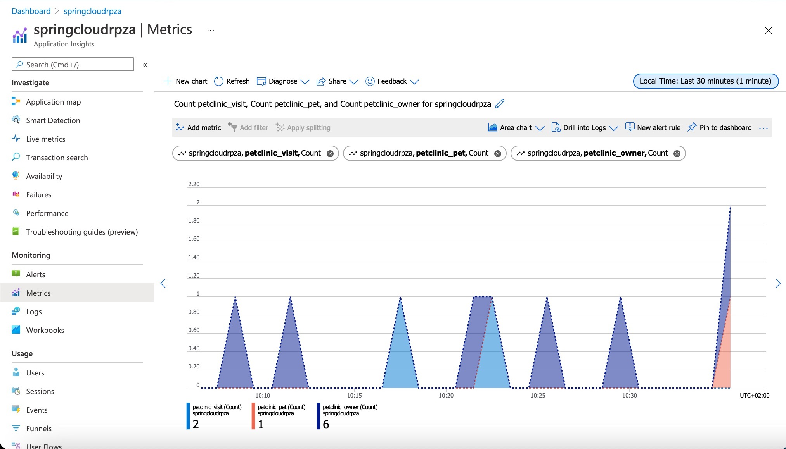

In this exercise, with zero configuration, you'll effortlessly monitor data flows for your sample application.

## Monitor the Application with Application insights

Select you Azure Spring instance and in the left navigation pane, select Application Insights to jump to the Overview page of Application Insights.

### Application Map

Application Map helps you spot performance bottlenecks or failure hotspots across all components of your distributed application. On the left, navigate to **Application Map** where you can see a view of your Azure Spring Cloud microservices:

Applications that are operating correctly (green) and those applications with bottlenecks (red).
In the Application Map above, each of the names in green boxes are different services of your Azure Spring Cloud.
You can easily identify issues in their applications and quickly troubleshoot and fix them. Each node on the map represents a MicroService or its dependencies with health KPI and alerts status. You can select from any component to more detailed diagnostics, such as Application Insights events.

### Performance

On the left, navigate to **Performance** where you can see response times and request counts for operations exposed by your applications.

Next, on the right, navigate to **Dependencies** where you can see all your dependencies and their response times and request counts.
You can see the performance number for dependencies, particularly SQL calls:

You can select a SQL call or a dependency to see the full end-to-end transaction in context:

### Failures/Exceptions

Next, select **Failures** in the Application Insights resource menu located in the Investigate section. You will see the failure rate trends for your requests, how many of them are failing, and how many users are impacted. As an Overall view, you'll see some of the most useful distributions specific to the selected failing operation, including top three response codes, top three exception types, and top three failing dependency types

Select an exception and drill in for meaningful insights and actionable stack trace:

### Metrics

You can see metrics contributed by Spring Boot apps, Spring Cloud modules, and dependencies.
The chart below shows `gateway-requests` (Spring Cloud Gateway), `hikaricp_connections` (JDBC Connections) and `http_client_requests`.

Spring Boot registers a number of core metrics: JVM, CPU, Tomcat, Logback...
The Spring Boot auto-configuration enables the instrumentation of requests handled by Spring MVC.
All those three REST controllers `OwnerResource`, `PetResource` and `VisitResource` have been instrumented by the `@Timed` Micrometer annotation at class level.

* `customers-service` application has the following custom metrics enabled:
  * @Timed: `petclinic.owner`
  * @Timed: `petclinic.pet`
* `visits-service` application has the following custom metrics enabled:
  * @Timed: `petclinic.visit`

You can see these custom metrics in the `Metrics` blade:

### Availability

You can use the Availability Test feature in Application Insights to monitor the availability of applications in Azure Spring Cloud. This is a recurring test to monitor the availability and responsiveness of applications at regular intervals from anywhere across the globe. It can proactively alert you if your applications are not responding or if they respond too slowly.

### Live Metrics

Navigate to the Live Metrics blade where you can see live metrics practically in real-time, within only one second:

## Next steps

In the next unit, we'll discuss monitoring your entire solution.
