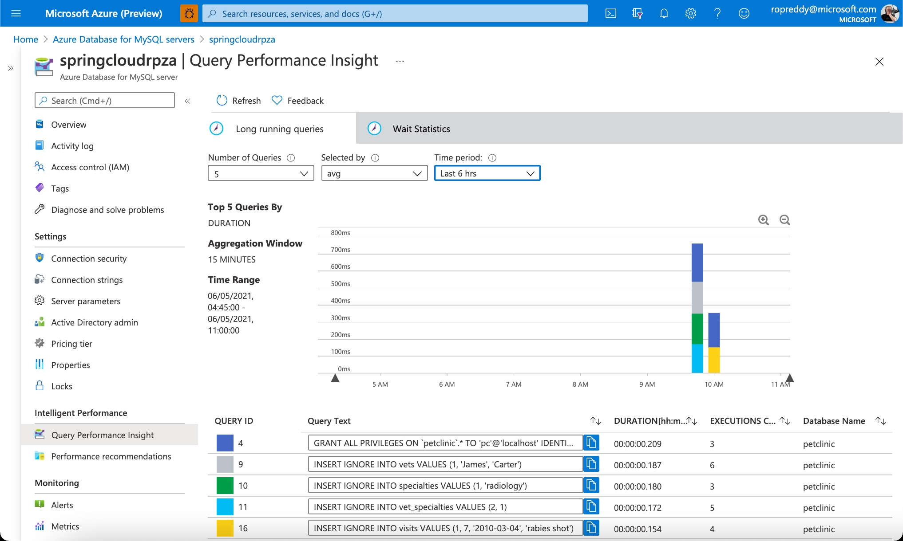

In this unit, we look at monitoring the entire solution.

## Introduction

Most cloud deployments are based on distributed architectures where components are distributed across various services. Troubleshooting monolithic applications often requires only one or two lenses - the application and the database. With distributed architectures, troubleshooting is complex and challenging because of various factors. This unit describes some of the tools to help with those challenges.

## Log analytics

Log Analytics provides aggregated logs with advanced query capability. Data is retrieved from a Log Analytics workspace using a log query, which is a read-only request to process data and return results. Log queries are written in **Kusto Query Language (KQL)**, which is the same query language used by Azure Data Explorer. You can write log queries in Log Analytics to interactively analyze their results, use them in alert rules to be proactively notified of issues, or include their results in workbooks or dashboards.

> [!NOTE]
> Data collected by Azure Monitor Logs is stored in one or more Log Analytics workspaces.
> Your Azure Spring Cloud sample application already has been setup with a Log Analytics workspace.
> For more information on KQL syntax, see the Summary unit at the end of this training.

### Use Log Analytics

There are actually three ways to access your application's logs: Azure Storage, Azure Events Hub, and Log Analytics. We'll focus here on Log Analytics as it's the most common one, and as it's integrated into Azure Spring Cloud.

Log Analytics is part of Azure Monitor, which is integrated into Azure Spring Cloud for metrics monitoring.

1. In the Azure portal, in the left pane, select **Log Analytics**.
1. Select the Log Analytics workspace that you chose when you added your diagnostics settings.
1. To open the **Log Search** pane, select **Logs**.
1. In the **Tables** search box,

   * to view logs, enter a query such as:

    ```sql
    AppPlatformLogsforSpring
    | limit 50
    ```

    * to view metrics, enter a query such as:

    ```sql
    AzureMetrics
    | limit 50
    ```

1. To view the search result, select **Run**.
1. You can search the logs of the specific application or instance by setting a filter condition:

    ```sql
    AppPlatformLogsforSpring
    | where ServiceName == "YourServiceName" and AppName == "YourAppName" and InstanceName == "YourInstanceName"
    | limit 50
    ```

### Analyze the logs

Application logs provide critical information and verbose logs about your application's health, performance, and more. In the next sections are some  queries to help you understand your application's current and past states.

### Show application logs from Azure Spring Cloud

To review a list of application logs from Azure Spring Cloud, sorted by time with the most recent logs shown first, run the following query:

```sql
AppPlatformLogsforSpring
| project TimeGenerated , ServiceName , AppName , InstanceName , Log
| sort by TimeGenerated desc
```

### Show logs entries containing errors or exceptions

To review unsorted log entries that mention an error or exception, run the following query:

```sql
AppPlatformLogsforSpring
| project TimeGenerated , ServiceName , AppName , InstanceName , Log
| where Log contains "error" or Log contains "exception"
```

Use this query to find errors, or modify the query terms to find specific error codes or exceptions.

### Show the number of errors and exceptions reported by your application over the last hour

To create a pie chart that displays the number of errors and exceptions logged by your application, run the following query:

```sql
AppPlatformLogsforSpring
| where TimeGenerated > ago(1h)
| where Log contains "error" or Log contains "exception"
| summarize count_per_app = count() by AppName
| sort by count_per_app desc
| render piechart
```

## Database Monitoring

Monitoring data about your servers helps you troubleshoot and optimize for your workload. Azure Database for MySQL provides various metrics that give insight into the behavior of your server.

### Metrics

Azure Database for MySQL provides tools and methods you can use to monitor usage easily, add, or remove resources (such as CPU, memory, or I/O), troubleshoot potential problems, and help improve the performance of a database. You can monitor performance metrics regularly to see the average, maximum, and minimum values for various time ranges.

## Query Store and Performance Insights

Query Store is a feature that keeps track of query performance over time including query runtime statistics and wait events.

Query Performance Insight works with Query Store to provide visualizations accessible from the Azure portal. These charts enable you to identify key queries that affect performance. Query Performance Insight is accessible in the Intelligent Performance section of your Azure Database for MySQL server's portal page.

Query Performance Insight helps you to quickly identify what your longest running queries are, how they change over time, and what waits are affecting them.

### Viewing performance insights

The Query Performance Insight view in the Azure portal will surface visualizations on key information from Query Store.

In the portal page of your Azure Database for MySQL server, select **Query Performance Insight** under the **Intelligent Performance** section of the menu bar.

### Long running queries

The **Long running queries tab** shows the top 5 queries by average duration per execution, aggregated in 15-minute intervals

> [!NOTE]
> Your Azure Spring Cloud sample application already has Query Performance Insights activated for Long running queries for your MySQL instance
> For Query Performance Insight to function, data must exist in the Query Store and can take a few minutes to reflect.



### Wait statistics

Wait statistics provides a view of the wait events that occur during the execution of a specific query.
Select the **Wait Statistics** tab to view the corresponding visualizations on waits in the server.

> [!NOTE]
> Wait statistics are meant for troubleshooting query performance issues. By default Wait Statistics is not switched on as it is recommended to be turned on only for troubleshooting purposes.

## Performance Recommendations

The Performance Recommendations feature analyzes workloads across your server to identify indexes with the potential to improve performance.
Open Performance Recommendations from the **Intelligent Performance** section of the menu bar on the Azure portal page for your MySQL server.

> [!NOTE]
> For more information on Database Monitoring, see the **Summary** unit at the end of this training.

## UI monitoring

If you add Application Insights to your page script, you get timings of page loads and AJAX calls, counts, and details of browser exceptions and AJAX failures, as well as users and session counts. All these can be segmented by page, client OS and browser version, geo location, and other dimensions. You can set alerts on failure counts or slow page loading. And by inserting trace calls in your JavaScript code, you can track how the different features of your web page application are used.
Application Insights can be used with any web pages - you just add a short piece of JavaScript. If your web service is Java, you can use the server-side SDKs in conjunction with the client-side JavaScript SDK to get an end-to-end understanding of your app's performance.

> [!NOTE]
> For more information on UI monitoring, see the Summary unit at the end of this training.

The next unit is a knowledge check to see what you've learned in this module.
