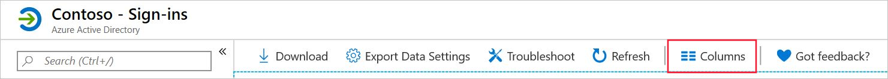

One of the primary causes of data loss is when a user's account is compromised and used to access confidential assets or resources on your network. Azure offers logging and auditing capabilities that help you assess whether a user is behaving according to their typical usage. When this behavior deviates from normal, it's flagged as suspicious. 

Your security team is worried about a repeat of a previous breach, and wants to know what Azure features and services might help. To reassure the team, you want to learn more about what Azure offers for logging user activities, and how it's used to identify suspicious sign-in behavior.

In this unit, you'll see two different approaches to monitoring your user's behavior. The first approach focuses on the user's sign-in details stored in the sign-in log files. The second approach looks at the activities those users carry out while logged in. These activities are stored in the audit files.

## Azure Active Directory logs

An Azure Active Directory (Azure AD) captures log information across your entire Azure tenant, which can be used in analysis and reporting. When you assess user behavior, you'll want to look at the activity and security logs.  

Activity logs cover all of a user's behaviors and interactions with your network and their assets.  There are two types of log files that you'll want to pay attention to:

- **Sign-in logs**: these logs hold details on all user activity and the applications that requested them
- **Audit logs**: these logs show what a user or group did while logged into your network

Security logs represent a list of the exceptions found in the activity logs.  There are two key log files worthy of note:

- **Risky sign-ins**: these hold data on user accounts where the sign-in behavior isn't consistent with previous sign-in attempts
- **Users flagged for risk**: this log file lets you see all users who have been assigned the risky user flag

For the moment, though, you're only interested in tracking user sign-ins and activity logs.

## Azure sign-in log files

Sign-in log files hold a copy of all sign-in attempts to your network.  However, this only applies to actual traditional sign-ins with user credentials.  The sign-in log files don't record automatic authentication used in server-to-server connections.

Sign-in log files can be used to identify:

- Patterns of user sign-in behavior
- Trends in user sign-in over time
- The overall status of all users who access your network

### Prerequisites

Given the nature of the log data captured by the sign-in logs, access is reserved and limited.  To use the sign-in log files, you'll need:

- An Azure premium or better subscription
- At least one user who has the Global Administrator, Report Reader, Security Reader, or Security Administrator roles or permissions

### Structure of a sign-in log file

The first time the sign-in logging service is enabled, it can take up to an hour before any data is available.  Azure captures a wide range of data about user activity, from access periods to the application that made the request, and more.  You access the sign-in log file through the Azure portal.  

1. Find your Active Directory Service.
1. In the Monitor section, select **Sign-in**.

You'll be presented with a screen similar to this one, which shows a typical view of the sign-in data.

The default sign-in columns are:

- Sign-in date
- Related user
- Application making the sign-in request
- Sign-in status
- Risk detection status
- Multi-factor authentication status

As with all reporting in Azure, you can modify the structure, adding and removing columns as necessary. To change the sign-in columns, select the **Columns** option from the menu bar.

From here, you select or remove the columns you need. Apart from the default columns, you can also select from:

- Request ID
- User
- UserName
- IP address
- Location
- Operating System
- Device Browser
- Conditional Access
- Alternate sign-in name

### Filtering

Even after you've selected all the sign-in columns you're interested in processing, you'll still have a lot of data. To manage these volumes, you'll need to apply filters to get to the right data. For example, you might only want to see sign-in records where the user has been flagged as a risk, or where multi-factor authentication has failed.  Using filters lets you look at the raw data in different ways, to identify trends or patterns.

To use a filter, select the add filter button, and then the filters you're interested in from the presented list.

Here's a few of the key filters and what you'd use them for:

- **User**: lets you target a specific user, either by name or using their user principal name
- **Application**: lets you find sign-in requests made by specific applications
- **Sign-in status**: lets you narrow the results to users who successfully signed in and those who failed
- **Conditional Access**: lets you examine whether any applicable conditional access policies have been applied
- **Date**: lets you adjust the timeframe of the data you're looking at, from a month to a single day

### Download the sign-in logs

You've nominated the columns you're interested in, and applied the filters to bring the data down to a manageable and specific subset. Now you'll want to process it. Azure offers some great tools for rendering and further analysis, but you might already be using existing applications. Azure offers the capability to download the sign-in data based on your current filters.

When you're downloading sign-in log records, you're limited to the most recent 250,000 records, based on the filter criteria used.

To download the data in your view, select the download option from the menu bar.

Decide what format you want for the data. You have two choices: CSV or JSON.

### Sign-in error codes

Analysis of failed sign-ins is key to maintaining a secure and healthy Azure environment.  When reviewing your sign-in log files, you can filter on the status to show only failed sign-ins.  

As before, when this filter is applied, the results will show only failed sign-ins.

When you select any of the resulting sign-in records, you'll see a snapshot of the record, including sign-in status, sign-in error code, and the failure reason.  

A complete list of the error codes can be found on the Microsoft Docs website.  Here's a few examples of the error codes you might find and their official descriptions.

| Error | Description                                                  |
| :---- | :----------------------------------------------------------- |
| 50002 | Sign-in failed because of restricted proxy access on the tenant. If it's your own tenant policy, you can change your restricted tenant settings to fix this issue. |
| 50005 | Users tried to log in to a device from a platform that's currently not supported through Conditional Access policy. |
| 50020 | The user is unauthorized for one of the following reasons: the user is attempting to log in with an MSA account with the v1 endpoint, or the user doesn't exist in the tenant. Contact the application owner. |
| 50055 | Invalid password entered or expired password.                  |
| 50057 | User account is disabled. The account has been disabled by an administrator. |
| 50074 | User didn't pass the MFA challenge.                         |
| 50126 | Invalid username or password, or invalid on-premises username or password. |
| 50133 | Session is invalid because of expiration or recent password change. |
| 50173 | Fresh auth token is needed. Have the user sign in again using fresh credentials. |
| 53003 | Access has been blocked because of Conditional Access policies.  |
| 65004 | User declined to consent to access the app. Have the user retry the sign-in and consent to the app. |
| 70019 | Verification code expired. Have the user retry the sign-in.  |
| 80007 | Authentication Agent can't validate the user's password.     |
| 81007 | Tenant isn't enabled for Seamless SSO.                      |

## Azure audit log files

Audit files provide a history of every task that's done in your tenant.

Audit logs are maintained for compliance, and keep records of all your system activities. When reviewing audit logs, you should realize there might be a delay of up to an hour before some activities appear in the audit log.

### Prerequisites

To access the audit log files, you'll need:

- At least one user who has the Global Administrator, Report Reader, Security Reader, or Security Administrator roles or permissions

### Structure of an audit log file

Much like the sign-in logs, the audit logs can be adapted and changed to meet your specific needs. The default audit log view will contain:

- Data
- Service
- Category
- Status
- Target
- Initiated by

As before, you can modify the columns that you see in your view, and select to add the following columns:

- Activity
- Status Reason

### Filtering the audit log results

Audit logs can contain hundreds of thousands of entries from across your Azure environment. To manage this number, you apply filters to the results to reach the data you need. When filtering, you can only use the following fields:

- **Service**: lets you narrow down the services in the results. Service is limited to access reviews, accounts provisioning, application SSO, authentication methods, B2C, conditional access, core directories, entitlement management, identity protection, invited users, PIM, self-service group and password management, and terms of use.
- **Category**: lets you specify what category of audit you want. The selection might be: administrative unit, application management, authentication, authorization, contact, device, device configuration, directory management, entitlement management, group management, policy resource management, role management, and user management.
- **Activity**: the choices here are predicated on the type of service and category you've previously selected.
- **Status**: lets you identify success or failure in the activity.
- **Target**: lets you use a target name or a user principal name.
- **Initiated by**: lets you specify a user name or a universal principal name; both are case-sensitive.
- **Date (range)**: lets you specify a date range that can vary from one month to a day.

### Download the audit log

When you've applied the filters to bring the data down to a manageable and specific subset, you can download it.
When you're downloading audit log records, you're limited to the most recent 250,000 records, based on the filter criteria used.

To download the data in your view, select the download option from the menu bar.

Decide what format you want for the data. There's two choices: CSV or JSON.

### Access audit logs through users, groups, and enterprise applications

You access audit log data through your Azure Active Directory. But you can also access the audit log directly through users, groups, and enterprise applications. Data is prefiltered according to the access point used.  If you access the audit logs through users, you'll only see audit log data related to users. The same applies to groups and enterprise applications.

#### Access the user audit logs

To access the user audit logs from your Azure Active Directory, select users as shown:

To access the group's audit logs from your Azure Active Directory, select **Groups**.
