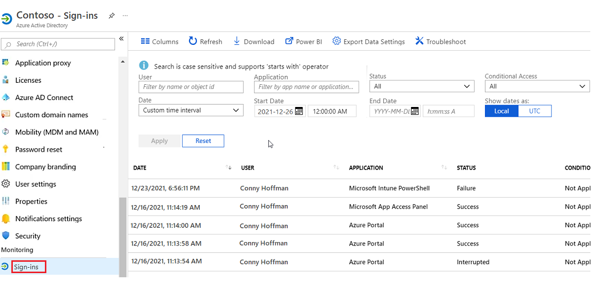
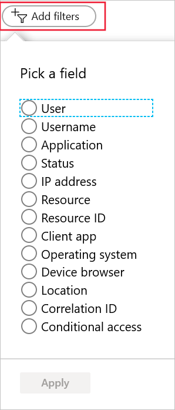
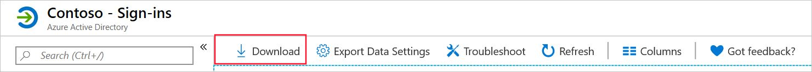
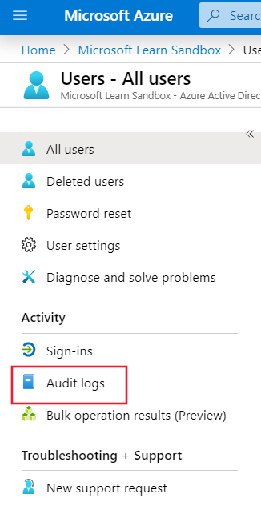

Data loss occurs most primarily when user accounts are compromised and used to access confidential assets or resources on your network. Azure offers logging and auditing capabilities that can help you assess whether your users' recent behavior is consistent with their typical behavior. When user behavior deviates from normal, it's flagged as suspicious. 

Your security team members are worried about a repeat of a previous breach, and they want to know what Azure features and services might help prevent it. To reassure the team, you want to learn more about what Azure offers for logging user activities, and how to use this logging to identify suspicious sign-in behavior.

In this unit, you'll see two different approaches to monitoring user behavior. The first approach focuses on users' sign-in details, which are stored in sign-in log files. The second approach looks at the activities that the users carry out while they're signed in. These activities are stored in audit files.

## Azure Active Directory logs

Azure Active Directory (Azure AD) captures log information across your entire Azure tenant. You can use this information in analysis and reporting. When you assess user behavior, you want to look at the activity and security logs.  

Activity logs cover all of a user's behaviors and interactions with your network and their assets. You want to pay attention to two types of log files in particular:

- **Sign-in logs**: Hold details about all user activity and the applications that requested them.
- **Audit logs**: Show what a user or group did while signed in to your network.

Security logs represent a list of the exceptions found in the activity logs. Worthy of note are two key log files:

- **Risky sign-ins**: Hold data about user accounts where the sign-in behavior is inconsistent with previous sign-in attempts.
- **Users flagged for risk**: Show you all users who have been assigned a risky user flag.

For the moment, though, you're interested in tracking only user sign-ins and activity logs.

## Azure sign-in log files

Sign-in log files hold a copy of all attempts to sign in to your network.  However, this applies only to actual traditional sign-ins with user credentials.  The sign-in log files don't record automatic authentication that's used in server-to-server connections.

You can use sign-in log files to identify:

- Patterns of user sign-in behavior.
- Trends in user sign-in activity over time.
- The overall status of all users who access your network.

### Prerequisites

Because of the nature of the log data that's captured by the sign-in logs, access is reserved and limited.  To use the sign-in log files, you need:

- An Azure AD Premium or better subscription.
- At least one user who has a *Global Administrator*, *Report Reader*, *Security Reader*, or *Security Administrator* role or permissions.

### Structure of a sign-in log file

The first time the sign-in logging service is enabled, it can take up to an hour before any data is available.  Azure captures a wide range of data about user activity, from access periods to the application that made the request, and more.  You access the sign-in log file through the Azure portal.  

1. In the Azure portal, go to your Azure AD instance.

1. In the **Monitor** section, select **Sign-ins**.

A page similar to the following displays a typical view of the sign-in table data:

The default table columns are:

- Sign-in date
- Related user
- Application making the sign-in request
- Sign-in status
- Risk detection status
- Multi-factor authentication status

As with all reporting in Azure, you can modify the structure by adding and removing columns, as necessary. To change the columns, select **Columns**.

In the **Columns** pane, you can add or remove the columns you need. In addition to the default columns, you have the following options:

- Request ID
- User
- UserName
- IP address
- Location
- Operating System
- Device Browser
- Conditional Access
- Alternate sign-in name

### Filter the log data

Even after you've selected all the sign-in columns you're interested in processing, you still have a lot of data. To manage these volumes and get to the right data, you need to apply filters. For example, you might want to see only sign-in records where users have been flagged as a risk, or where multi-factor authentication has failed.  By using filters, you can view the raw data in a variety of ways, to identify trends or patterns.

To use filters, select **Add filters**, and then select the filters you want to use.

Here are a few key filters and what you would use them for:

- **User**: Lets you target specific users, by either their name or their user principal name.
- **Application**: Lets you find sign-in requests made by specific applications.
- **Sign-in status**: Lets you narrow the results to users who successfully signed in and those who failed.
- **Conditional access**: Lets you examine whether any applicable conditional access policies have been applied.
- **Date**: Lets you adjust the timeframe of the data you're looking at, from a month to a single day.

### Download the sign-in logs

You've nominated the columns you're interested in, and applied the filters to narrow the data to a manageable and specific subset. Now you can process it. Azure offers some great tools for rendering and further analysis, but you might already be using existing applications. With Azure, you can download the sign-in data based on your current filters.

When you download sign-in log records, you're limited to the most recent 250,000 records, based on the filter criteria that you've applied.

To download the data in your view, select **Download**.

Decide which format you want to use for the data, CSV or JSON.

### Sign-in error codes

Analysis of failed sign-ins is key to maintaining a secure and healthy Azure environment. When you review your sign-in log files, you can filter on the status to show only failed sign-ins.  

As previously described, when this filter is applied, the table displays only failed sign-ins.

When you select any sign-in record in the results list, you'll see a snapshot of the record, including sign-in status, sign-in error code, and the failure reason.  

You'll find a complete list of error codes at the URL provided in the summary unit of this module. A few example error codes and their official descriptions are listed in the following table:

| Error | Description                                                  |
| :---- | :----------------------------------------------------------- |
| 50002 | Sign-in failed because of restricted proxy access on the tenant. If it's your own tenant policy, you can change your restricted tenant settings to fix this issue. |
| 50005 | Users tried to log in to a device from a platform that's currently not supported through Conditional Access policy. |
| 50020 | The user is unauthorized for one of the following reasons: the user is attempting to log in with an MSA account with the v1 endpoint, or the user doesn't exist in the tenant. Contact the application owner. |
| 50055 | Invalid password entered or expired password.                  |
| 50057 | User account is disabled. The account has been disabled by an administrator. |
| 50074 | User didn't pass the multi-factor authentication (MFA) challenge.                         |
| 50126 | Invalid username or password, or invalid on-premises username or password. |
| 50133 | Session is invalid because of expiration or recent password change. |
| 50173 | Fresh auth token is needed. Have the user sign in again using fresh credentials. |
| 53003 | Access has been blocked because of Conditional Access policies.  |
| 65004 | User declined to consent to access the app. Have the user retry the sign-in and consent to the app. |
| 70019 | Verification code expired. Have the user retry the sign-in.  |
| 80007 | Authentication Agent can't validate the user's password.     |
| 81007 | Tenant isn't enabled for Seamless SSO.                      |

## Azure audit log files

Audit files provide a history of every task that's done in your tenant.

Audit logs are maintained for compliance. They keep records of all your system activities. When you review the audit logs, realize that there might be a delay of up to an hour before some activities appear in the log.

### Prerequisites

To access the audit log files, you need:

- At least one user who has the *Global Administrator*, *Report Reader*, *Security Reader*, or *Security Administrator* role or permissions

### Structure of an audit log file

Much like the sign-in logs, the audit logs can be adapted and changed to meet your specific needs. The default audit log view displays the following columns:

- Data
- Service
- Category
- Status
- Target
- Initiated by

As with the logs discussed earlier, you can modify the columns that are displayed, and you can add the following columns:

- Activity
- Status Reason

### Filter the audit log results

Audit logs can contain hundreds of thousands of entries from across your Azure environment. To manage this number, you apply filters to the results to display the data you need. You can filter data in the following fields only:

- **Service**: Narrows down the services in the results. The Service field is limited to access reviews, accounts provisioning, application SSO, authentication methods, B2C, conditional access, core directories, entitlement management, identity protection, invited users, Privileged Identity Management (PIM), self-service group and password management, and terms of use.
- **Category**: Specifies what category of audit you want. The selection might be: administrative unit, application management, authentication, authorization, contact, device, device configuration, directory management, entitlement management, group management, policy resource management, role management, and user management.
- **Activity**: Options depend on the type of service and category you've previously selected.
- **Status**: Identifies the activity's success or failure.
- **Target**: Lets you use a target name or a user principal name.
- **Initiated by**: Lets you specify a user name or a universal principal name. Both are case-sensitive.
- **Date (range)**: Lets you specify a date range, which can vary from one month to one day.

### Download the audit log

When you've applied the filters to narrow the data to a manageable and specific subset, you can download it. When you download audit log records, you're limited to the most recent 250,000 records, based on the applied filter criteria.

To download the data in your view, select **Download** on the menu bar.

Decide which format you want to use for the data, CSV or JSON.

### Access audit logs through users, groups, and enterprise applications

You access audit log data through your Azure AD instance. But you can also access the audit log directly through users, groups, and enterprise applications. The data is prefiltered according to the access point that's being used.  If you access the audit logs through users, you see only audit log data that's related to users. The same applies to groups and enterprise applications.

#### Access the user audit logs

To access the user audit logs from your Azure AD instance, select **Audit logs**, as shown here:

To access the group's audit logs from your Azure AD instance, select **Groups**.
