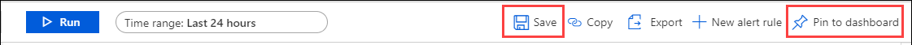
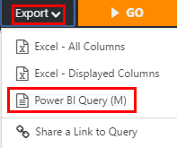

You've used the tools and services in the Azure portal to gather logging details about your users and their activities. With the collected audit and sign-in data, you've built queries to gain answers and insights into specific behaviors. These queries will also alert your team when there's suspicious user behavior. This process has gone a long way toward meeting your team's security concerns.

Your team members are pleased. They'll be alerted when suspicious behaviors are identified, and they know that those alerts are tightly focused. Now they want to know whether Azure can provide real-time views of the security of their estate. They can then identify and respond to new threats.

Azure provides several visualization tools and reports that can meet the team's needs. You want to understand how to put these tools and reports into practice.

In this unit, you explore some of the prebuilt views that are available for reporting on sign-in events. You also learn how to enhance and customize the underlying report queries, and save them to a security dashboard. Finally, you learn how to export these reports to Excel and Power BI.

## Understand prebuilt views

In addition to building your own reports and queries to report on user activity, you can use prebuilt log analytics views. These views help you report on frequently encountered scenarios by using the sign-in and audit log events. All reports and views can be linked with alerts to warn of any unusual results.

Prebuilt views are available on GitHub in the [AzureAD/Deployment-Plans](https://github.com/AzureAD/Deployment-Plans/tree/master/Log%20Analytics%20Views?azure-portal=true) repository. Two views are available to use:

- Azure AD Account Provisioning Events
- Sign-ins Events

### The Azure AD Account Provisioning Events view

This view is a collection of reports that are based on audit log data and focused on account provisioning. You can use reports to:

- View the number of newly set up users, and the number of failed attempts.
- Gauge the number of successfully updated users, and the number of failed attempts.
- View the number of deprovisioned users, and the number of failed attempts.

To get these reports, download the [*Azure AD Account Provisioning Events.omsview* file](https://github.com/AzureAD/Deployment-Plans/blob/master/Log%20Analytics%20Views/Azure%20AD%20Account%20Provisioning%20Events.omsview?azure-portal=true) from the GitHub repository.

### The Sign-ins Events view

This view is a collection of reports that monitor your users' sign-in attempts. With this view, you can report and monitor:

- Sign-ins by application
- Sign-ins by user
- Sign-ins by device
- Sign-ins over time

To get these reports, download the [*AzureADSignins.omsview* file](https://github.com/AzureAD/Deployment-Plans/blob/master/Log%20Analytics%20Views/AzureADSignins.omsview?azure-portal=true) from the GitHub repository.

### Install a prebuilt view

You can choose to download and install one or both of these prebuilt views in your Log Analytics workspace.  You'll be using the one to which you previously directed the audit and sign-in data streams.

1. In the Azure portal, select **All services**, enter **Log Analytics**, and then select the Log Analytics workspace that you created earlier.

1. Select **Workbooks**.

1. Select **Import**, select **Choose file**, and then browse to the location where you downloaded both views.

1. Select the **Azure AD Account Provisioning Events** file, and select **Save**.

1. Repeat the preceding steps, but select the **Sign-ins Events** file instead, and then select **Save**.

You've now imported both prebuilt views to your Log Analytics workspace.

### Use the prebuilt views

With the two prebuilt views installed, you can start using them to assess your users' activity and behavior.  

In the **Log Analytics workspace** summary, you can see the views you installed:

- Sign-ins Events
- Azure AD Account Provisioning Events

To access a view, select the one you're interested in.  Each view comes with many reports that you can tailor to provide the insight you're looking for.

## Create a security dashboard

Dashboards provide an organized view of the resources in your Azure cloud instance. From a dashboard, you can organize and arrange your day-to-day and recurring operational tasks and activities. Each dashboard can be built around a specific activity, such as a task or a project.

To create a new dashboard for your security team, do the following:

1. In the Azure portal, search for **Dashboard**.

1. Select **New Dashboard** to create an empty dashboard.

1. Give the dashboard a name, and then select **Done**.

1. Even though the dashboard contains no data, you can still share it.  Select the **Share** option, and then confirm that the sharing and access controls are correct. Give this dashboard a unique and recognizable name, such as **Security Dashboard**.  

Now that you've created a dashboard, you need to add a query report to it. It might seem as though you can add audit or sign-in log data directly to the dashboard, but you can't yet. To build a query to add to the dashboard, you need to return to the Log Analytics workspace you created earlier.

### Build a dashboard query

From the Log Analytics workspace, create a new query. Let's suppose you want to identify the most common user event for the last week. You would use a query like this one.

```kusto
AuditLogs
| where TimeGenerated >= ago(7d)
| summarize auditCount = count() by OperationName
| sort by auditCount desc
```

It's good practice to check any query by running it. When the query returns a valid result set, you can save it.



When the **Save query** control pane appears, do the following:

1. Give the query a meaningful **Name**, such as *Common User Events Last 7 days*.

1. For **Category**, select **Dashboards**.

1. Select **Save**. By saving queries, you can build a library of the ones you use most often.

1. Select **Pin to dashboard**, and then select the dashboard that you created earlier.

Now that you've pinned the query to the dashboard, you can return to the security dashboard that you created earlier. When you open **Security Dashboard**, the analytics result appears.

The name of the report could be improved, so consider renaming it to something more specific.


1. To change the dashboard name, select **Edit** (pencil icon). A more specific title might be **Top User Events past seven days**.

1. When you've made all your changes, select **Update**.

## Export reports

When you're satisfied with the report, you can export it to Excel or the Power BI Desktop application. From the navigation bar, select the **Export** drop-down list, and then select **Export to Excel - All Columns**, **Export to Excel - Displayed Columns**, or **Power BI Query (M)**.



### Export a report to Excel

When you export to Excel, you have two choices. You can export the whole report or selected columns.  This action exports all the result set data for the query you've built. You can save the CSV file to your local computer.

### Export a report to Power BI (M)

Power BI lets you build complex and dynamic reports and dashboards from the data you supply it.  From your Log Analytics workspace, you export the report to Power BI by selecting the **Export** drop-down list and then selecting the **Power BI (M)** option.  This sequence doesn't export the data directly, but it builds a complex M query. The Power BI desktop application uses the M query to make a connection to your Azure instance and pull active data from it.

1. Select **Save** to save the report text file to your local computer.

1. Open the saved file in a text editor. In a moment, you'll copy the content to Power BI.

1. Open Power BI Desktop.

1. Select **Get Data**, and then select **Blank Query**.

   The Power BI query editor appears.

1. Select the **View** menu option, and then select **Advanced Editor**.

1. Copy the content from the saved Power BI (M) file.

1. Paste the **M Language script** into the editor pane.

1. Select **Done**.

Because this query originated in Azure, you'll need to use the **Organizational account** option and your Azure authentication credentials to grant Power BI access to your Azure instance.

Now that you've created the link, you can select a reporting chart style to represent your data in the way you want.  


After you've designed the report as you want it, you can select **Publish to Web** to publish it to your Azure Power BI cloud workspace. From there, you can display the report on other webpages as well.
