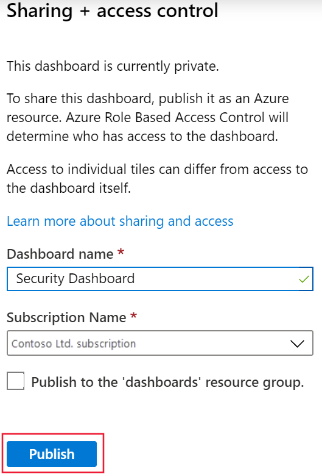

So far, you've learned about the various user-based logging methods provided by Azure. You've learned how to route the audit and sign-in data to an Azure Log Analytics workspace. Also, you've seen how to use this data to create a variety of views and reports for your security team.

You want to implement a dashboard for the security team so they can see the potential of Azure Monitor logs and alerting to help them better understand user behavior.

In this exercise, you create a Log Analytics workspace in your Azure sandbox by using the Azure portal. You then direct the audit and sign-in log files to your workspace. Next, you download and install the prebuilt user sign-in and audit log views from GitHub. Finally, you create a dashboard for your security team that displays reports that are built into it from the workspace.

> [!NOTE]
> This exercise is optional. If you don't have an Azure account, you can read through the following instructions to understand how to use Log Analytics and dashboards.
>
> If you want to complete this exercise but you don't have an Azure subscription or prefer not to use your own account, you can create a [free account](https://azure.microsoft.com/free/?azure-portal=true) before you begin.

## Create a Log Analytics workspace

1. In the [Azure portal](https://portal.azure.com/learn.docs.microsoft.com?azure-portal=true), select **All services** and then, in the search box, type **Log Analytics**.

   

1. In the results list, select **Log Analytics workspaces**.

1. Select **New**. The **Create Log Analytics workspace** pane appears.

1. On the **Basics** tab, enter the following values for each setting.

    | Setting | Value |
    | --- | --- |
    | **Project Details** |
    | Subscription | Enter your subscription  |
    | Resource group | select **Create new**, and enter a unique resource name |
    | **Instance Details** |
    | Name | enter a name that's globally unique across all Azure Monitor subscriptions. For this exercise, enter **ContosoWorkspace**, and append it with several unique characters |
    | Region     | Select the location nearest to you |

1. Select **Next : Pricing tier**, and enter the following value for the setting.

    | Setting | Value |
    | --- | --- |
    | **Pricing tier** |
    | Pricing tier | Leave it automatically assigned as **Pay-as-you-go** and based on a per-gigabyte (GB) cost  |

1. Select **Review + Create**. After validation succeeds, select **Create** to create the workspace.

You've now created a Log Analytics workspace that you can use to store your logging data and run queries.  In the next section, you stream data to this workspace.

## Send log files to a Log Analytics workspace

To stream the audit and sign-in logs to your Log Analytics workspace, do the following:

1. Open Azure Active Directory.

1. In the middle menu pane, under **Monitoring**, select **Diagnostics settings**, and then select **Add diagnostics setting**.

   Here, you create a connection between the two log files and your Log Analytics workspace.

1. On the **Diagnostics setting** pane, do the following:

    a. In the **Diagnostic setting name** box, give the new diagnostics settings a name, such as **SendToLogAnalytics**.  
    b. Under **Destination details**, select the **Send to Log Analytics workspace** check box.  
    c. Select the Log Analytics workspace that you created earlier, **ContosoWorkspace**.  
    d. Decide which of the log files you want to stream to the workspace. For this exercise, select both **Audit** and **AllMetrics**.

1. Select **Save**.  

## Download prebuilt views

1. In a new browser tab, go to [Azure AD Account Provisioning Events.omsview](https://github.com/AzureAD/Deployment-Plans/blob/master/Log%20Analytics%20Views/Azure%20AD%20Account%20Provisioning%20Events.omsview?azure-portal=true).

1. Right-click **Raw**, select **Save link as**, and then select your desktop as the destination.

1. Go to [AzureADSignins.omsview](https://github.com/AzureAD/Deployment-Plans/blob/master/Log%20Analytics%20Views/AzureADSignins.omsview?azure-portal=true).

1. Right-click **Raw**, select **Save link as**, and then select your desktop as the destination.

## Install prebuilt views in your Azure Log Analytics workspace

1. In the Azure portal, select **All resources**.

1. Select the Log Analytics workspace that you created earlier.

1. In the middle menu pane, under **General**, select **Workbooks**.

1. Select **Import**, select **File**, and then browse to your desktop.

1. Select the *Azure AD Account Provisioning Events.omsview* file, and then select **Save**.

1. Repeat steps 3 and 4, but, in step 4, select the *AzureADSignins.omsview* file.

1. Select **Save**.

You've now imported the prebuilt workspace views to your workspace. You can use them to display common views of your audit and sign-in data.

In the next section, you set up a dashboard that your security team can begin to use.

## Create a security dashboard

1. In the Azure portal, search for **Dashboard**, and then select **New dashboard**.

   

1. At the prompt, name the dashboard **Security Dashboard**, and then select **Done**. For now, leave the dashboard blank. In the next few steps, you'll be adding a report query to the dashboard.

   To make the dashboard accessible to your workspace, you need to share it. Even though the dashboard contains no data, you can still share it.  

1. Select **Share**.

   

1. In the **Sharing + access control** pane, confirm that the information is correct:  

   - The dashboard name is **Security Dashboard**.
   - For the subscription name, keep the default value.
   - The **Publish to the 'dashboards' resource group** check box is cleared.
   
1. Select **Publish** to make the empty dashboard available.

   

## Build a query for the dashboard

1. Select **All resources**.

1. Select the Log Analytics workspace that you created earlier.

1. Under **General**, select **Logs**.

1. For this exercise, you want to know the most common user event for last week. In your query editor, paste the following query.

    ```kusto
    AuditLogs
    | where TimeGenerated >= ago(7d)
    | summarize auditCount = count() by OperationName
    | sort by auditCount desc
    ```

1. In the menu bar, select **Run** to ensure that the query returns data.

1. When you're satisfied that you have the data you want, select **Save**.

   

1. When the **Save query** control pane appears, do the following:

   a. Give the query a meaningful **Name**, such as *Common User Events Last 7 days*.  
   b. For **Category**, select **Dashboards**.  
   c. Select **Save**.  
   d. Select **Pin to dashboard**, and then select **Security Dashboard**, which you created earlier.  
   e. Go to the dashboard to view your analytics results.

   

To change the title of the report in the dashboard, do the following:

1. Select **Edit** (pencil icon) in the report tile.

1. Select the title, and change it to **Top User Events past seven days**.

1. Remove the subtitle, which you don't need for this report.

1. Select **Update**.

1. At the prompt, you can choose to publish or discard your changes. Select **Publish**.

You've now created a dashboard with a query report embedded in it.
