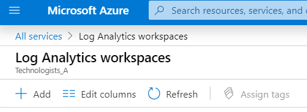
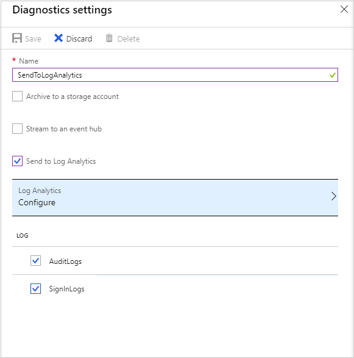

So far, you've learned about the various user-based logging provided by Azure. You've learned how to route the audit and sign-in data to an Azure Log Analytics workspace. Also, you've seen how to use this data to create different views and reports for your security team.

You want to implement a dashboard for the security team so they see the potential of Azure Monitor Logs and alerting to better understand user behavior. 

In this exercise, you'll create a Log Analytics workspace in your Azure sandbox, using the Azure portal.  Then you'll direct the audit and sign-in log files to your workspace.  Next, you'll download and install the prebuilt user sign-in and audit log views from GitHub. Finally, you'll create a dashboard with a report built into it from the workspace that your security team will use.

## Create a Log Analytics workspace

It's straightforward to create a Log Analytics workspace:

1. Go to the [Azure portal](https://portal.azure.com/learn.docs.microsoft.com?azure-portal=true) and select **All services** and in the search field type **log analytics**.

   
1. Select the **Log Analytics workspaces**.
1. Select the **Add** option to create a new Log Analytics workspace.

   
1. To create a new Log Analytics workspace, you'll need to supply some details.

   - Select **Create New**, as this workspace will be unique to the user who logs in.
   - Each workspace needs a **name** that's globally unique across any Azure Monitor subscriptions. Use the name **ContosoWorkspace**.
   - Now select the subscription this workspace will use.  
   - For the **Resource group** select **\<rgn\>\[sandbox Resource Group\]\<\/rgn\>**.
   - Select the nearest **Location** to you.
   - The pricing tier is automatically assigned as **pay-as-you-go** and is based on a per GB cost.

1. When you've added all the details, select **Ok** to create the workspace.

You've now created a Log Analytics workspace you can use to store your logging data and run queries.  Next, you need to stream data to this workspace.

## Send log files to a Log Analytics workspace

To stream the audit and sign-in logs to your Log Analytics workspace, you'll need to:

1. Open your Azure Active Directory.
1. Under the **Monitoring** section, select **Diagnostic settings**.
1. From this page, select **Add diagnostic settings**.
1. This page is where you'll create the connection between the two log files and your Log Analytics workspace.

   - Give the new diagnostic a **name**. Type: **SendToLogAnalytics**.
   - Make sure the **Send to Log Analytics** option has been selected.
   - Select the Log Analytics workspace you created earlier: **ContosoWorkspace**.
   - Finally, decide which of the log files you want to stream to the workspace. In this instance, you need to have both **Audit log** and **Sign-up logs**. Check both options.

     

1. When you're done, select **Save**.  

## Download pebuilt views

1. In a new browser tab navigate to [Azure AD Account Provisioning Events.omsview](https://github.com/AzureAD/Deployment-Plans/blob/master/Log%20Analytics%20Views/Azure%20AD%20Account%20Provisioning%20Events.omsview).
1. Right-click on **Raw**, select **Save link as**.
1. Select your desktop as the destination.
1. Navigate to [AzureADSignins.omsview](https://github.com/AzureAD/Deployment-Plans/blob/master/Log%20Analytics%20Views/AzureADSignins.omsview).
1. Right-click on **Raw**, select **Save link as**.
1. Select your desktop as the destination.

## Install prebuilt views into Azure Log Analytics workspace

1. In the Azure portal, select **All resources**.
1. Select the Log Analytics workspace you created earlier.
1. Under the **General** section, select **View Designer**.
1. Select **Import**, choose **File**, and then browse to your desktop.
1. Select the **Azure AD Account Provisioning Events.omsview** file, and select **Save**.
1. Repeat step 3, but select the **AzureADSignins.omsview** file, then select **Save**.

You've now imported the prebuilt workspace views into your workspace. You can use them to look at common views of your audit and sign-in data. Next, you'll set up a dashboard that your security team can begin to use.

## Create a security dashboard

From your Azure portal:

1. Search for **Dashboard**, unless it's already in your favorites.
1. Select **New Dashboard**.

   

1. You'll be prompted to give the dashboard a **name**.  Use **Security Dashboard**, and select **Done**.  For now, leave the dashboard blank.  In the next few steps, you'll be adding a report query to the dashboard.
1. To make the dashboard accessible to your workspace, it needs to be shared. Even though the dashboard contains no data, you can still share it.  Select the **share** option.

   

1. Confirm the sharing and access control are correct:  

   - The **Dashboard name** will be: **Security Dashboard**.
   - Leave the subscription with the default value.
   - Ensure that **Publish to the 'dashboards' resource group** isn't checked.
   - Select **Publish** to make the empty dashboard available.

   

## Build a query for the dashboard

1. Select **All resources**.
1. Select the Log Analytics workspace you created earlier.
1. Under the **General** section, select **Logs**. 

1. You wanted to know the most common user event for last week.  Copy this query into your query editor.

    ```
    AuditLogs
    | where TimeGenerated >= ago(7d)
    | summarize auditCount = count() by OperationName
    | sort by auditCount desc
    ```

1. Select the **Run** option from the navigation bar to test the query returns data.
1. When you're satisfied you have the data you want, select **Save** from the navigation bar by selecting the disc icon from the menu bar.


When the save query control panel appears:

1. Give the query a meaningful **Name**. Type:  **Common User Events Last 7 days**.
1. Select the **Category** of **Dashboards**.
1. Select the **Save** option.  
1. With the query saved, pin it to the dashboard you created earlier. Select **Pin to dashboard**, and select the **Security Dashboard** that you've already created.

Return to the **Security Dashboard** you created earlier.  When you open the **Security Dashboard**, you'll now see the analytics result displayed.


Now you need to change the title of the report in the dashboard.

1. Select the **edit** option (pen) in the report tile.
1. Select the **Title**, and change it to **Top User Events past seven days**.  
1. Remove the subtitle as you don't need it for this report.
1. When you're done, select **Update**.  
1. You'll be prompted with a choice to either: **Publish the changes** or **discard the changes**.  Select **Publish**.

You've now created a dashboard with a query report embedded in it.
