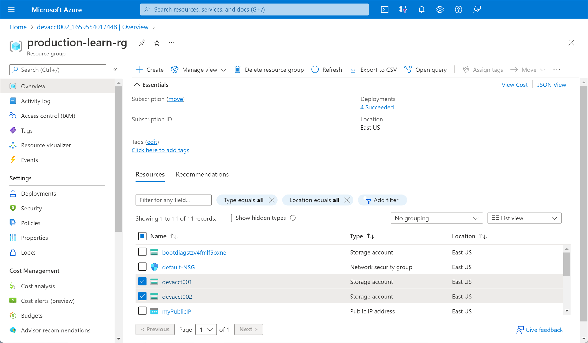
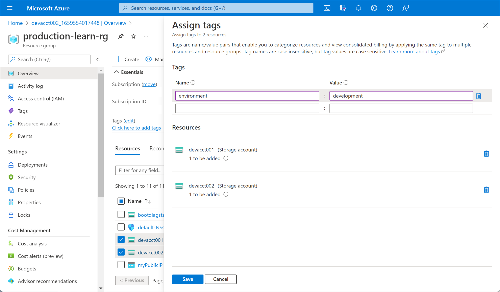
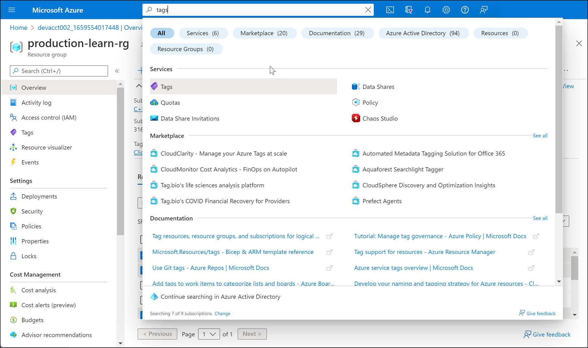

Your organization uses different resources for production and development environments. Some resources that were created for development work were put into the same resource group as production resources. You need to be able to identify which resources belong to a development resource group.

In this unit, you'll create both development and production resources, and put them in a production resource group. You'll tag your resources appropriately. You'll then filter the resources to identify all your development resources from a single location.

[!include]

## Create resources

Create a resource group to act as the production resource group.

1. [Sign in](https://portal.azure.com/learn.docs.microsoft.com?azure-portal=true) to the Azure portal.
1. Select **Resource groups** > **Add**.
1. Enter **production-learn-rg** as the name for the resource group.
1. Select **Review + create** > **Create**.
1. Use the following quickstart template to create a virtual machine (VM) in your production resource group: [Deploy a simple Windows VM](https://azure.microsoft.com/resources/templates/101-vm-simple-windows/).  
1. Select **Deploy to Azure** on the template page.
1. For **Resource group**, select **production-learn-rg**.
1. Enter a username, password, and **DNS Label Prefix**.
1. Select **Review + create** > **Create**.

Now you need to create some additional resources that you'll eventually move to a development resource group.

1. Select **Create a resource** on the left side of the Azure portal.
1. Search for **Storage account**, and select **Create**.
1. Select the resource group **production-learn-rg**.
1. Enter a unique storage account name that starts with the prefix **dev**.
1. Select **Review + create** > **Create**.
1. Create another storage account by repeating steps 1 to 5 again.

You now have a production resource group with two additional storage accounts that you'll move to a development resource group.

## Apply tags to your resources

Now, use the Azure portal to apply tags to resources so you can identify and locate them later.

1. In the Azure portal, on the **Home** page, select **Resource groups**.
1. Select the **production-learn-rg** resource group.
1. Select the check box next to the **Name** field for both storage accounts you created.

    

1. Select **Assign tags**.
1. Enter the following values:

    

    |Field |Value  |
    |---------|---------|
    |NAME    |   environment     |
    |VALUE     |  development      |

1. Select **Save**. Your resources have now been tagged with "development".
1. Repeat these steps to assign the following tag to the remaining resources.

    |Field |Value  |
    |---------|---------|
    |NAME    |   environment     |
    |VALUE     |  production       |

## Filter and identify your development resources

Now you'll filter your resources and find your development tagged resources.  

1. At the top of the Azure portal, search on **tags**.

    

1. Select **Tags**.
1. Select the **environment:development** tag. 
1. All your tagged development resources are listed in one place.

Keep your portal instance open to use later.
