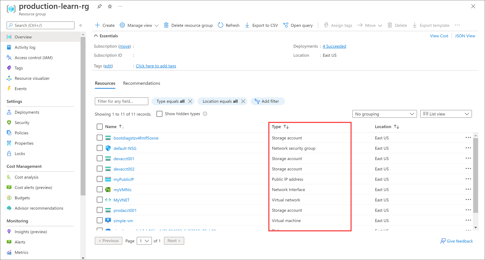

You've identified the development resources that were added to the production resource group. Now, you want to assess whether you can move those development resources to a dedicated resource group. Some resources can't be moved, while it's OK to move others with certain restrictions.

In this unit, you'll learn:

- How to identify the resource types in the resource group.
- How to check resource types against an approved move list, and check for limitations on moving identified resource types.

## Identify your resource types

First, you need to identify the resource type of the resources you want to move. In the Azure portal, you can see the resource type for each resource on the **All resources** pane. The same **Type** column is also included in the list of resources in a resource group.

## Check the limitations on resource types

After identifying the resource types of your resources, you must investigate whether they can be moved, and the restrictions that might be in place. Check your resource types against the [move support for resources](/azure/azure-resource-manager/move-support-resources) list. The list shows whether each resource type can be moved between resource groups or between subscriptions. For example, these resources can be moved:

- Azure Storage accounts
- Azure virtual machines
- Azure virtual networks

These resources can't be moved:

- Azure Active Directory domain services 
- Azure Backup vaults
- Azure App Service gateways

In your case, you'll need to move a pair of storage accounts that support the development version of an application. According to the move operation support for resources list, you can move these storage accounts between resource groups and between subscriptions, without any limitations.

The list also gives links to guidance on moving specific resource types. For example, in the list you'll see that Azure App Service resources have some limitations. The move guidance for App Service states that, if you're moving a web app to another resource group in the same subscription, you can't automatically move third-party SSL certificates. 

Virtual machines have their own limitations you must keep in mind. Here's a summary of limitations for virtual machines:

- If you want to move a virtual machine, all of its dependants must go with it.  
- You can't move virtual machines with certificates in Azure Key Vault between subscriptions.
- You can't move virtual machine scale sets with standard load balancers or a standard public IP.
- You can't move any managed disks that are in availability zones to different subscriptions.

Consider all the relevant limitations before attempting to move your resources. You can then decide which resources are candidates for a move.