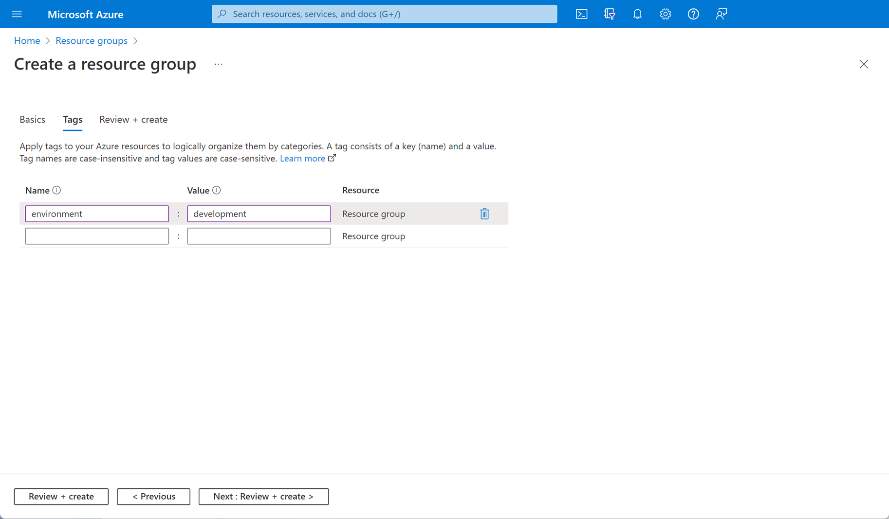
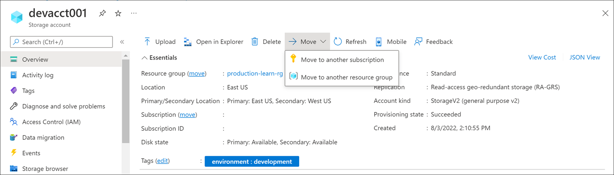
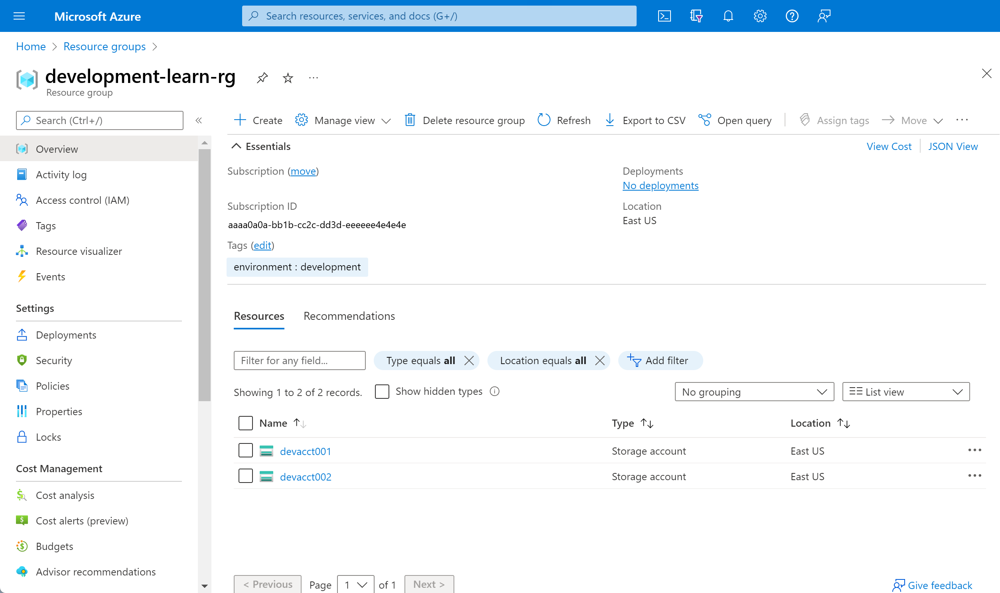

You've identified the development resources that are in the production resource group, and you've checked that they'll move successfully. Now, you want to move your development resources from the production resource group into the dedicated development resource group. You can use the Azure portal to do so.

## Create a resource group for development resources

First you create the development resource group where you'll move your resources.

1. Return to the Azure portal.

1. Under **Azure services**, select **Resource groups**.  The **Resource groups** pane appears.

1. On the top menu bar, select **Create**. The **Create a resource group** pane appears.

1. On the **Basics** tab, enter the following values for each setting.

    | Setting | Value |
    |---|---|
    | **Project details** |
    | Subscription | From the dropdown list, select your account's subscription  |
    | Resource group | Enter *devgroup* |
    | **Resource details** |
    | Region | Accept the default value |

1. Select **Next : Tags**.

1. On the **Tags** tab, enter the following values for each setting.

    | Setting | Value |
    |---|---|
    | Name | environment |
    | Value | development  |

1. Select **Review + create**. After validation passes, select **Create**.

    

## Move development resources to the new group

Now that you've created a devgroup resource group, you can move your development resources into it.

1. At the top of the Azure portal, search for and select **Tags**. The **Tags** pane appears.

1. Select the **environment:development** tag.

1. Select the storage account that you want to move. The storage account pane appears.

1. On the top menu bar, select **Move** > **Move to another resource group**.

    

    The **Move resources** pane appears.

1. On the **Source + target** tab, under **Target**, for the **Resource group**, from the dropdown list, select **devgroup**.

1. Select **Next**. On the **Resources to move** tab, the resources will be validated as to whether they can be moved. The validation might take a few minutes.

1. After validation succeeds, select **Next**.

1. On the **Review** tab, check the disclaimer box, and then select **Move**.

    The move might take a few minutes. Wait for the notification that your resource has been moved. The notification will appear in the top-right hand of the portal.

1. Repeat this process again to move the other storage account.

To confirm that your move operations have succeeded:

1. On the Azure portal home page, under **Azure services**, select **Resource groups**. The **Resource groups** pane appears.

1. Select **devgroup**. The *devgroup* Resource group pane appears.

    You'll see that the development resources have been moved to the devgroup resource group.

    

In a real environment, you'd now update the resource IDs in any tools and scripts that reference your resources.
