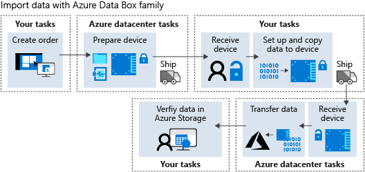

After looking at the options for moving data, you decide that Azure Data Box Disk is the best choice. You don't need to dedicate your entire network bandwidth to the task of importing your data to Azure. As the administrator for your organization, you need to better understand the overall workflow involved in getting the data into Azure.

In this unit, you will learn how to use Azure Data Box Disk and the other devices in the Azure Data Box family.

## Azure Data Box family workflow

The following diagram shows the high-level steps involved when you order a device from the Azure Data Box family.

When you decide to use an Azure Data Box device, you complete the following high-level steps:

1. Create an order in the Azure portal.
1. Receive the device from the Azure datacenter. Connect to and unlock the device.
1. Set up and copy data to the device. Validate the data.
1. Ship the device to Azure.
1. Verify the data in Azure storage.

If you plan to order Data Box Heavy, make sure that it will fit through the entrance of your premises, and that you have at least two people to handle it. It's a massive device that weighs around 500 lbs and it arrives on wheels.

We'll cover the specific steps to use Azure Data Box Disks later in this unit.

### Copy data using standard tools

You can copy data using standard tools. For example, drag and drop files with File Explorer. Or, use any SMB compatible file copy tool like Robocopy.

### Use Azure Storage file naming conventions and size limits

When you copy data, all of the normal Azure Storage naming conventions apply.

-  Subfolder names should be lowercase, between 3 and 63 characters, and consist only of letters, numbers, and hyphens. Consecutive hyphens aren't allowed.
- Directory and file names for Azure Files shouldn't exceed 255 characters in length.
- File size must not exceed ~4.75 TiB for block blobs, ~8 TiB for page blobs, and ~1 TiB for Azure Files.

Copy data into the appropriate folder for your storage type: PageBlob, BlockBlob, AzureFile, or ManagedDisk.

- Use the ManagedDisk folder for virtual hard disks (VHDs) that you want to migrate to Azure. Use the PageBlob folder for VHDX files.
- Any files copied directly to the PageBlob or BlockBlob folders are inserted in a default **$root** container. Subfolders are created as containers in Azure.
- For Azure Files, files must be in subfolders under the AzureFile folder. Any files copied to the root of the AzureFile folder are uploaded as block blobs instead of Azure Files.

If you fail to follow the file structure, size limits, and naming conventions, the data upload to Azure may fail. If you're using Windows, we recommended you validate the files with DataBoxDiskValidation.cmd provided in the DataBoxDiskImport folder. If you have time, use the _generate checksums_ option to validate your data before sending your data to Azure.

## Azure Data Box Disk workflow

For your vehicle data, you'd order a Data Box Disk to import the data to Azure by following these steps:

1. **Create order**
   - Start by making an assessment of how much data your vehicles generate during the time you plan to sample before shipping it to Azure.
   - Create an order in the portal, and specify the amount of data, source country, and destination region.

1. **Receive device from Azure Datacenter**
   - The service assigns between one and five 8-TB BitLocker-encrypted SSDs (up to 35 TB of usable capacity) and ships them within 10 days. If you need to ship more than 35 TB, you can create more orders.
   - When you receive the disks, sign in to the Azure portal and go to the 'Device Details' page for Data Box Disk. Get the passkey. Download the right version of the Data Box Disk unlocker tool for your operating system. 

1. **Set up and copy data to device**
   - For the autonomous vehicle scenario, it would make most sense to connect the disks directly to the onboard Linux or Windows computer in the car. With Azure Data Box Disk, multiple disks can be connected simultaneously, and multiple copy jobs can run in parallel.
   - Azure Data Box Disk supports Azure block blob, Azure page blob, Azure Files, or Managed Disks storage types for upload to Azure. The disks come with a pre-defined folder structure based on the storage type. Copy data into the appropriate folder for your storage type: PageBlob, BlockBlob, AzureFile, or ManagedDisk.
   - Validate the files by running DataBoxDiskValidation.cmd provided in the DataBoxDiskImport folder. Select option 1 to validate the files. If you have time, we recommend you generate checksums by selecting option 2. Generating a checksum may take some time depending on the data size.
   - The first three days are billed as a single day as a grace period, with a one-off shipping and order processing fees. After the first three days, there's a per-day cost for each SSD.

1. **Ship device to Azure datacenter**

   Ship the disks back to Azure using the provided shipping label for your regional carrier. When the device is received by the Azure datacenter, the data is copied to your Azure Storage account.
1. **View data in Azure Storage**

   Check for any errors, and verify that the data has been copied to your storage account.

## Clone a Data Box order

Because you'll need to periodically ship telemetry data from the autonomous vehicles, you require an easy way to repeat the process described here. The best way is to clone the previous Azure Data Box Disk order in the portal. When you select 'clone' within an order, all details of the previous order remain the same, and the name becomes the original order name appended with '-Clone'.