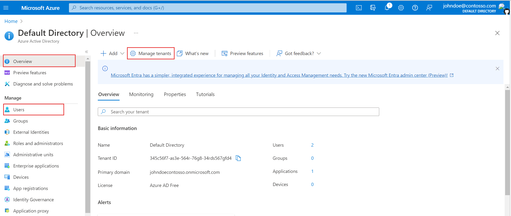
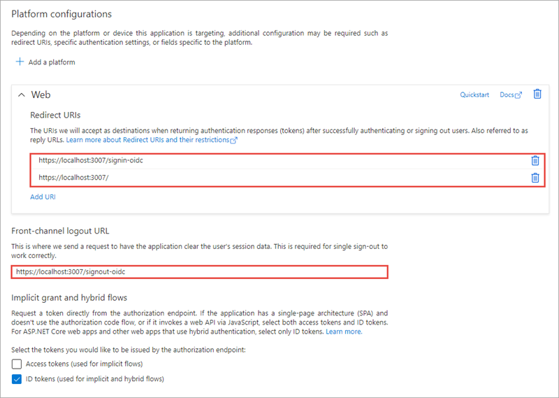
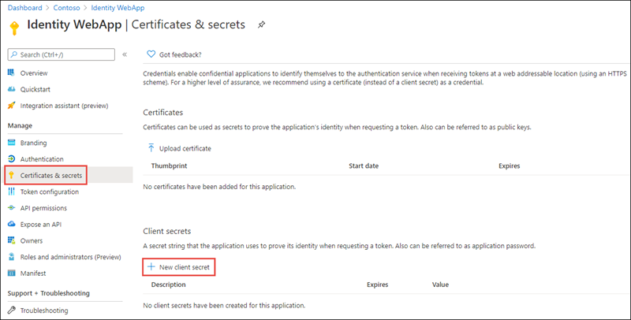

Organizations often want to keep their data safe from unauthenticated and unauthorized users. Developers can use Microsoft identity to add authentication to web apps to enable users to sign in. In our banking company example, users need to authenticate themselves so as to access protected data. In order for a web app to use Microsoft identity to enable users to authenticate and obtain tokens, you must register a new app with Azure AD. In this unit, you'll learn about registering web apps Azure AD tenants.

<!-- 5. Chunked content-------------------------------------------------------------------------------------

    Goal: Provide all the information the learner needs to perform this sub-task.

    Structure: Break the content into 'chunks' where each chunk has three things:
        1. An H2 or H3 heading describing the goal of the chunk
        2. 1-3 paragraphs of text
        3. Visual like an image, table, list, code sample, or blockquote.

    [Learning-unit structural guidance](https://review.docs.microsoft.com/learn-docs/docs/id-guidance-structure-learning-content?branch=main)
-->

## Azure AD tenants and user accounts

To build apps that use the Microsoft identity platform for identity and access management, you need access to an Azure Active Directory (Azure AD) tenant. It's in the Azure AD tenant that you register and manage your apps. A tenant represents an organization.

Each Azure AD tenant is distinct and separate from other Azure AD tenants. It has its own representation of work and school identities, consumer identities (if it's an Azure AD B2C tenant), and app registrations. An app registration inside your tenant can allow authentications only from accounts within your tenant (single tenant apps) or from all tenants (multi-tenant apps).

The Microsoft identity platform helps you build applications your users and customers can sign in to using their several identity types, including:

- Work or school accounts, provisioned through Azure AD
- Personal Microsoft account, like Skype, Xbox, and Outlook.com
- Social or local accounts, by using Azure AD B2C

In this module, we focus on authenticating a work or school accounts provisioned through Azure AD.

## Azure AD app registration

In order for a web app to use Microsoft identity to enable users to authenticate, you must register a new app with Azure AD. This can be done on the [Azure portal](https://portal.azure.com/). Your web app should live in an Azure AD tenant. If your account is present in more than one Azure AD tenant, select your profile at the top right corner in the menu on top of the page, and then switch directory to change your portal session to the desired Azure AD tenant.

When registering a web app in Azure AD, ensure the redirect URI of the app points to the callback URL of the web app. This URL must match the redirect URL provided by the app when the authentication process is started. The authorization code will be sent to this endpoint, which means you need to configure any authentication libraries and/or middleware to listen on this endpoint to receive the authorization code.

A sign-out URL should also be specified so the authentication libraries and/or middleware deletes any cached tokens or other data that is only needed for signed in users.

The web app will also need a client secret to sign in with Azure AD to exchange the authorization code for an access token.

There are three things you'll need from the Azure AD app registration:

- **Tenant ID**: ID of your Azure AD directory
- **Client ID**: unique autogenerated ID of the app (this is also referred to as the application ID)
- **Client secret**: secret you created during app registration
