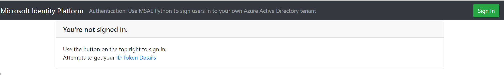
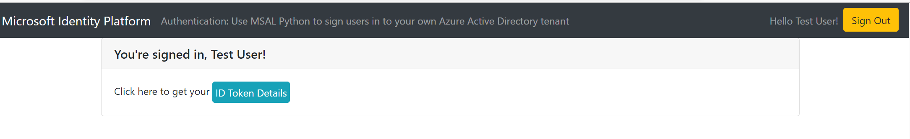

Authentication is the process of proving that you are who you say you are. Users who want to access protected resources need to authenticate by providing credentials that identify them, such as a username and password. 

In this exercise, you sign in users to your Django banking app. The users will provide the username and password credentials that will allow them to access the app.

## Create routes

The *aad.config.json* configuration file defines some authentication endpoints that your Django web app will use. These endpoints are registered as `msal_urls`.

In addition to these endpoints, you define `sign_in_status` and `token_details` endpoints for testing purposes. The `sign_in_status` endpoint displays whether the user is signed in or not. The `token_details` endpoint displays details of the ID token.

1. In the *views.py* file, create the following views:

    ```python
        from django.shortcuts import render
        from django.conf import settings

        ms_identity_web = settings.MS_IDENTITY_WEB

        def index(request):
            return render(request, "auth/status.html")

        @ms_identity_web.login_required
        def token_details(request):
            return render(request, 'auth/token.html')
    ```

1. Register the endpoints in the *urls.py* file. Your file should contain the following code:

    ```python
        from django.contrib import admin
        from . import views
        from django.urls import path, include

        from django.conf import settings
        from django.conf.urls.static import static
        from ms_identity_web.django.msal_views_and_urls import MsalViews

        msal_urls = MsalViews(settings.MS_IDENTITY_WEB).url_patterns()

        urlpatterns = [
            path('admin/', admin.site.urls),
            path('', views.index, name='index'),
            path('sign_in_status', views.index, name='status'),
            path('token_details', views.token_details, name='token_details'),
            path(f'{settings.AAD_CONFIG.django.auth_endpoints.prefix}/', include(msal_urls)),
            *static(settings.STATIC_URL, document_root=settings.STATIC_ROOT),
        ]
    ```

## Create templates

Django templates help you create HTML files that are loaded when a user accesses an endpoint. 

1. In your Django *templates* folder, create an *auth* folder and store your template files in there:

    ```bash
    |---templates
        |
        |---auth
        |   |
        |   |--401.html
        |   |--auth-bar-items.html
        |   |--status.html
        |   |--token.html
        |---content.html
        |---layout.html
    ```

1. Create the *401.html* template. This template is the file that's loaded when the user tries to access a protected page without authorization.

    ```html
        

        
            401: Unauthorized
        

        
            Visiting this page requires you to be <strong>authenticated</strong>.
            Use the button on the top right to sign in.
        
    ```

1. Create the *status.html* template. This template provides the status of the user. It shows whether the user is signed in or not. It's also loaded when the user goes to the `/auth/sign_in_status` endpoint.

    ```html
        

        

            
                You're signed in, {{ request.identity_context_data.username }}!
            
                You're not signed in.
            

        

        
            
                Click here to get your <a class="btn btn-info p-1" href="">ID Token Details</a>
            
                Use the button on the top right to sign in. <br/>
                Attempts to get your <a href="">ID Token Details</a>
            
        
    ```

1. Create the *token.html* template. This template is loaded when the user accesses the `/auth/token_details` endpoint. It displays the ID token details.

    ```html
        

        
            ID Token Details
        

        
            
                <strong>{{ claim }}:</strong> {{ value }}
                <br>
            
            <br>
            Click here to see your <a class="btn btn-info p-1" href="">Sign-in Status</a>
        
    ```

1. Create the *auth-bar-items.html* template. This template displays the sign-in or sign-out button, depending on whether the user is signed in or not.

    ```html
        <ul class="nav navbar-nav navbar-right">
        
            <li class="nav-item">
                <a class="nav-link" href="">Hello {{ request.identity_context_data.username }}!</a>
            </li>
            <li>
                <a class="btn btn-warning" href="">Sign Out</a>
            </li>
        
            <li>
                <a class="btn btn-success" href="">Sign In</a>
            </li>
        
        </ul>
    ```

1. Create the *layout.html* shared template:

    ```html
        
        <!doctype html>
        <html lang="en">
            <head>
                <!-- Required meta tags -->
                <meta charset="utf-8">
                <meta name="viewport" content="width=device-width, initial-scale=1, shrink-to-fit=no">

                <!-- Bootstrap CSS -->
                <link rel="stylesheet" href="https://stackpath.bootstrapcdn.com/bootstrap/4.3.1/css/bootstrap.min.css" integrity="sha384-ggOyR0iXCbMQv3Xipma34MD+dH/1fQ784/j6cY/iJTQUOhcWr7x9JvoRxT2MZw1T" crossorigin="anonymous">
                <link rel="stylesheet" href="">
                <link rel="icon" type="image/x-icon" href="">
                <title></title>
            </head>
            <body>

                <nav class="navbar navbar-expand-lg navbar-dark bg-dark">
                    <a class="navbar-brand" href="/">Microsoft Identity Platform</a>
                    <span class="navbar-text"></span>
                    <div class="btn-group ml-auto dropleft">
                        
                    </div>
                </nav>
    
                <div class="container body-content">
                    
                </div>

                
                <footer id="footer">
                    
                </footer>
                <!-- jQuery first, then Popper.js, then Bootstrap JS -->
                <script src="https://code.jquery.com/jquery-3.3.1.slim.min.js" integrity="sha384-q8i/X+965DzO0rT7abK41JStQIAqVgRVzpbzo5smXKp4YfRvH+8abtTE1Pi6jizo" crossorigin="anonymous"></script>
                <script src="https://cdnjs.cloudflare.com/ajax/libs/popper.js/1.14.7/umd/popper.min.js" integrity="sha384-UO2eT0CpHqdSJQ6hJty5KVphtPhzWj9WO1clHTMGa3JDZwrnQq4sF86dIHNDz0W1" crossorigin="anonymous"></script>
                <script src="https://stackpath.bootstrapcdn.com/bootstrap/4.4.1/js/bootstrap.min.js" integrity="sha384-wfSDF2E50Y2D1uUdj0O3uMBJnjuUD4Ih7YwaYd1iqfktj0Uod8GCExl3Og8ifwB6" crossorigin="anonymous"></script>  </body>
        </html>
    ```

1. Finally, create the *content.html* shared template:

    ```html
        

        
            
                Authentication: Use MSAL Python to sign users in to your own Azure Active Directory tenant
            
        

        
            <div class="card">
                <h5 class="card-header">
                     
                </h5>
                <div class="card-body">
                    <p class="card-text">
                         
                    </p>
                </div>
            
            </div>
        
        
        

            
                <div id="wrapper">
                    <!-- the MS_ID_WEB key is configurable in the config file -->
                    <div id="left">
                        <svg id="check-icon" xmlns="http://www.w3.org/2000/svg" viewBox="0 0 16 16" width="16" height="16"><path fill-rule="evenodd" d="M1.5 8a6.5 6.5 0 1113 0 6.5 6.5 0 01-13 0zM0 8a8 8 0 1116 0A8 8 0 010 8zm11.78-1.72a.75.75 0 00-1.06-1.06L6.75 9.19 5.28 7.72a.75.75 0 00-1.06 1.06l2 2a.75.75 0 001.06 0l4.5-4.5z"></path></svg>
                    </div>
                    <div id="right">
                        Have you updated your app's <em>redirect URI</em> on <a target="_blank" href={{ aad_link }}>Azure Portal</a>?
                        <br>
                        <strong>redirect_uri</strong>: {{ redirect_uri_external_link }}
                    </div>
                </div>
            

        
    ```

## Create a context processor for your templates

Create a context processor called *context_processors.py* to pass data to your templates. Context processors make the function available and usable in all templates in your projects.

```python
    from django.urls import reverse
    from django.conf import settings
    
    def context(request):
        claims = request.identity_context_data._id_token_claims
        exclude_claims = ['iat', 'exp', 'nbf', 'uti', 'aio', 'rh']
        claims_to_display = {claim: value for claim, value in claims.items() if claim not in exclude_claims}
    
        client_id=settings.AAD_CONFIG.client.client_id
        aad_link="https://portal.azure.com/#blade/Microsoft_AAD_RegisteredApps/ApplicationMenuBlade/Authentication/appId/" + client_id +"/isMSAApp/"
        
        return dict(claims_to_display=claims_to_display,
                    redirect_uri_external_link = request.build_absolute_uri(reverse(settings.AAD_CONFIG.django.auth_endpoints.redirect)),
                    aad_link=aad_link)

```

Be sure to register this context processor in your settings file.

## Check your work

To check whether your app is working well, run the following commands in the root of your project folder:

```bash
    python manage.py collectstatic
    python manage.py runserver localhost:8000
```

Go to `http://localhost:8000`. A page that says you're not signed in should appear.



Select the sign-in button and enter your username (the test user that you created) and password. On successful sign-in, a page that says you're signed in as a test user should appear.



To view the ID token details, select the **ID Token Details** button.
