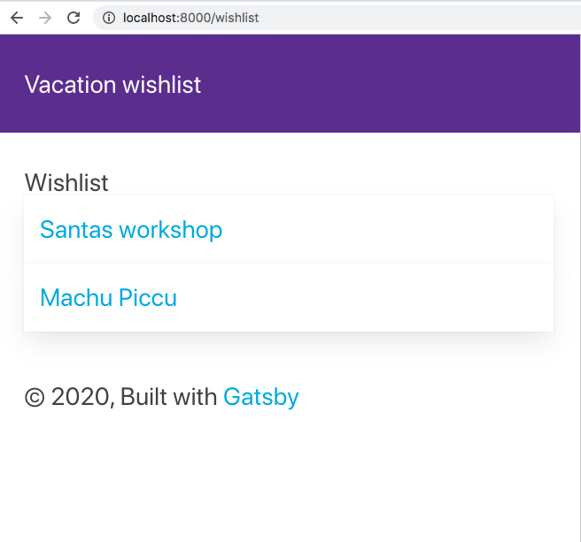

In this exercise, we will learn to build a sample application. We will learn how to:

- Add styling to our app
- Use plugins to work with JSON data
- Set up routing for wild-card routes and working with context data

## Building the Sample app

You can find the sample app the following GitHub repo [](TODO url to GitHub repo)

Our sample application shows us different Vacations we would be willing to embark on. You will be able see all your suggestions and you can also select a specific one and learn more details about that vacation suggestion.

You will build something that will look like this:



The above is a list view and represents all the possible vacations you would want to embark on.


### The plan

How do we get there?

We need to do the following:

- **Styling**, we choose SASS, SCSS to express our styling. We will add support for SASS/SCSS through a plugin that will help us compile it to CSS. Additionally we will use the library `Bulma` to add some extra styles.
- **Data**, we chose to represent our data as static JSON, we will need to add a Gatsby plugin to support transforming and adding JSON data to the Gatsby data Graph.
- **Routing**, Our list view will be a page component that we will place under the `pages/` directory. Thereby it will have routing out of the box.

### Scaffolding our project

All of our Gatsby projects start with the usage of the Gatsby CLI. To create a new project, we type:

```bash
gatsby new wishlist
```

We've chosen to name the project `wishlist` but you can call it whatever you want.

### Adding styles

There are many ways to add styling to a Gatsby app. We have chosen to use SCSS. For that we need to install a plugin

```bash
npm install --save node-sass gatsby-plugin-sass
```

We are also going to use some styles from the library `bulma`. To install that type the following:

```bash
npm install bulma
```

After that we need to open up `gatsby-config.js`, and add the following entry:

```javascript
plugins: [`gatsby-plugin-sass`]
```

Next we create a `styles.scss` under the `src` directory.

> [!NOTE]
> For larger projects you most likely want to create several *.scss files per domain/function

Let's now add the needed styles to `styles.scss`:

```scss
@import 'bulma/bulma.sass';

ul.list {
  box-shadow: none;
}

.card {
  margin-bottom: 2em;
  padding: 10px;
}
```

### Adding data

Create a `data/` directory under source. In the  directory, create a file `wishlist.json`. Your file-system should roughly look like so:

```bash
- | src/
--- | data/
------ | wishlist.json
```

Give the file `wishlist.json` the following content:

```json
[{
  "id": 1,
  "name": "Santas workshop",
  "description": "Adventure and mystery"
},
{
  "id": 2,
  "name": "Machu Piccu",
  "description": "Adventure, Hiking and History"
}]
```

Next, we need to install a plugin for Gatsby to pick up this data and have it added to the Gatsby data Graph. To install said plugin, we run the command:

```bash
npm install gatsby-transformer-json
```

Additionally we need to add some configuration in `gatsby-config.js`:

```javascript
`gatsby-transformer-json`,
  {
    resolve: `gatsby-source-filesystem`,
    options: {
      path: `./src/data/`,
    },
  }
```

This configuration is to ensure that Gatsby knows where to find the JSON data. The above reads: Look for data in the directory pointed by `path`, i.e our `/data` directory.

This creates the following entries in our data Graph `allWishlistJson` and `wishlistJson`. As you can see from the naming, it uses the name of the JSON file to create these entries.

`allWishlistJson` is used to list all the entries and `wishlistJson` is meant for filtering down to a specific request.

Let's visit our GraphQL query endpoint at `http://localhost:8000/___graphql`. We will be using the `allWishListJson` to create our data query:


On the left 1), we can see how we expanded our `allWishListJson` resources until we found the data we needed under `allWishListJson -> edges > node`. In the middle section 2) we see how the UI constructed the data query for us being:

```bash
query MyQuery {
  allWishlistJson {
    edges {
      node {
        description
        id
        name
      }
    }
  }
}
```

Finally on the right 3), we see the result of running the query, which corresponds to the content in our JSON file. The JSON content has now been imported into the Gatsby data Graph.

### Creating a list component

To list all the wishes in our wishlist, we need to create the page component `pages/wishlist.js` with the following content:

```javascript
import React from 'react';
import { graphql, Link } from 'gatsby';
import '../styles.scss';
import Layout from "../components/layout"

export default ({ data }) => {  
  return (
    <Layout>
      <React.Fragment>
        <h2>Wishlist</h2>
        <ul class="list">
        {data.allWishlistJson.edges.map(edge => <li><div class="card"><Link to={`/wish/${edge.node.id}`}>{edge.node.name}</Link></div></li>)}
        </ul>
      </React.Fragment>
    </Layout>
  )
};

export const data = graphql `
  query {
    allWishlistJson {
      edges {
        node {
          name
          id
        }
      }
    }
  }
`
```

We did three things:

- **Construct** a data query, note at the bottom how we construct a query to query for all the entries using the resource `allWishlistJson`. 
- **Import** styles, we import our SCSS styles with this import at the top `import '../styles.scss';` 
- **Render** data, Lastly we render out all the wishes by looping through them and render a `Link` component for each entry:

```jsx
{data.allWishlistJson.edges.map(edge => <li><div class="card">{edge.node.name}</div></li>)}
```

Let's inspect the results. Run the command `gatsby develop`. You should see the following if you navigate to `http://localhost:8000/wishlist/`:


## Summary

Congratulations you managed to create a list component. You also managed to style it with SASS/SCSS. Additionally you learned how to install and configure plugins to support the import and parsing of JSON data. :)
