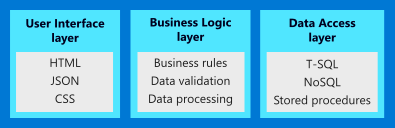
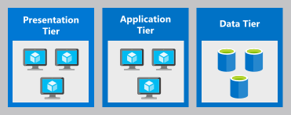

An N-tier architecture divides an application into **logical layers** and **physical tiers**. The **N** represents the number of physical tiers the application is separated into, which typically correlates with the number of layers. We could have a two-tier architecture (client-server), or even a five-tier architecture, though it's common, and often best to keep the number of tiers to four or less. 

Let's talk about what makes up the layers and tiers.

## What are layers?

Layers logically separate the application code that makes up an application. Each layer has a specific responsibility such as handling requests from users, running business logic, or handling the storage of data.

By separating an application into these logical layers, we treat each layer independently. This makes the components of the application modular and allows us to more easily maintain the app. As well, we can optimize the application for each responsibility. The layer handling web requests focuses on its primary task: handling web requests. It doesn't need to be concerned with the storage of data or running business logic. Conversely, the data access layer focuses on optimizing communication to the data store, and disregards details about how the data is presented to the user. This concept of limiting focus on particular features is called *separation of concerns*.

Here's a diagram that shows layers in a common N-tier architecture. Each layer handles one aspect of the application. The business layer manages communication between the user interface layer and the data access layer.

## What are tiers?

Tiers represent the physical separation of parts of your application on separate compute resources. In general, each **physical** tier runs one **logical** layer of the application.

Separating the architecture into physical tiers comes with several benefits:

- The application components can be scaled separately by adding resources to each tier.
- The application can be more resilient by adding load balancing to detect failed resources and redirect requests to healthy systems.
- The application can be more secure by restricting network communication between tiers and only allowing the access that is required.

Communication between tiers should be in a top-down fashion. Each tier is allowed talk to the next tier below it, but generally is not allowed to skip tiers. This is done to improve security by limiting the exposed surface area of a tier.

## The three-tier architecture

Of all N-tier architectures, a three-tier architecture is the most common. The responsibilities and names of each layer and tier vary by application and business, but a typical three-tier application has: a presentation tier, an application or middle tier, and a data tier. AS this is the most common N-tier style, for the rest of this module, we'll reference a three-tier model with each tier running a single layer of the application, and refer to them synonymously as tiers.

### Presentation tier

The presentation tier typically facilitates user requests. These could be end users accessing a web page, or public access to your application through an exposed API. The focus at this tier is on the user experience, providing things like an intuitive interface and ensuring secure communication between the end user and your application.

At this tier you're not concerned with the data itself, other than how it's presented to the end user. Typically there is no data processing or data access that is happening at this tier. This is the responsibility of the lower tiers.

### Application tier

The application tier (also often called the middle tier) typically focuses on handling the business logic of the application. This could be handling a customer order, tracking a shipment, or updating inventory based on materials received. This tier is also responsible for create, read, update, delete (CRUD) activities against the data tier. This is also a good location to make calls to dependent services, such as external APIs. 

This tier isn't concerned with how the information is presented back to the user, nor is it concerned with how the data is stored and retrieved. The focus is on the business logic required to fulfill the request that the application has received.

### Data tier

At this tier, the focus is on data storage. Storage of the data in tables, files, or other medium is the responsibility of this tier. This tier provides an interface (such as T-SQL) to access the data. In a three-tier architecture, the data layer provides data access to the application tier.

This tier is not focused on how the data is presented to the user, nor is it focused on any logic around the data. The usage of stored procedures may sit in this tier, but most of the logic around the data itself should be handled at a higher tier.

## When to use N-tier architectures

Now that we've talked about what an N-tier architecture is, let's discuss when would you use an architecture of this style. Consider an N-tier architecture for:

- Small to medium-sized web applications
- Migrating an on-premises application to Azure with minimal refactoring
- Leveraging skill sets and developer capabilities with on premises dev experience

Web applications are a good use case for architectures of this style. Because of the reduced complexity of this architectural style, and the often natural separation between responsibilities in web applications, N-tier architectures may work well. These could be public facing applications, or line-of-business applications used internally by an organization. For smaller or less complex applications, a two-tier (client/server) architecture might be sufficient, with the presentation and application tiers combined instead of separated.

N-tier architectures are common in traditional on-premises applications, so it's a natural fit for migrating existing workloads to Azure. Applications in this style are often migrated to Azure with minimal refactoring or modifications, simplifying the initial migration. Once on Azure, you can take advantage of platform-as-a-service (PaaS) services to further improve your application.

Since this is a common architectural style, engineers often have a higher level of experience and familiarity with it. By choosing this architecture, you can use  existing skill sets to deploy applications without ramping up on new architectural patterns. 