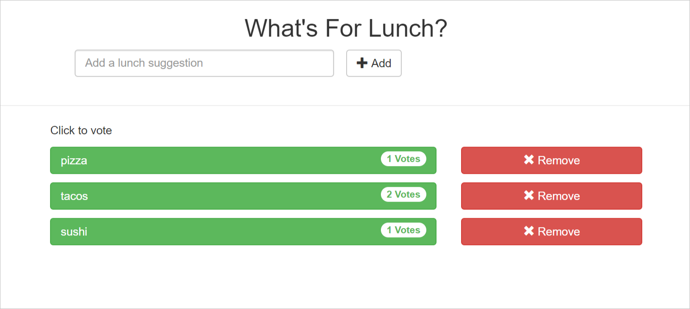
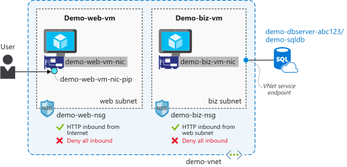

Remember our scenario about migrating an application from on-premises to Azure. What might this architecture look like? Your organization has a non-critical application that is a good candidate to try out. It's an application written to solve the all-too-common problem of picking what's for lunch.

Think of the last time you went out to lunch with a group of friends or colleagues. Did you find it easy to make a decision, or did you spend a lot of time trying to figure out what everyone really meant when they said "I like everything?" Let's deploy an application based on a three-tier architecture that might help you solve this problem. This application that lets you make lunch suggestions, and everyone can vote for their preferred choice.

We've created a template for this application that deploys each tier as Azure resources, then deploys the actual code. This application is an ASP.NET Core MVC application deployed on Linux servers, but you can use this architectural style regardless of the underlying OS platforms or SDK.

Here's a high-level visualization of what this template deploys.


## Deploy an N-tier architecture

1. Run the following command to start the deployment. The `az deployment group create` command starts a deployment into our sandbox resource group using the template file and parameters we specify. We also specify a random 32 character string generated from the `head /dev/urandom | tr -dc A-Za-z0-9 | head -c 32` command as the password parameter.

    The deployment takes approximately 5 minutes to complete.

    ```azurecli
    az deployment group create \
      --resource-group "<rgn>[sandbox resource group name]</rgn>" \
      --template-uri  https://raw.githubusercontent.com/MicrosoftDocs/mslearn-n-tier-architecture/master/Deployment/azuredeploy.json \
      --parameters password="$(head /dev/urandom | tr -dc A-Za-z0-9 | head -c 32)"
    ```

## View deployed resources and test the application

After the deployment has completed, test the application. Run the following command, which returns the URL for the app.

```azurecli
az deployment group show \
  --output table \
  --resource-group "<rgn>[sandbox resource group name]</rgn>" \
  --name azuredeploy \
  --query properties.outputs.webSiteUrl
```

Open a web browser, and visit the site. You see a box where you can add food choices. After you add an option, selecting it adds a vote.



## Three tiers of "What's For Lunch?"

This application is intentionally minimal in its complexity. It's a fun application, but still demonstrates a three-tier architecture. The template creates two virtual machines (VMs), an Azure SQL database, and the resources needed to support these resources, such as disks, NICs, and virtual networks. It also deploys the code to run the application on each tier. The virtual network we've deployed has two subnets, one for the presentation tier and one for the application tier, providing a security boundary for each tier.

We also applied tags to the resources as part of the deployment to reflect the tier the resource is supporting (`tier:presentation`, `tier:application`, `tier:data`). Tags are a method of applying metadata to Azure resources, and in this case they enable us to easily filter the resources for each tier.

Let's look closer at each tier. Here's a detailed visualization of the deployed resources.



### Presentation tier

Run the following command to list the presentation tier resources.

```azurecli
az resource list --tag tier=presentation --output table
```

In the three-tier architecture we've been referencing, this is the presentation tier. We've deployed the code responsible for the web interface on this tier, it presents the UI, and directly handles user requests. The only concern of this tier is the presentation of the web site to the user. It doesn't have direct access to the data, and doesn't include business logic.

We've deployed a web server called **demo-web-vm** that is running the web site we're accessing. The server has a network interface **demo-web-vm-nic** that has a public IP address **demo-web-vm-nic-pip** associated with it. This public IP address is the URL that we retrieved earlier. It also has a network security group **demo-web-nsg** that allows only port 80 (HTTP) traffic inbound from the internet. This network security group restricts access to only the website, and prevents access via unnecessary ports that could be used maliciously. This tier communicates with the presentation tier over HTTP to fulfill the request for the user.

### Application tier

Run the following command to list the application tier resources.

```azurecli
az resource list --tag tier=application --output table
```

We've deployed the application tier on a VM called **demo-biz-vm** that is running the business logic. It also has a network interface, **demo-biz-vm-nic**, but this network interface only has a private IP address, providing no mechanism for direct inbound connectivity to the server. It also has a network security group, **demo-biz-nsg**, that only allows access from the subnet of the presentation tier.

This tier is the conduit for the application to access the data. The code that exposes the API that the presentation tier calls is deployed on this server. No data is stored here, and users aren't able to access this server directly. To access data and fulfill user requests, this tier communicates with the data tier through T-SQL commands.

There's a simple example of business logic incorporated in the application at this tier. There's server-side validation of the lunch suggestions, comparing them to a list of acceptable values. If you try to add something that isn't on this list, it's not accepted. A message is returned with the valid lunch options.

### Data tier

Run the following command to list out the data tier resources.

```azurecli
az resource list --tag tier=data --output table
```

The data tier is an Azure SQL Database server, **demo-dbserver-abc123** (we add a random string to the server name for global uniqueness). This server stores the data for the application in a database called **demo-sqldb**. This tier of the application is solely concerned with the storage of data, and providing a method to access it. In this case, the access is through T-SQL, which the application executes against the database. We're not handling any business logic at this tier, nor are we doing any presentation of data back to the user.

This tier exposes connectivity over port 1433 through a VNet service endpoint. VNet service endpoints are a mechanism to connect PaaS services (such as Azure SQL Database) to a subnet, and restrict connectivity to only the resources within that subnet.

This is also an example of using PaaS services in place of infrastructure as a service (IaaS) VMs to run a tier of an application. We often think of N-tier applications as VM-based applications, but that isn't a requirement. By using PaaS services in place of VMs, you can lower your costs, increase security, and reduce administration requirements.
