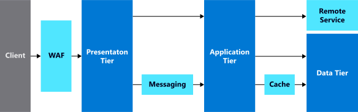

We've looked at what makes up an N-tier architecture, and we've deployed an example of a three-tier architecture. Let's explore some of the benefits and challenges of this architectural style, and best practices to optimize it for performance and security.

## Benefits

This style of architecture is beneficial in its simplicity. It's an often used and well-defined architectural pattern, both for on-premises and cloud deployments, and can work with a wide range of applications.

It's a platform-agnostic architecture, and fits applications deployed on Windows or Linux. As we showed in our example environment, you can use PaaS or IaaS services at any tier.

With the application separated into tiers, each tier can be scaled, updated, or upgraded independently. If requests for our website increase, we can add more web servers to the load without impacting the other tiers. Similarly, if requests against our data tier increase, we can scale our database to have more capacity to handle the requests.

Network separation is a natural byproduct of this architecture. Because the application is separated into tiers, we should isolate each tier, and only allow necessary network access. The presentation tier can be exposed to the internet, the database can be fully secured behind multiple network tiers, and our application functions just the same. By securing network access between tiers, we reduce the attack surface of the application, and increase its security.

## Challenges and considerations

As you separate your application into multiple tiers, avoid middle tiers that only perform database operations. Each tier should add specific value. Extra tiers add complexity, processing time, latency, and ultimately delay to the user.

Because the APIs for each application-level domain aren't separated into individual services, they must be scaled together. If a single application method requires more processing power or needs to handle more requests than others, the application tier must be scaled out as a whole to handle the load, instead of an individual service.

In some cases, you might develop an application as an N-tier architecture, but still do deployments as a monolith. By fully separating out each tier, you should deploy each independently. Full separation involves the removal of shared dependencies, and a greater reliance on API calls between tiers. When done properly, it ensures your application deployments are flexible.

Applications in an N-tier architecture often get deployed on VMs. This is a good first step, but evolving your application to use PaaS services provides numerous benefits in security, scalability, and administration. This evolution is often overlooked, and N-tier architectures remain resident on VMs.

N-tier is a classic architectural style, but in many scenarios it's superseded by other modern design patterns, such as a microservices architecture. It's often worth investing some time to evaluate other architectures to see if they're a better fit for your application.

## Best practices for N-tier architectures

There are several things you should do to ensure your N-tier architecture runs at its best. The following diagram shows visually how you can make improvements to an N-tier architecture.

### Optimize performance

Let's look at ways to optimize an N-tier architecture for both performance and security.

#### Autoscaling

With the application separated into tiers, we can use cloud features, such as autoscaling, to adapt to system load. As users or requests increase, use autoscaling at multiple tiers to add more resources to handle requests. As requests drop, autoscaling reduces the compute resources, also reducing your bill. Autoscaling makes it easy to ensure your users have the best experience, and that your costs remain low. Azure Virtual Machine Scale Sets can be used for VM-based workloads, and many PaaS services, such as Azure App Service, have built-in autoscaling capabilities.

#### Load balancing

As you scale out your application with autoscaling, the use of load balancing becomes a necessary piece of your architecture. With load balancing, as you add more compute resources to your tier, they're added to your load balancer distribution to take advantage of the additional processing power. Conversely, when a system fails, it's removed from the load to minimize user impact through poor performance or erred requests. This ensures user requests go to systems in a healthy state. Azure load balancer is a built-in feature of the networking capabilities, and Application Gateway provides a more feature-rich HTTP load balancing solution.

#### Messaging

The use of a messaging service between tiers has a positive effect on performance, especially on requests that are asynchronous in nature. The service places a message in a queue, where it remains until it's processed, offsetting the impact of downstream load. If a system outage occurs, a messaging service ensures that your message is still handled. The message remains in the queue and is processed after the system is back online. Azure has several messaging solutions to choose from, depending on your requirements. Azure Service Bus, Azure Storage queues, and Azure Event Hubs are a few to look at when looking for a messaging service.

#### Caching data

Use a cache for data that is frequently accessed and has a low change rate, or for data that doesn't require long-term persistence, such as session state. Caching systems sit between tiers, and reduce data retrieval times for these types of data. Azure Cache for Redis is a PaaS service that is well suited for this scenario.

### Optimize security

Optimizing your application for security, is often a job that is never "done." Even though the application is separated into tiers, there still must be well planned security practices woven into the architecture. The more tiers that you add, the more you need to secure, and the more you introduce complexity into the system. There are several things you should do to ensure your architecture provides a secure environment to run your application.

#### Network isolation

When running an N-tier architecture on VMs, ensure that each tier is in its own subnet. This subnet acts as a security boundary, allowing you to isolate connectivity through network access control lists. The subnet also eases management by ensuring new systems in the subnet receive the same rules. In Azure, this is done natively with network security groups (NSGs). Similar considerations should be made for PaaS services, but network integration capabilities vary between services and should be evaluated on their own. It's a best practice to ensure that each tier may only communicate to the next tier below it. The presentation tier should only be able to talk to the application tier, and the application tier should only be able to talk to the data tier. Minimizing this connectivity provides a layered approach to network security, and improves the overall security posture of an architecture.

#### Web application firewall

With the security isolation between subnets in place, you want to ensure that your publicly exposed front end is secure, and only allows access to what is needed. You should only expose your presentation tier to inbound internet traffic. A web application firewall (WAF) technology in front of your presentation tier enhances the security at this tier. WAFs inspect traffic for malicious activity, ensure communications are encrypted, and alert you if something is out of the ordinary. In Azure, Application Gateway is an HTTP load balancer that has a built-in WAF that you can enable.
