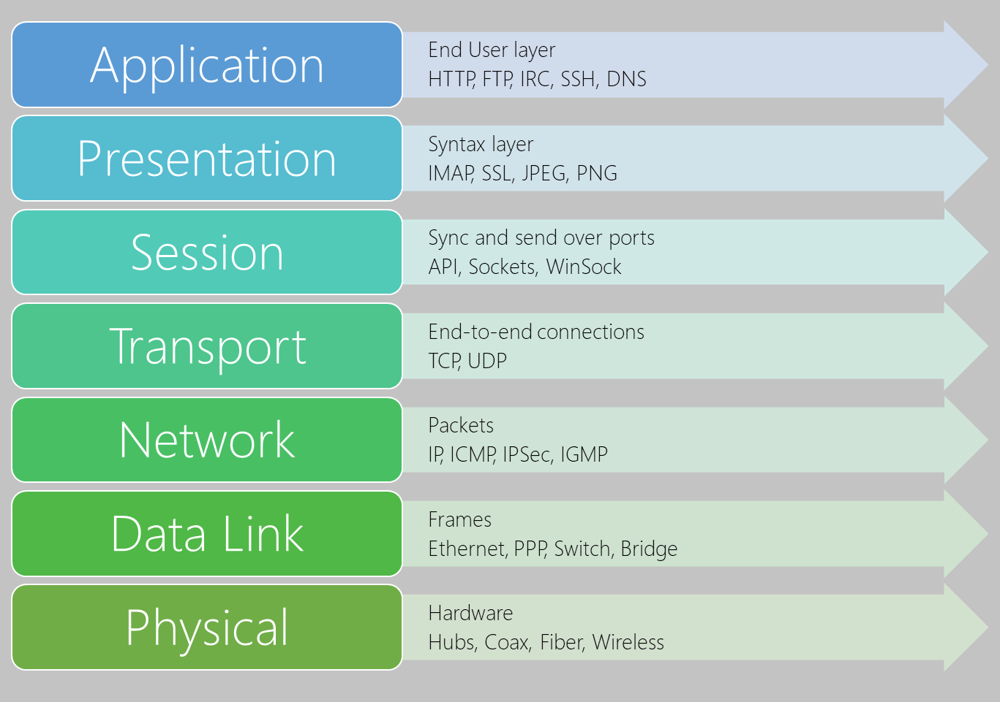

The next step in understanding the composition of a network is how they're built. A network cannot exist unless each of the devices has the means of communicating with each other. This knowledge applies whether it's your own organization's network or more extensive networks like the world wide web. All networks are built on the same principals.

In this until, you'll learn about the hardware that forms the backbone of any network, hubs, switches, and routers.

**7 layer OSI network model**

## Network Infrastructure

All networks, regardless of their type or usage, are comprised of the same fundamental hardware. Hubs, switches, routers, and wireless routers.

## Hub

To build a network, you need a means of connecting different devices together.  The simplest and most basic network device for achieving this is a hub.  It is also known as an Ethernet hub, multiport hub, repeater hub, or network hub.   Each of them operates in the same fundamental way.   The hub will contain multiple ports, which traditionally come in groups of 4, 8, 16, 24, and 32, etc. A port is an input/output Ethernet connection between the hub and a network device, like a computer.   A hub can only operate at one speed, and that is the speed of the slowest network device on the network.  A hub is unaware of the type, or nature, of the devices connected to it.

As a signal arrives at one port, it's replicated to every other active port in the hub.  An active port is one where a network device is connected.  For example, if you assume a four-port hub, with ports 1, 2, and 4 active.  When a signal is received by port 1, the signal is output to ports 2 and 4.

A hub operates at the physical level of the 7 layer OSI network model.

### Physical level functionality

A hub is quite a simple device.  It allows multiple networked devices, linked by an Ethernet cable, to send packets of data between each other.  The hub will only handle one active signal at a time.  Like a switchboard operator, that can speak to anyone, it can only talk to one person at a time.  When it receives two signals from two different devices at the same time, there's a collision.  When a collision occurs, the hub discards both of them, rather than re broadcasting them to all the other ports.  A hub can't parse or interpret a signal packet when it arrives.  It can acknowledge the signal, detect when there's a gap in the signal, and detect a collision.

### Connecting Hubs

Signal or packet collision is common in a hub-based network.  Because of these collisions, there's a limit to the size of a hub-based network can be.  For a 10-Mbit/s 10BASE-T network, you should have no more than four hubs/repeaters.  For a 100-Mbit/s network, you should have no more than two Class II hubs.

While hubs are now used for small ad-hoc networks of a few devices, they're rarely used at an enterprise level.  In those instances, Switches are used.

### Types of hub

- Fast Ethernet - Used for 100-Mbit/s networks, these come in two types. Class I and II.  The primary difference between the two is the amount of delay,  Class I introduces a signal delay of up to 140-bit times, and Class II has a delay of up to 96-bit times.  The delay allows for the transcoding of data between different base types.  Given the higher speeds, and that's why the increased likelihood of collisions, only two Class II hubs can be used in a hub-based network.
- Dual Speed - With a traditional hub network, the speed of the network was governed by the slowest network device attached.  So if you had a mix of 10 Mbit/s and 100-Mbit/s devices, the whole speed of the network would be 10 Mbit/s. To get around this, dual speed hubs were introduced. They acted as a bridge between the two different speeds.

## Switch

The Ethernet switch is the most common form of network connectivity device.  The Ethernet switch was invented to get past the limitations of network hubs.  Rather than re broadcasting a packet to every connected device, the Ethernet switch redirects the packet to the correct device.   Each network-enabled device has a MAC address.  The MAC address is a physical identifier for the network device.  The switch maintains an internal list of all the MAC addresses connected to it.  When an Ethernet packet is received, the switch reads the header to find the destination address, and then either routes the packet to the correct machine or passes the packet onto another switch in the network, where the process is repeated.

### Features

Modern Ethernet-based switches offer more functionality and capabilities than an Ethernet Hub.

- An Ethernet switch can adjust the connection speed of an inbound packet to match the connection speed of the destination network.
- Many switches now support Power over Ethernet (PoE).  PoE enables network devices like Voice Over IP (VOIP) phones to get power from the switch, without needing a separate power supply.
- Other modules can be attached to the switch to enable functions like port mirroring, packet sniffers, and intrusion detection systems.

A switch operates at the data link level of the OSI model.

### Types of Ethernet switch

There are two distinct types of switch, unmanaged and managed.

#### Unmanaged

This type of switch has no configuration capability.  It's designed for small office/home office environments.  Packet switching occurs automatically.  An unmanaged switch isn't different from an Ethernet hub.  Unmanaged switches tend to be at the cheaper end of the market.

#### Managed

This type of switch offers the means to adjust the configuration, behavior, and operation of the switch.   Access to the switch configuration will be through either a Command Line (CLI) using telnet or SSH, Remote Console, or via a web interface.

Here is a list of the more commonly available options that you can configure on a managed switch.  Each switch manufacturer will offer their own flavors of these.

- Quality of Service (QoS) - Manage LAN traffic so critical systems are given higher priority. For example, voice-data packets, which need to be delivered quickly.
- Virtual LANS - Create logical groups of devices in their own virtual LAN.  Traffic in one virtual LAN wouldn't cross over into another virtual LAN.  This can improve security and also the performance of the network.
- Spanning Tree Protocol (STP) - Build resilience into your network by defining alternative network routes in case a cable or device fails.
- Port Mirroring - Typically used with a network analyzer to diagnose network issues and problems.  When setting up, the switch exports a copy of the network traffic to a single port.
- Bandwidth rate limiting - allows fine control of the bandwidth used by specific ports.   High bandwidth for ports handling database or VOIP, lower bandwidths for email, etc.
- MAC address filtering - provides the ability to control which network devices can be used or have access through the switch.
- SNMP client - set up and configuration of SNMP with your network monitoring tools.

There are two subtypes of managed switch:

- Smart - These are a half-way point between an unmanaged and a managed switch.  They tend to offer only a web-based interface to manage the configuration.  The available options are virtual LANs, port mirroring, and bandwidth rate limiting.
- Enterprise - This is the fully managed switch service described above.

## Router

If a switch is used to route network traffic between devices on your network, a router is responsible for routing network traffic between interconnected networks.   The router reads the header and knows if the data traffic is internal to the network or external to the network.  

An excellent example of this is the cable/DSL router in your home, usually provided by your Internet Service Provider.  It allows all your IoT devices, smartphones, tablets, laptops, and printers access to the Internet.  In your organization, you'll have enterprise-grade routers, designed to provide high-speed connectivity using optical fiber or a dedicated backbone to the Internet.

### Interconnectivity

Each router in an interconnected network maintains a routing table that lists the preferred route between each of the interconnected networks.  The router acts as the start of authority for all the network devices on its network.  Routing information is shared between routers using a routing protocol like BGP or EBGP.

### Types

The majority of routers will use the Border Gateway Protocol (BGP) to share routing information.   The type of information shared depends on the usage of the router and the functions they use.

There are several distinct classifications or types of routers available. Each service a different need.

- Access routers are typically used in a home or small satellite offices.  These tend to be low-cost devices, with a simple routing need.
- Distribution routers compile traffic routing data from multiple routers. Designed to hold vast quantities of routing information, distribution routers come with more significant memory and processing power.   They're often used to manage and control the quality of service across your WAN.
- Edge routers operate at the boundary between your network and other networks, such as a WAN or the Internet.   They act as gateways, filtering traffic and routing it internally or forwarding depending on the packet header.  An edge router will often come with access control, or firewalls to improve the security. It may also handle DHC and DNS services, as well.
- Core routers, sometimes called enterprise routers, are designed for higher bandwidths.  They're used to connect different builds or geographic locations together.  Core routers tend to have fewer features than edge routers since their primary focus is on minimizing packet loss and preventing congestions. They tend to do packet forwarding to edge routers.

## Wireless Router

This network device provides all the routing capabilities of a regular access router, but also offers wireless access point functions.  There are several flavors of the wireless router: wired, wireless only, and hybrid wired and wireless.  The latter is the most common in use today.

A wireless router shouldn't be confused with a wireless modem.  A wireless modem is typically what you receive from your ISP for your home or office.  It can act as a switch, letting all connected devices communicate with each other as well as providing access to the Internet.

A wireless router or wireless access point is designed to provide a non-wired connection to your network. Any provision to access the Internet or other networks is handled by an edge router associated with your network.  A wireless router lets you build a different type of network called a Wireless Local Area Network.

## The 802 family of standard

The 802 specification covers all the physical networking standards for both Ethernet and Wireless.   The table below shows some of the more widely used standards.

| **802**   | **Overview**                        | **Basics of physical and logical networking concepts.**      |
| --------- | ----------------------------------- | ------------------------------------------------------------ |
| 802.1     | Bridging                            | LAN/MAN bridging and management of the lower sublayers of OSI Layer 2. |
| 802.2     | Logical Link                        | Commonly referred to as the Logical Link Control specification (LLC). |
| **802.3** | **Ethernet**                        | Provides asynchronous networking using "carrier sense, multiple accesses with collision detect" (CSMA/CD) over coax, twisted-pair copper, and fiber media. |
| 802.5     | Token Ring                          | The token-passing standard for shielded copper cables and twisted pair. |
| 802.11    | Wi-Fi                               | Wireless LAN Media Access Control and Physical Layer specification. |
| 802.11a   | Wi-Fi                               | Specifies a PHY that operates in the 5 GHz                   |
| 802.11b   | Wi-Fi                               | Enhances 802.11, adds higher data rate modes.                |
| 802.11d   | Wi-Fi                               | Enhances 802.11a/b, allows for global roaming                |
| 802.11e   | Wi-Fi                               | Enhances to 802.11, adds quality of service (QoS) features.  |
| 802.11g   | Wi-Fi                               | Extends WLAN maximum data rate.                              |
| 802.11 h   | Wi-Fi                               | Enhances 802.11a, now resolves interference issues.          |
| 802.11i   | Wi-Fi                               | Enhances 802.11, adds security for WLAN applications.        |
| 802.11j   | Wi-Fi                               | Enhances 802.11a for Japanese regulatory extensions.         |
| 802.11n   | Wi-Fi                               | Higher-speed standards                                       |
| 802.12    | Demand Priority                     | Ethernet data rate increased to 100 Mbp/s                    |
| 802.15    | Wireless Personal Area Networks     | Support for Wireless personal area networks (WPANs).         |
| 802.15.1  | Bluetooth                           | Short range (10 m) wireless technology.                       |
| 802.15.3a | UWB                                 | Short-range, high-bandwidth "ultra wideband" link            |
| 802.15.4  | ZigBee                              | Short-range wireless sensor networks                         |
| 802.16    | Wireless Metropolitan Area Networks | Covers Mobile and Wireless Broadband Access in a Wireless Metropolitan Area Networks (WMANs.) |

## Azure options

There are a couple of azure options that can help with routing and managing your network traffic.

### Azure hub-spoke

This is a reference architecture. The hub is usually an Azure virtual network that acts as the central connection point between the cloud and your on-premises network.  Each of the spokes is also Azure virtual networks, usually connected to the hub via a peer network.   Connections between the cloud and the on-premises network can be made through VPN gateway or ExpressRoute.

### ExpressRoute

An ExpressRoute is a dedicated circuit between your on-premises network and the cloud that uses a much higher bandwidth than a regular VPN gateway connection.  An ExpressRoute circuit is hosted by a connectivity partner and provides a super resilient connection.
