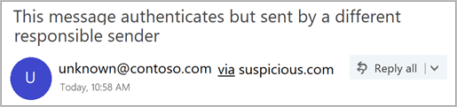
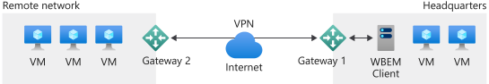
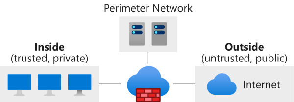
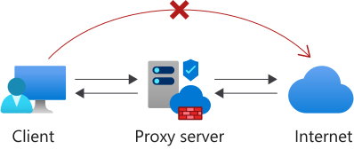
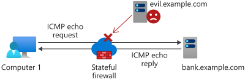
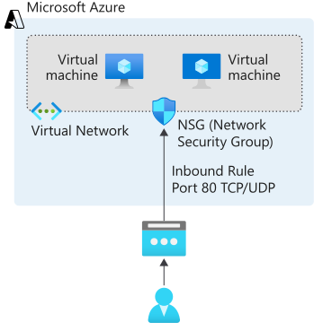
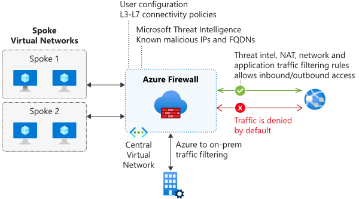
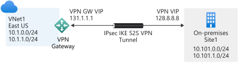

A vulnerable network can be exploited by attackers to steal information and render services and resources inaccessible. Such an attack on our organization can lead to reputational and financial loss.

In this unit, we'll get an overview of network security and some of the different types available. We'll also learn about network security zones and firewalls. Finally, we'll explore the network security tools we use to strengthen network protection in Azure.

## Overview of network security

We need robust security to diagnose and prevent suspicious events, attacks, and weaknesses in our network. There are many reasons why security-related issues arise and several ways we can deal with them. There exist different types of network security strategies that we can use to help deal with these issues.

### Access control

We use access control to scrutinize every user and client to judge whether they have permission to access our network or its resources. Access control is implemented by configuring security policies that ensure the user has the right level of permissions assigned to do specific actions on our network. For example, we might want to deny read access for some resources when the user is connecting from outside our on-premises location.

### Anti-malware tools

Anti-malware tools protect our network from malicious software (malware). Malware comes in different forms, including:

- Ransomware
- Viruses
- Spyware
- Trojans

We use anti-malware and antivirus tools to monitor and remedy malware. These tools can detect anomalies in our files, taking actions to remove malicious pieces of code, and repairing affected resources and devices on our network.

### Application security

Attackers can compromise applications whether applications are our own or owned by a third party. The software may inadvertently contain security vulnerabilities that an attacker might use to access devices and network resources. If an application is developed in-house, we'll need to make sure we actively find and fix vulnerabilities that attackers could abuse. One solution is to test our application during its development life cycle and implement whatever changes are needed to fix a potential vulnerability. If we're dealing with an application development elsewhere, it's a good practice to apply updates as soon as they're available.

### Behavioral analytics

We use behavioral analytics tools to establish regular usage and behavior across our network and identify any suspicious changes. 

For example, let's assume we detect a user office user starts accessing our network outside their standard usage patterns. Usually, the user accesses the network from one location in the United States during work hours. If their credentials are suddenly used to attempt, access from Australia at midnight, the attempt would be flagged as suspicious.

To address this problem, we can create security policies based on these analytics.  We can deny access pending additional verification, like a secret code sent to the user's work mobile device.

### Email security

Attackers often use email to access our network. An email that looks genuine might ask users to select a link and provide details that the attacker uses to access resources and devices on our network. Email applications like Microsoft Outlook help us identify suspicious messages and senders.

### Intrusion detection and prevention

We want to take a proactive and preventative security posture for our network. The earlier we can identify intrusion, the better. We can use intrusion prevention and detection tools together to monitor all our network traffic.

For example, Azure Network Watcher can provide data to an open-source intrusion detection system. From this system traffic is analyzed across our network on Azure, and we're alerted about intrusions.

### VPN

A virtual private network (VPN) can establish an encrypted connection from one network to another over the internet. The VPN configures an encrypted tunnel that either uses TLS or IPSec to provide secure communication and remote access capabilities across our networks.

### Web security

We can employ tools that secure how our people use the web. For example, we use a web filter to prevent users from accessing certain types of sites that have been red-flagged. These web security tools also allow us to set up policies that help us decide how we want to handle different types of web requests in our network.

### Wireless security

The wireless portions of our network aren't as secure as the wired portions. A wireless network is accessible from outside of our organization, depending on the strength of the wireless signal. Different tools are available to scan and monitor activity on the wireless portions of our network. The first step to securing a wireless network is to make sure we use the strongest type of encryption available on wireless devices. Second, configure a separate wireless network for guests to prevent visitors from using the wireless network intended for internal users.

## Network security zones

A network security zone is a network segment that has specific security policies applied to it and often separated from other network segments by firewalls. There are three different types of security zones.

### Trusted or private zones

A trusted or private zone contains the resources and devices that should never be accessible to anyone who's outside of our organization. Examples include printers, workstations used by internal users, and internal servers. In this zone, we'll configure the devices with private IP addresses.

### Public zones

A public zone contains everything outside of the organization. This zone is part of the internet or another network and not in the control of the organization.

### Perimeter network (also known as DMZ, demilitarized zone, and screened subnet)

The perimeter network is a zone where resources and services accessible from outside of the organization are available. For example, we can use a perimeter network to provide access to an application, a partnering organization, or a supplier.

### Zone filtering policies

Zone filtering policies handle the flow of traffic as it travels between different zones. These policies include:

- **Inside-to-outside** and **inside-to-perimeter-network**. This type of filter scrutinizes all traffic that originates from the inside and is headed to the perimeter network. For example, our internal staff members may want to access a public website. The traffic would be inspected to check whether the website is trustworthy.

- **Outside-to-inside**. This type of filter blocks traffic coming from outside into our network. The only traffic permitted will be traffic that is a direct response to a request that originated from the inside zone. For example, when an internal staff member requests a web page from a server, the response is allowed (if it's a trusted source), so the user can browse the site.

- **Outside-to-perimeter-network**. This type of filter inspects all traffic coming from the outside and going to the perimeter network. The traffic will either be permitted or denied permission. The type of traffic that may be allowed to pass through include email and HTTPS traffic.

- **perimeter-network-to-outside**. This type of filter inspects traffic that comes from the perimeter network and leaves our network. Traffic is permitted to travel outside the network based on firewall rules and the resource or client starting the request. For example, a mail server in the perimeter network might need to sync with another server that's outside the network. In this case, we'll configure firewall rules to decide what should happen.

### What is a network firewall?

A network firewall is a security appliance that blocks or remedy unauthorized access into our network. Network firewalls also monitor and make logs of all traffic across our network. We use security policies to configure our network firewalls to take appropriate action on all traffic across our network. Network firewalls can be hardware or software implementations.

A **hardware firewall** can be a standalone physical device or form part of another device on our network. Physical devices like routers, for example, already have a built-in firewall. Hardware firewalls are expensive to operate and typically found in large organizations.

A **software firewall** is installed and configured on a device, like a workstation or a server. Software firewalls have flexible features and can be run on many devices more cost-effectively, compared with hardware firewalls. However, certain sophisticated breaches can more easily compromise these types of firewalls.

### Firewall types

Firewalls can perform several different functions across our network.

**Application-layer firewalls** can be a physical appliance, or software-based, like a plugin, or a filter. These types of firewalls target our applications. For example, they could affect how requests for HTTP connections are inspected across each of our applications.

**Packet filtering firewalls** scrutinize each data packet as it travels through our network and, based on rules we configure, decide whether to block the specific packet or not.

**Circuit-level firewalls** check whether TCP and DUP connections across our network are valid before data is exchanged. For example, this type of firewall might first check whether the source and destination addresses, the user, the time, and date meet certain defined rules. When these checks pass and a session starts, data is exchanged between parties without further scrutiny.

A **proxy server firewall** controls the information that goes into and out of a network. Firewall proxy servers provide safety and security by providing internet access to all devices on a network. This ability means the server can monitor, filter, and cache data requests to and from the network.

**Stateful firewalls and next-generation firewalls**. Stateful firewalls inspect characteristics about the connections on our network. The firewall also monitors packets over time and stores a combination of this information in a state table. When a connection and packet match aren't recognized, based on the information held in the table, traffic is blocked.

**Next-generation firewalls** do many of the same functions as stateful firewalls. But they can encompass more functions from other types of firewalls such as packet filtering, VPN support, and more. This type of firewall also investigates packets more thoroughly when compared to stateful firewalls. For example, a next-generation firewall could look at the payload for each packet and inspect it for suspicious characteristics and malware.

### The importance of firewalls

Firewalls help protect our network from the outside world. If we don't have a firewall set up:

- An attacker could employ malware and take advantage of our bandwidth to use it for themselves
- Sensitive and private information about employees and clients could be stolen
- Our resources, devices, and the entire network could be held to ransom

It's important to place firewalls between our network and any outside connection. We can combine different types of firewalls to 
achieve the most robust network security.

## Azure network security tools

Azure provides a number of tools we can use as part of our network security. Each of these tools is designed to address a different aspect of our network's security.

Azure lets us build our own networks through Azure Virtual Networks. We use **Azure Network Security Groups** to filter traffic from Azure and on-premises resources to, and from, resources that form part of our VNets. An Azure Network Security Group filters traffic through security rules that we specify to deny or permit different types of traffic across our networks.

We can also log all the traffic flowing through our network security groups for analysis. We use Azure's Network Watcher service and enable NSG flow logs. Our logs will then be stored for use in a JSON file in a storage account.

**Azure Firewall** - is a fully managed firewall we can use to protect the resources that are inside our Azure Virtual Networks. Because Azure Firewall is cloud-based, it comes with certain advantages. We won't have to worry about whether Azure Firewall can scale to the number of resources on our networks. It comes pre-configured with high availability to prevent our firewall from going down.

We connect our on-premises network to our Azure Virtual Networks by configuring a **Site-to-Site VPN** connection with Azure. We'll use a VPN Gateway (which is a VPN appliance from Azure), along with our local VPN device, to establish a VPN tunnel for communication. Our cloud and on-premises resources then communicate across the VPN tunnel.

We can also set up a **Point-to-Site VPN** connection between Azure and our on-premises network. Here, individual users and clients can connect to our Azure resources through a secure tunnel.

### Azure network security considerations

There's much we can do to improve network security on Azure. Below are a few of the things we should consider implementing.

Use **Azure network security appliances**, developed by Microsoft partners on the Azure marketplace, to improve network security. This range of appliances provides a number of functions including:

- Detecting anomalies on our network
- Identifying and rectifying vulnerabilities
- Web filtering
- Antivirus protection

Configure **Azure Virtual Network Service Endpoints** so that critical Azure services we might use only connect to our Azure virtual networks, and not to the public internet. These services include:

- Azure SQL Database
- Azure Storage
- Azure App Service
- Azure Key Vault

**Disable SSH/RDP** access whenever possible. While these protocols are used to manage our virtual machines from a remote location, attackers could attempt brute-force attacks if no proper protections are in place. Instead, create a point-to-site VPN connection first, before enabling SSH/RDP for remote management.

Use **load balancing** to improve the performance and availability of our network. When we use a load balancer, we distribute network traffic across the machines in our network. For example, if we have a couple of web servers that look after a website as part of our network, we can configure a load balancer to distribute the traffic between them. This way, we improve the performance and availability of the website.

Use **Azure DDoS protection**. A Distributed Denial Of Service (DDoS) attack overloads resources or services across our network so that they become unusable or inaccessible. Azure provides automatic traffic monitoring and mitigating for DDoS attacks through its protection service. We can interact with the service and enable additional features, like having access to DDoS experts, by upgrading to the standard tier.
