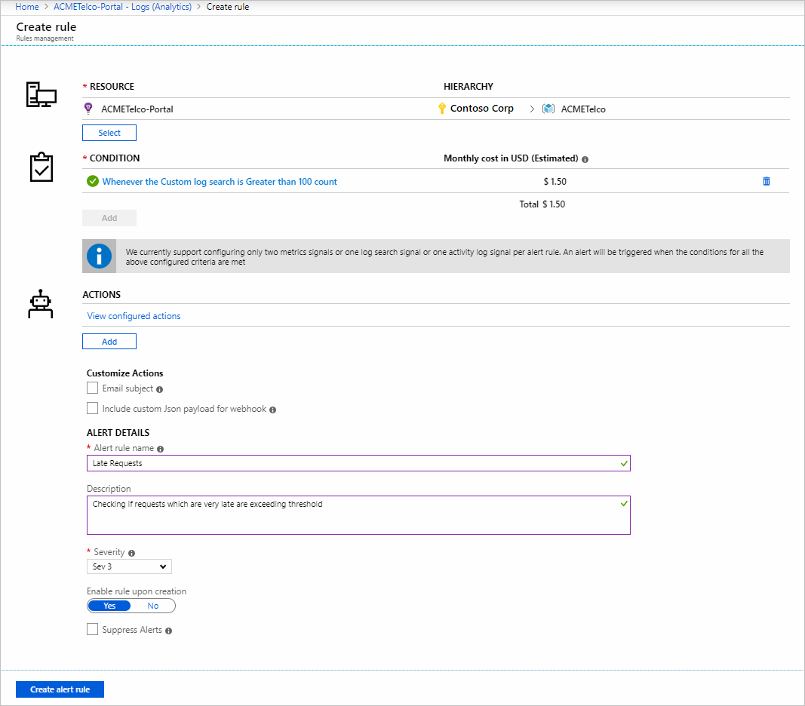
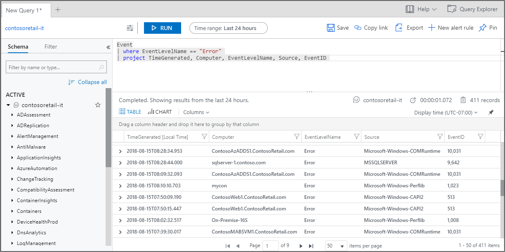

Our organization has servers, applications, services, and data, all of which are crucial to delivering services and products to our customers. We need to monitor our network regularly to protect our organization's assets and resources.

In this unit, we'll explore some of the different network monitoring tools available. We'll explore best practices, like how to separate our monitoring tasks and functions, and we'll also look at the tools available for alerting and monitoring on Azure.

## What is network monitoring?

Network monitoring is when we monitor all the components of our network, like switches, routers, servers, and firewalls. We monitor our network for performance and faults and continuously analyze the information we gather. When we monitor a network, we're taking a preventative approach to issues. As a result, we're improving the availability of our network, reducing downtime and failures.

### Agent-based monitoring

Network monitoring solutions are often agent-based. An agent is a piece of software that runs on the monitored device. The agent monitors and gathers information on the device then sends information to the appropriate network monitoring solution that employed it.

The agent helps gather granular data on the monitored device, such as the processes running and its hardware performance. For example, an agent could gather information on the processes running on the device, or its hardware performance. Keep in mind that an agent needs time to install and configure. The agent might also require maintenance and update tasks that may be time-consuming if there are many agents.

### Agentless monitoring

Here, an agent isn't deployed to monitor devices. The networking solution gathers information on the device by looking at things like transferred data packets. The networking solution could also look at APIs that the device uses to send information about itself. Agentless monitoring helps us avoid having to configure and maintain agents on devices. However, the information we gather might not be as granular as when we're using agent-based monitoring. Some devices may also not expose the information we need.

### Monitoring intervals

Monitoring intervals show how frequently we want to poll for information on one of our network devices.

The interval frequency depends on what we want to monitor. For example, we'd use the shortest interval possible if we're monitoring to see if a particular device is available or not. If we're monitoring for things like memory and CPU usage, we could have intervals of a few minutes. We don't necessarily want to monitor every device at the shortest intervals possible for each metric because we'd add unnecessary load to our network.

### Protocols

To monitor our network, we'll need to use a secure network management protocol that consumes minimum bandwidth. We want to keep our network secure and prevent unnecessary load on network performance. The following are some network management protocols that can be employed:

- **Simple Network Management Protocol (SNMP)**

  Like switches and routers, the majority of Linux servers and network devices use SNMP. An SNMP-based agent is already preinstalled on the device and allows for configuration. The SNMP agent collects things like traffic on our network switch, memory usage, or even printer queues. The SNMP protocol communicates information about our device to our network monitoring and management solution (NMS).

- **Windows Management Instrumentation (WMI)**

  Windows devices use WMI to provide information about the status of our device. We also use WMI to make changes to devices, such as scheduling processes to trigger, or updating system properties and settings. Windows Management Infrastructure is a newer version of WMI that has upgraded capabilities, such as better integration with PowerShell to run commands and scripts.

- **System Logging Protocol (Syslog)**

  Syslog is a protocol that lets our device send event messages and is used for event logging. For example, our web server might use Syslog to log events about failed attempts to access it, or our router could log events on user activities.

## Best practices

### Fault, configuration, accounting/administration, and performance management (FCAPS)

When we manage a network, we deal with many different tasks and functions. These tasks and functions have been categorized to help us do them effectively. The categories are fault management, configuration management, accounting/administration and performance management, or FCAPS:

- **Fault management**. Fault management relates to the processes and tasks used to identify and resolve faults on the network. Dealing with issues that could cause problems later is also classified as fault management.

- **Configuration management**. Configuration management includes aspects like collecting information based on changes made to the configurations of devices, physical hardware, and network changes as well as software updates.

- **Accounting/administration**. Accounting applies when we're dealing with a network used in a service provider setting, and all the tasks and functions that apply. With service provider networks, usage needs to be monitored to track utilization and billing for users. If the network isn't in a service provider setting, then administration is applicable, and tasks like managing permissions and user passwords are included.

- **Performance management**. Performance management covers anything that's done to manage the performance of our network. Some of the aspects include monitoring throughput, usage, improving response times, and more.

- **Security**. Security encompasses all the tasks we do to secure our network. These tasks include protecting devices, restricting access to network resources, or protecting user activity in the network.

### Alerting and reporting

As we're monitoring the network, we collect data. We process data through reporting and put it into a format we can use to make informed management decisions about our network. We use alerts to capture information about events and issues. These alerts help us respond better to issues and risks as they arise.

Here are some of the Azure network monitoring solutions we can use for reporting and alerts.

**Azure Monitor**

Azure Monitor is a unifying solution that collects log data for analysis, helping us take appropriate action for resources across our on-premises and Azure networks. Azure Monitor varies in the scope of its capabilities. For example, Azure Monitor uses its integration with Application Insights to check and diagnose any risks and issues in our applications and their dependencies.

We use Azure Monitor to configure alerts to notify us about potential problems. These alerts allow us to take further action, when needed, to rectify potential problems in our network environment.

**Log Analytics**

We can use Azure Monitor's Log Analytics tool to query and aggregate large amounts of log data for comprehensive analysis. This tool helps us gain a better understanding of the resources and services across our network.

