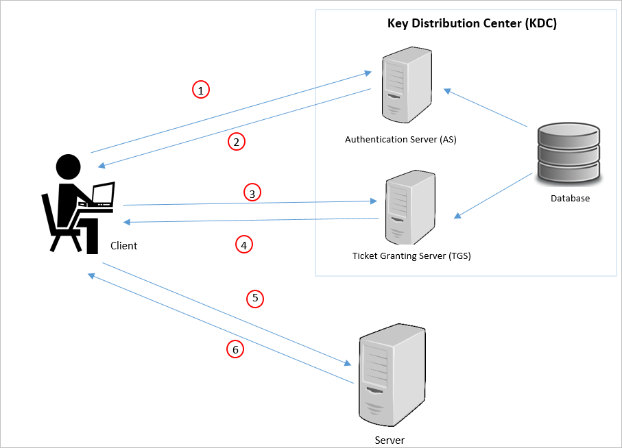
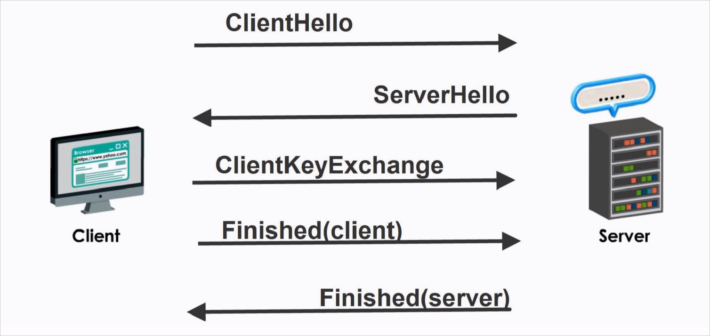

Network resources like servers and applications should only be accessed legitimately. You'll need to make sure that access is contingent on authentication and authorization.

In this unit, you'll learn about network authentication to authenticate users and services in your network. You'll also learn about network authorization as a method to check whether a particular user, or service, should in fact be given the access they request.

## Network authentication

You configure network authentication to verify that users are who they claim to be. Authentication is how your network separates legitimate access from suspicious access. You can use different methods to implement network-level authentication.

### Types of authentication

**Password authentication**

The most familiar form of authentication. Your user enters a secret value, only known to them, to gain access to your network. Secure passwords need to meet certain criteria, like having lowercase and uppercase characters, along with numbers and symbols (such as ? , %, or $). It's also recommended to make passwords as long as possible. However, even the most secure password can sometimes be compromised. There are more sophisticated authentication techniques available to further protect your systems.

**Two-factor authentication**

<!-- Please style according to learn standards. Original image: https://www.imperva.com/learn/wp-content/uploads/sites/13/2019/01/2fa-example.jpg -->

Users have to tackle an additional challenge for successful authentication after they enter their credentials. They'll need to provide a one-time code that's sent to their device. For example, they might receive a code through text message, or a code generated through an app on their phone, like Microsoft Authenticator.

**Token authentication**

Because a cell phone isn't built just for two-factor authentication, and many applications can run on a phone, attackers could circumvent two-factor authentication. Instead, a company might choose to opt for token-based authentication. A device purpose-built for authentication, and prepared by the organization, is used for two-factor authentication. This device could be a USB, or a smart card the person has to use for successful authentication. When using token-based authentication, the company should make sure the user returns the device if they no longer require access. Otherwise, the device could be compromised in some way.

**Biometric authentication**

The user's physical attributes are used for authentication. These are unique human characteristics, like fingerprints, and facial or voice attributes. You can take this authentication process further so the user has to provide many of these attributes. However, biometric-based authentication can be costly to implement because of the specific type of scanners required to handle this information. User privacy concerns could also pose problems.

**Transactional authentication**

You may not always want to rely only on information provided by a user. Instead, transactional authentication lets you scrutinize characteristics about the user. You could, for example, expect your users to regularly access the network from the United States during work hours. But if there's a sign-in from the other side of the world at midnight, then it would be flagged. 

You don't have to necessarily block their access. There's a possibility that this particular user is traveling for work. They could be asked to complete an additional verification step before authentication. Transactional authentication gives an additional layer of protection for your network.

**Computer recognition authentication**

Computer recognition authentication looks at the device being used to access the network. A small piece of software is installed on the device the first time it's used. This software holds a cryptographic device marker. When the user signs in, the device marker is checked to see if they're using the right device. Computer recognition authentication is especially useful if your users are only allowed to sign in from one single device. This method could make things difficult if users regularly switch devices.

**CAPTCHA**

<!-- Please style according to learn standards, original image: https://wonderfulengineering.com/wp-content/uploads/2017/03/Google-reCAPTCHa-1-1.jpg -->
Attackers use bots to impersonate when there's a human attempt to sign in. CAPTCHAs are used to verify whether the entity attempting access is actually a human being. A CAPTCHA presents an obfuscated image of a scenario, letters, or numbers, and the user is asked to explain what they see. Compared to humans, bots have difficulty identifying distorted photos, letters, and numbers. Humans typically make out what is shown in a distorted image. However, keep in mind that this method might present difficulties for people with certain disabilities, like blindness or low vision. Sometimes, even users without that type of disability will find it difficult to figure out what's being displayed.

**Single sign-on**

Single sign-on lets users enter their credentials once to be authenticated across multiple applications and tools. For example, a user could sign in to their mail application and automatically become authenticated across tools they use to manage network security and storage. Single sign-on saves time for your users. However, this method of authentication could also help an attacker gain access to several platforms, tools, and applications by successfully accessing one of them.

### Authentication protocols ###

An Authentication protocol is a shared set of rules for how information is exchanged between devices like computers. Here are two of the most commonly used authentication protocols.

**Kerberos**

Kerberos is an authentication protocol used across different operating systems. Windows uses Kerberos as its default authentication protocol. Linux and Mac OS can also use Kerberos.

<!-- Please style according to Learn standards. Original image: https://miro.medium.com/max/1358/1*T7OCCglhAI5WPSFR00Is0w.png -->
Kerberos authentication protocol relies on a trusted server called a Key Distribution Center (KDC). A KDC consists of a few components:

- An authentication server that authenticates and issues tickets to principals, like a user or service.
- A database that holds information about principals and their secret keys.
- Another server that grants service tickets based on the initial tickets that the principals present.

In Kerberos, principals get tickets that grant them service tickets from the KDC. They use those service tickets to access resources, services, or applications. This process remains invisible to the user.

**SSL/TLS**

TLS and its older sibling SSL are protocols for encrypting information sent over the internet. Because the data is encrypted, attackers can't view what you send through SSL/TLS. You'll often see a padlock on your browser. This symbol means the site is using a secure SSL/TLS session with your browser. SSL/TLS is also used for file transfers, voice-over-IP, and email. SSL is the older predecessor of TLS, and has been deprecated. You'll often find the two terms are used interchangeably. For that reason, we're going to use the terms interchangeably here too.

SSL/TLS protocol works as follows:

<!-- Please style according to learn standards.
original image: https://www.youtube.com/watch?v=sEkw8ZcxtFk -->

1. The client sends a "ClientHello" message to the server. This message includes information like the SSL/TLS version, and the cryptographic algorithms that the client supports.
1. The server sends a "ServerHello" message back that includes the algorithm it has chosen from the list of those supported by the client. The message also includes a session ID, the server's digital certificate, and its public key.
1. The client uses the digital certificate to verify the server's identity with a certificate authority, so the client can be sure it's dealing with a trusted server.
1. A client key exchange happens, where the client sends a shared key that's encrypted with the server's public key, to the server.
1. The client sends a "finished" message that's encrypted with the shared key.
1. The server sends its own "finished" message that is encrypted with the shared key. From this point, the client and the server can continue to exchange messages that are encrypted with the shared encrypted key.

## Network authorization

When authentication is completed successfully, you'll need to ensure the authenticated user or client is authorized to access the resources or services they're requesting. Authorization can be granular. For example, a particular database user might have the permissions to access and make changes to a single database. But the user couldn't access any other database because they don't have the permissions. 

Permissions can include read, write, delete, and more. You use the <!--CE: Is this correct - or should it say 'write'?-->right permissions for the right user or client. If a user or client switches roles, you can change their permissions to match the new level of access. Give each user or client the least number of permissions needed to get the job done. Never give a user or client any permissions they don't need.

### Differences between authentication and authorization

|Authentication  |Authorization  |
|---------|---------|
|Confirm whether the user or client is who they claim to be|Confirm whether the user or client can perform an action against a resource or service|
|Asks for credentials like username or password|Checks permissions attached to your account in the background and *might* tell you which permission you need|
|Must happen before authorization| Happens after successful authentication |
|For example, an HR member signs in to the HR app| The HR member attempts to delete a user from the wrong department by accident. The action is denied because they don't have the right permissions for that department|
