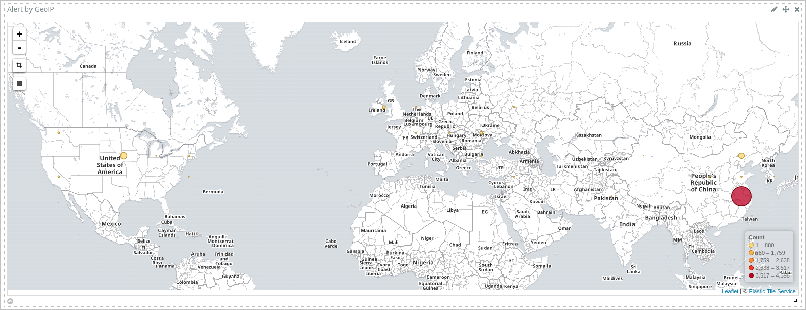
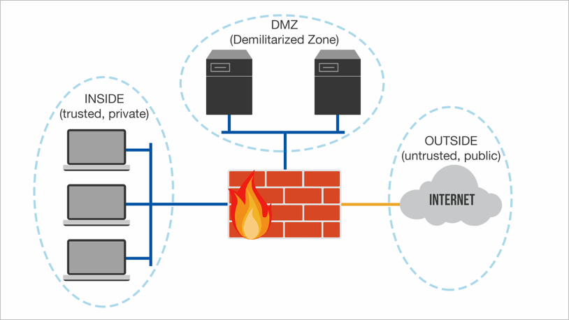
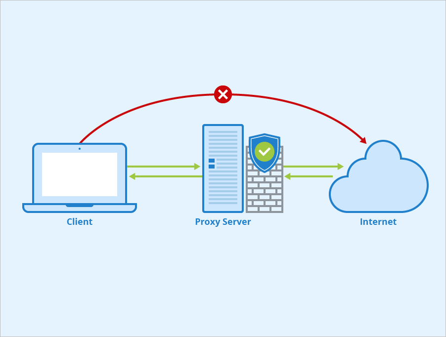
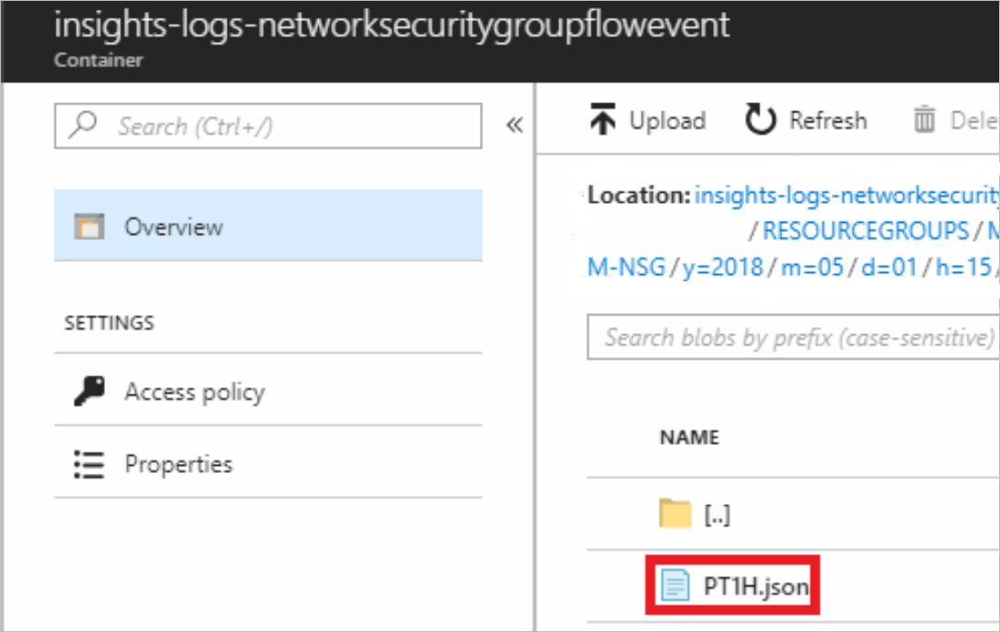
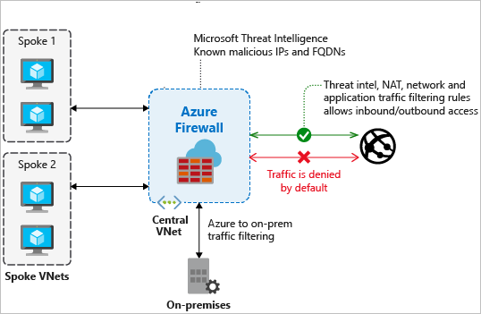
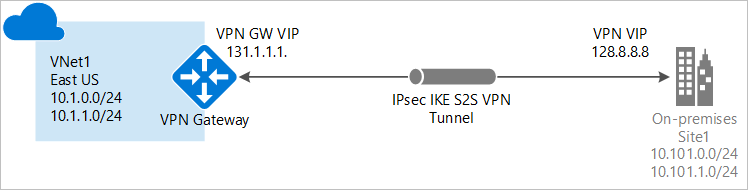

A vulnerable network can be exploited by attackers to steal information, and render services and resources inaccessible. Your organization could experience reputational and financial loss.

In this unit, you'll get an overview of network security and some of the different types available. You'll also learn about network security zones and firewalls. And you'll explore which Azure network security tools you use to strengthen network protection.

## Overview of network security

You need robust security to diagnose and prevent suspicious events, attacks, and weaknesses in your network. There are many reasons why security-related issues arise and several ways you can deal with them. You can employ different types of network security to help deal with these issues.

### Access control

Use access control to scrutinize every user and client to judge whether they have permission to access your network, or a network resource. You configure security policies that ensure the user or client has the right level of permissions assigned to do certain actions on your network. For example, you might want to deny read access for some resources if the client or user is connecting from outside your on-premises location.

### Anti-malware tools

Protect your network from malicious software (malware). Malware comes in different forms, including:

- Ransomware
- Viruses
- Spyware
- Trojans

You use anti-malware and antivirus tools to monitor and remedy malware. These tools do tasks like looking for anomalies in your files, taking actions to remove malicious pieces of code, and repairing affected resources and devices on your network.

### Application security

Whether applications are yours or are owned by a third party, they can contain security vulnerabilities that an attacker might use to access devices and network resources. If an application is developed in-house, you'll need to make sure you actively find and fix vulnerabilities that attackers could abuse. Test your application during its development life cycle and implement whatever changes are needed to fix a potential vulnerability. If you're dealing with an application development elsewhere, make sure you install updates as soon as they're available.

### Behavioral analytics

You use behavioral analytics tools to establish regular usage and behavior across your network and identify any suspicious changes. You can create security policies based on these analytics. For example, you could conclude that an office user normally accesses the network from one location in the United States during work hours. If their credentials are suddenly used to attempt access from Australia at midnight, the attempt would be flagged as suspicious. Access could be denied pending additional verification, like a secret code sent to the user's work mobile device.

### Email security

Attackers often use email to access your network. An email that looks genuine might ask users to select a link and provide details that the attacker uses to access resources and devices on your network. Email applications like Microsoft Outlook help you identify suspicious messages and senders.

<!-- Please style according to Learn standards. Original image: https://support.content.office.net/en-us/media/1e6f6fcb-ddbd-4d7e-bb5a-53ef09f3920f.png -->

### Intrusion detection and prevention

You want to take a proactive and preventative security posture for your network. The earlier you can identify intrusion, the better. You can use intrusion prevention and detection tools together to monitor all your network traffic. For example, Azure Network Watcher provides data to an open source intrusion detection system like Suricata. Traffic is analyzed across your network on Azure, and you're alerted about intrusions.

<!-- Please style according to Learn standards. Original image: https://docs.microsoft.com/en-us/azure/network-watcher/media/network-watcher-intrusion-detection-open-source-tools/figure3.png -->
### VPN

You use a virtual private network (VPN) to establish an encrypted connection from your network to another over the internet. A VPN can use SSL/TLS protocol to provide secure communication and remote access capabilities across your networks.

<!-- Please update to Learn standards. Remove the "WBEM Client" icon. Original image: https://www.researchgate.net/profile/Michael_Hutter4/publication/224570352/figure/fig1/AS:671521781583883@1537114677543/Management-of-an-IPsec-enabled-Virtual-Private-Network-VPN.png -->

### Web security

You can employ tools that secure how your people use the web. For example, you use a web filter to prevent users from accessing certain types of sites that have been red flagged. These web security tools also allow you to set up policies that help you decide how you want to handle different types of web requests in your network.

### Wireless security

The wireless portions of your network aren't as secure as the wired portions. Your wireless network can be accessed from outside of your organization, depending on how far the signal goes. Different tools are available for you to scan and monitor activity on the wireless portions of your network. Also, make sure that you use the strongest type of encryption you have available. And ensure you have a separate wireless network for guests to prevent visitors from using the wireless network intended for internal users.

## Network security zones

Network security zones have specific security policies applied to them, and are often separated by firewalls.

There are three different types of security zones. The first is the inside (trusted or private) zone. An inside zone contains the resources and devices that should never be accessible to anyone who's outside of your organization. Examples include printers, workstations used by internal users, and internal servers. In this zone, the devices are provided with private IP addresses.

<!-- Please style according to learn standards. Original image: https://s3.amazonaws.com/kajabi-storefronts-production/blogs/3184/images/9hFpYzphSaawzqta0OQm_Picture2.png -->

The second zone is the outside (untrusted, or public) zone, which is for everything outside of the organization. This zone is thought of as the public internet or another network that isn't in the control of the organization.

The third zone is the demilitarized zone (or DMZ), where resources and services are located that should be accessible from outside of the organization. You might, for example, use a DMZ to provide access to an application, a partnering organization or a supplier.

### Zone filtering policies

Zone filtering policies decide how traffic is handled as it travels between different zones. These policies include:

- **Inside-to-outside** and **inside-to-DMZ**. All traffic that originates from the inside and is headed outside, or to the DMZ, is scrutinized. For example, your internal staff members may want to access a public website. The traffic would be inspected to check whether this is a trustworthy website.

- **Outside-to-inside**. Traffic coming from outside is always blocked. The only time traffic would be permitted is when it's a direct response to a request that originated from the inside zone. For example, when an internal staff member requests a web page from a server, the response is allowed (if it's a trusted source), so the user can browse the site.

- **Outside-to-DMZ**. All traffic coming from the outside and going to the DMZ is inspected and either permitted or denied permission. Traffic types that might be allowed to pass through include email and HTTPS traffic.

- **DMZ-to-outside**. Traffic that comes from the DMZ and wants to go outside is also inspected. Whether traffic is permitted to travel outside depends on the firewall rules in place, and the resource or client starting the request. For example, a mail server in the DMZ zone might need to sync with another server that's outside. You'd configure firewall rules to decide what should happen.

### What are network firewalls?

Network firewalls are security appliances that block or remedy unauthorized access into your network. Network firewalls also monitor and make logs of all traffic across your network. You configure security policies that are implemented by your network firewalls. These policies help you take appropriate action on all traffic across your network. Network firewalls can be either hardware or software firewalls.

A **hardware firewall** can be a standalone physical device, but can also come as part of devices that are on your network. Physical devices like  routers, for example, already have a built-in firewall. Hardware firewalls are expensive to operate if the network belongs to a larger organization.

A **software firewall** is installed and configured on a device, like a workstation or a server. Software firewalls have flexible features, and can be run on many devices more cost-effectively, compared with hardware firewalls. However, certain sophisticated breaches can more easily compromise these types of firewalls.

### Firewall types

Firewalls have a number of different functions across your network.

**Application-layer firewalls** can be a physical appliance, or software based, like a plugin, or a filter. These types of firewalls target your applications. For example, they could affect how requests for HTTP connections are inspected across each of your applications.

**Packet-filtering firewalls** scrutinize each data packet as it travels through your network and, based on rules you configure, decide whether to block the specific packet or not.

**Circuit-level firewalls** check whether TCP and DUP connections across your network are valid before data is exchanged. This type of firewall might, for example, first check whether the source and destination addresses, the user, the time, and date meet certain defined rules. When the checks are passed, and a session is started, data is exchanged between parties without further scrutiny.

A **proxy server firewall** obfuscates the real source and destination address details of requests and messages on your network, to prevent them from being exposed. A proxy server might act for a client in your network to request pages from the outside internet, to prevent exposing the client's details.

<!-- Please format to Learn standards. Original image: https://www.seobility.net/en/wiki/images/8/8a/Proxy-Server.png -->

**Stateful firewalls and next-generation firewalls**. Stateful firewalls inspect characteristics about the connections on your network. The firewall also monitors packets over time and stores a combination of this information in a state table. When a connection and packet match aren't recognized, based on the information held in the table, traffic is blocked.

<!--  Please style according to learn standards. Original image: https://ars.els-cdn.com/content/image/3-s2.0-B9780128112489000048-f04-03-9780128112489.jpg?_ -->

**Next-generation firewalls** do many of the same functions as stateful firewalls. But they can encompass more functions from other types of firewalls such as packet filtering, VPN support, and more. This type of firewall also investigates packets more thoroughly when compared to stateful firewalls. For example, a next-generation firewall could look at the payload for each individual packet, and inspect it for suspicious characteristics and malware.

### The importance of firewalls

Firewalls help protect your network from the outside world. If you don't have a firewall set up:

- An attacker could employ malware and take advantage of your bandwidth to use it for themselves
- Sensitive and private information about employees and clients could be stolen
- Your resources, devices, and entire network could be held to ransom

It's important to place firewalls between your network and any outside connection. Combine different types of firewalls to help you achieve the most robust network security.

## Azure network security tools

Azure provides a number of tools you can use as part of your network security. Each of these tools is designed to address a different aspect of your network's security.

Azure lets you build your own networks through Azure Virtual Networks. You use **Azure Network Security Groups** to filter traffic from Azure and on-premises resources to, and from, resources that form part of your VNets. An Azure Network Security Group filters traffic through security rules that you specify to deny or permit different types of traffic across your networks.

<!-- Please style according to learn standards. Original image: http://vcloud-lab.com/files/images/1.-Microsoft-Azure-NSG-network-security-group-Inbound-firewall-rule-80-http-vnet-virtual-network.png -->

You can also log all the traffic flowing through your network security groups for analysis. You use Azure's Network Watcher service and enable NSG flow logs.

<!-- Please feel free to format according to Learn standards. Original image: https://docs.microsoft.com/en-us/azure/network-watcher/media/network-watcher-nsg-flow-logging-portal/nsgs.png -->

Your logs will then be stored for use in a JSON file, in a storage account.

<!-- Please feel free to format according to Learn standards.  Original image: https://docs.microsoft.com/en-us/azure/network-watcher/media/network-watcher-nsg-flow-logging-portal/log-file.png -->

**Azure Firewall**
 is a fully managed firewall you can use to protect the resources that are inside your Azure Virtual Networks. Because Azure Firewall is cloud-based, it comes with certain advantages. You won't have to worry about whether Azure Firewall can scale to the amount of resources on your networks. It also comes with high availability pre-configured, so you don't have to think about how to prevent your firewall from going down.

<!-- Please style according to learn standards. Original image: https://docs.microsoft.com/en-us/azure/firewall/media/overview/firewall-threat.png -->

You connect your on-premises network to your Azure Virtual Networks by configuring a **Site-to-Site VPN** connection with Azure. You'll need to use a VPN Gateway (which is a VPN appliance from Azure), along with your own local VPN device, to establish a VPN tunnel for communication. Your cloud and on-premises resources then communicate across the VPN tunnel.

<!-- Please style according to learn standards. Original image: https://docs.microsoft.com/en-us/azure/vpn-gateway/media/vpn-gateway-howto-site-to-site-resource-manager-portal/site-to-site-diagram.png -->

You can also set up a **Point-to-Site VPN** connection between Azure and your on-premises network. Here, individual users and clients can connect to your Azure resources through a secure tunnel.

<!-- Please style according to learn standards. Original image: https://docs.microsoft.com/en-us/azure/vpn-gateway/media/vpn-gateway-howto-point-to-site-classic-azure-portal/point-to-site-connection-diagram.png -->

### Azure best practices for network security

There's much you can do to improve network security on Azure. Below are a few of the things you should consider implementing.

Use **Azure network security appliances**, developed by Microsoft partners on the Azure marketplace, to improve network security. This range of appliances provides a number of functions including:

- Detecting anomalies on your network
- Identifying and rectifying vulnerabilities
- Web filtering
- Antivirus protection

Configure **Azure Virtual Network Service Endpoints** so that critical Azure services you might use only connect to your Azure virtual networks, and not to the public internet. These services include:

- Azure SQL Database
- Azure Storage
- Azure App Service
- Azure Key Vault

**Disable SSH/RDP** access whenever possible. While these protocols are used to manage your virtual machines from a remote location, attackers could attempt brute-force attacks if no proper protections are in place. Instead, create a point-to-site VPN connection first, before enabling SSH/RDP for remote management.

Use **load balancing** to improve the performance and availability of your network.  When you use a load balancer, you distribute network traffic across the machines in your network. For example, if you have a couple of web servers that look after a website as part of your network, you can configure a load balancer to distribute the traffic between them. This way, you improve the performance and availability of the website.

Use **Azure DDoS protection**. A Distributed Denial Of Service (DDoS) attack overloads resources or services across your network so that they become unusable or inaccessible. Azure provides out-of-the-box automatic traffic monitoring and mitigating for DDoS attacks through its protection service. You can interact with the service and enable additional features, like having access to DDoS experts, by upgrading to the standard tier.
