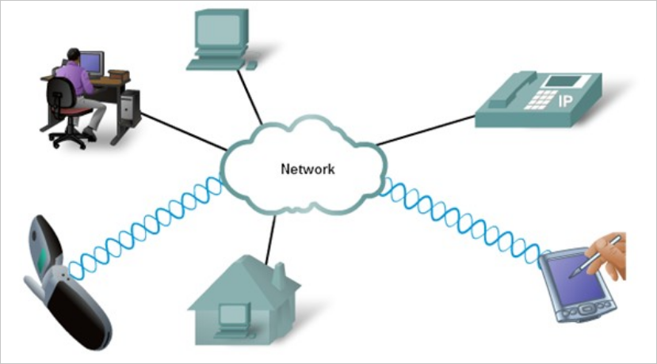
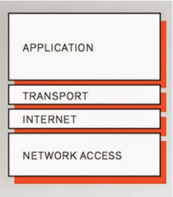

When considering the move to the cloud, it's important in your role as either an Azure Developer, Solution Architect, or Administrator to know the fundamentals of how a network works. The first step in understanding the composition of a network is how they communicate with each other. This knowledge applies whether it's your own organization's network or more extensive networks like the world wide web. All networks are built on the same principals.

In this unit, you'll learn about the network protocols that are essential for communication across a network. You'll also learn about network standards that form the ground rules for all networks, whether hardware or software. Finally, you'll touch on network security and management protocols.

## Network Protocols

A network protocol is a set of conditions and rules that specify how communication between one device and another is handled. It provides a common framework for establishing and maintaining a communications channel. The protocol also defines how to handle errors or faults if they occur. Network protocols allow seamless communication between different devices, for example, laptops, tablets, smartphones, routers, and servers.

The network protocol is an essential building block in the design of your organization's network architecture.

There are many network protocols available, covering different network usages, including:

- Basic communication protocols like TCP/IP and HTTP
- Security protocols like SSL and HTTPS
- Management protocols that keep your network healthy, like Internet Control Message Protocol (ICMP), and Simple Network Management Protocol (SNMP).

Each network protocol will have many properties that govern its use and implementation. Some of the more common features include:

- Packet size
- Address mapping
- Routing, transmission speed
- Handshaking techniques
- Flow control
- Error correction
- Packet sequence
- Address formatting

## Network Standards

While network protocols provide a unified method for communication, network standards govern the hardware and software that uses them.

Today, there are hundreds of thousands of hardware suppliers yet all of their technology, seamlessly integrates with your computer or network with minimal effort. Network standards provide the framework that enables this interoperability.

Network standards provide backwards compatibility between product revisions, and between differing vendors. Without network standards, it would be impossible to build networks, and network devices, that would interact reliably without significant configuration or maintenance effort.

## Network communication protocols

Communication protocols focus on establishing and maintaining a connection between devices.

Here is a list of the most commonly used network communication protocols.

| Protocol                                                     | Definition                                                   |
| ------------------------------------------------------------ | ------------------------------------------------------------ |
| TCP (Transmission Control Protocol)                          | TCP is a protocol that chunks up data into packets that can be sent securely and quickly while minimizing the chance of data loss. |
| IP (Internet Protocol)                                       | IP is a protocol that holds the IP address of the sender and the receiver. |
| TCP/IP                                                       | TCP/IP is frequently used to represent the internet protocol suite. This protocol stacking is synonymous with network communications on the web and also within your organization's network. TCP/IP combines two protocols, the TCP and the IP. |
| HTTP (Hypertext Transfer Protocol)                           | The HTTP protocol uses TCP/IP to deliver web page content from a server to your browser. The transmission protocol used is HTTP. HTTP also handles the downloading of files from remote servers. |
| HTTPS (Hypertext Transfer Protocol over Secure Socket Layer) | Provides a secure and encrypted method for transmission of data. SSL secures data transfer by encrypting all of the data between the server and client. |
| FTP (File Transfer Protocol)                                 | FTP is used to transfer files between different computers on a network. Typically FTP is used to upload files to a server from a remote location. While you can use it download files, this is typically handled through HTTP. There's a secure flavor of FTP called SFTP or Secure Shell (SSH). |
| POP3 (Post Office Protocol)                                  | POP3 is one of three email protocols. It's most commonly used by your email client to allow you to receive emails. This protocol uses TCP for the management and delivery of an email. |
| SMTP (Simple Mail Transfer Protocol)                         | SMTP is one of three email protocols. It's most commonly used to send emails from your email client. This protocol uses the TCP for management and transmission of the email. |
| IMAP (Interactive Mail Access Protocol)                      | IMAP is the more powerful of the three email protocols, and is often used to manage a single mailbox in your organization. |
| Bluetooth                                                    | It is a data exchange protocol is designed for lightweight communications and combines a number of the previously mentioned protocols. |

## Internet protocol suite

The Internet protocol suite (IPS) is a collection of communication protocols that define how data should be handled during transmission and receipt. It defines the type of packet to be used, how it will be routed, and the addressing method to use. It's sometimes called the TCP/IP protocol suite since both TCP and IP are primary protocols used in the suite. There's some similarity between the Internet protocol suite and the OSI model that came after it. Both of which describe different abstract layers needed to send and receive a packet of data,

The Internet protocol suite is functionally arranged into a layered protocol stack. Each layer of the stack is responsible for a specific function or behavior. Each layer knows how to communicate with the layer above and below it. The structure of the Internet protocol suite is:

- **Application layer** - The top layer of this stack. The application layer is responsible for determining which communication protocols will be used based on where the message originated. If the message is an email, it will assign the correct email protocols, if it's based around a web page, it will use HTTP protocols. The protocols associated with this layer are DNS, FTP, HTTP, IMAP, LDAP, POP, SMTP, SNMP, SSH, Telnet, and TLS/SSL.
- **Transport layer** - This layer receives information from the application layer about the type of application that is going to receive it, for example, email or a web browser. This layer is controlled by the TCP, which doesn't care where the data is going, that's the next layers job. All it wants to do is split the application data into manageable chunks and ensure they're sent using the right port, based on the protocol being used. When the transport layer receives data from the internet layer (below), it does the reverse. It will piece the data together and then send it to the target application. The protocols associated with this layer are TCP and UDP.
- **Internet layer** - Also know as the network layer. It's responsible for packaging the data into datagrams. A datagram contains the data from the transport layer and adds in the origin and recipient IP addresses. This layer only wants to make sure the data packet gets to its destination. It isn't interested in how or even if the packets are received, or are in the right order. The protocols associated with this layer are IP, IPv4, IPv6, ICMP, and IPsec.
- **Network interface layer** - This is the bottom layer of the TCP/IP stack. It's responsible for defining how the data is sent across the network. This layer is responsible for getting the data packet delivered. The protocols associated with this layer are ARP, MAC, Ethernet, DSL, and ISDN.

## Network Security protocols

Network security protocols are designed to maintain the security and network of data across your network. They've been created to prevent unauthorized access by users, services, applications to your organization's resources and assets.

Network security protocols use encryption and cryptographic principals to secure the data. Some of the more popular security protocols include HTTPS, TLS, SSH, and SSL.

To implement a secure network, you must match the right security protocols for your needs. The following list explores the leading network security protocols:

- **Hypertext Transfer Protocol Secure** (HTTPS) - HTTPS provides a more secure version of the standard HTTP protocol, by using the TLS or SSL encryption standard. This combination of protocols ensures that all data transmitted between the server and the web browser are encrypted and secure from eavesdropping or data packet sniffing.
- **Secure Socket Layer** (SSL) - SSL was the standard encryption and security method used on the internet until it was replaced by Transport Layer Security (TLS). It provided a secure and encrypted connection between your computer and the target server or device when accessed over the internet. While TLS is now used, the replacement security protocol is often still called SSL. This level of security protocol, whether SSL or TLS , is what transforms a regular HTTP URL address into an HTTPS one.
- **Transport Layer Security** (TLS) - is the successor to SSL and provides a stronger and more robust security encryption method. Based on the ITEF standard, it's designed to stop message forgery and tampering and eavesdropping. It's typically used to protect web browser communications, email, VOIP, and instant messaging.
- **Secure Shell** (SSH) - SSH is a cryptographic network security protocol that provides a secure data connection across a network. Designed to support command-line execution of instructions, including remote sign-in to servers. The FTP protocol uses many of the SSH functions to provide a secure file transfer mechanism.
- **Kerberos** - This validation protocol provides a robust authentication for client-server based applications through secret-key cryptography. Kerberos assumes that all the endpoints in the network are insecure, and enforces strong encryption for all communications and data at all times.

## Network management protocols

In your network, it's perfectly acceptable to have multiple different protocols running concurrently. Previously, we've discussed communications and network protocols. It's equally important to the successful day-to-day running and operating of the network are the management protocols. The focus of this type of protocol is the sustainability of the network, looking at faults and performance.

Network administrators need to monitor their networks and any devices attached to them. Each device in your network will expose some indicators about the state and health of the device. These indicators are requested by the network administrator tool and can be used for monitoring and reporting.

There are two network management protocols available: SNMP and ICMP.

- **Simple Network Management Protocol** (SNMP) - The SNMP is an internet protocol that allows the collection of data from devices on your network, and the management of those devices. The device has to support SNMP for information to gather information. Typically, these types of devices support SNMP: switches, routers, servers, laptops, desktops, and printers.

- **Internet Control Message Protocol** (ICMP) - The ICMP is one of the protocols included within the Internet protocol suite. It allows network-connected devices to send warning and error messages, along with operation information about the success or failure of a connection request, or if a service is unavailable. Unlike other network transport protocols like UDP and TCP, ICMP isn't used to send or receive data from devices on the network.

### Monitoring your network in Azure

Azure has two network monitoring tools to assist in maintaining and managing the health of your network. The first is the Network Performance Monitor (NPM), and the other is the Performance Monitor.

- Network Performance Monitor (NPM) - NPM has been designed to monitor and report on the health of your network, provide insights into its performance, and report on connectivity between your applications. While NPM is cloud-based, it can provide a hybrid service to monitor both cloud and on-premises networks.
- Performance Monitor - This is a capability within the NPM. Designed to monitor network connectivity across your entire estate, whether on-premises or cloud-based, it will report network issues as they occur. It can monitor all network routes, including redundant paths, and report any issues. It can identify particular network segments that are degrading network performance. Performance Monitor can report on the health of the network without needing to rely on SNMP.
