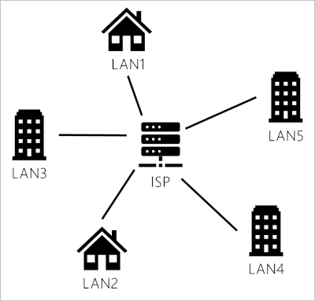
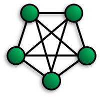
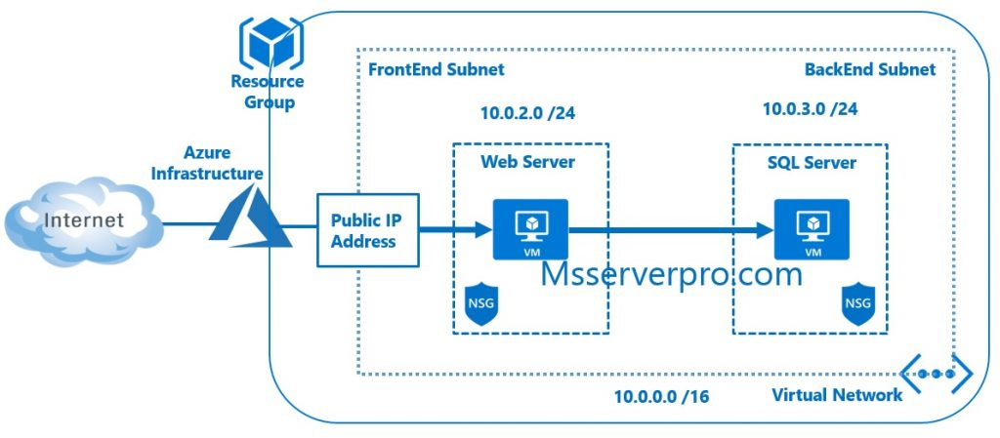

All networks are built on the same principals, and we can apply these principals to design and build our organization's local or cloud-based networks.  When building a network, we need to know about the different types of networks, their topologies, and their uses. 

In this unit, you'll explore some of the common types of network topologies we use to create Internet-based networks.

## What is a network?

A network is a collection of network-enabled devices, typically comprising computers, switches, routers, printers, and servers. Networks are a fundamental part of our day-to-day lives and exist in our homes, workplace, and public areas and allow all types of network-enabled devices to communicate.

## Network Types

Networks vary in size, shape, and usage. To make it easier to identify different network types, we categorize networks into one of the following network categories.

- Personal Area Networks
- Local Area Networks
- Metropolitan Area Networks
- Wide Area Networks

### What is a Personal Area Network (PAN)?

The Personal Area Network provides networking needs around an individual. An excellent example of a PAN is where our smartphone, smartwatch, tablet, and laptop all connect and share data without the need to connect to an Access Point or other third-party network services. PAN networks typically use Bluetooth to communicate as it provides a low-power short-range data sharing capability. The network standards associated with a PAN are Bluetooth, and IEEE 802.15.

### What is a Local Area Network (LAN)?

The Local Area Network provides networking needs around a single location. This location might be our organization's office, a school, university, hospital, an airport, and many others. A LAN is usually privately owned and needs authentication and authorization to access. Of the different classification of a network, a LAN is by far the most commonly used.

### What is a Metropolitan Area Network (MAN)?

The Metropolitan Area Network provides networking capabilities between two different locations within a city or metropolitan area to provide a single extensive network. Typically a MAN requires a dedicated and secure connection between each LAN joined to the MAN.

### What is a Wide Area Network (WAN)?

The Wide Area Network provides networking capabilities between two different geographical locations locally or world-wide. We would use a WAN to connect our organization's head office with branch offices all over the country. A WAN links multiple LANs together to create one super network. As a MAN, we would use a virtual private network (VPN) to manage the connection between different LANs.

### Differences between LAN and WAN networks

Several aspects set a LAN apart from a WAN. Knowing what these items are, will make it easier for us to plan the services that we want to deploy across these networks.

| LAN | WAN |
| ------------------------------------------------------------ | ------------------------------------------------------------ |
| A LAN is a privately operated network typically contained in a single building. | A WAN is used to connected geographically separate offices to each other. Multiple organizations may operate WANs. |
| A LAN operates at speeds of 10 Gbps or higher. | A WAN typically operates at speeds of less than 1 Gbps. |
| A LAN is less congested compared to other network types. | A WAN is more congested compared to other network types. |
| A LAN can be managed and administrated in-house. | A WAN typically requires using a third party to configure and set up, increasing cost. |

## Network topologies

A network topology describes the physical composition of a network. Let's look at four topologies we can choose from when designing a LAN. They are:

- Bus
- Ring
- Mesh
- Star

### Bus topology

In a bus topology, each network device is connected to a single network cable. Even though it's the simplest type of network to implement, there are limitations to it. The first limitation is the length of the main cable or bus. The longer it gets, the higher the chance of signal dropout. This limitation constrains the physical layout of the network.  All devices have to be physically located near to each other, for example, in the same room. Finally, if there is a break in the bus cable, the whole network fails.

### Ring topology

In a ring topology, each network device is connected to its neighbor to form a ring. This form of network is more resilient than the bus topology. However, a break in the cable ring will still affect the performance of the network.

### Mesh topology

We can describe the mesh topology in two ways. Either as a physical mesh or as a logical mesh.

In a physical mesh, each network device connects to every other network device in the network. It dramatically increases the resilience of our network but has the physical overhead of connecting all devices. Few networks today are built as a full mesh. Most networks use a partial mesh, where some machines interconnect, but others connect through one device. 

Keep in mind that there's a subtle difference between a physical mesh network and a logical one. The perception is that most modern networks are mesh-based since each device can see and communicate with any other device on the network. This description is of a logical mesh network and is primarily made possible through the use of network protocols.

### Star topology

The star topology is the most commonly used network topology. Each network device connects to a centralized hub or switch. Switches and hubs can be linked together to extend and build more extensive networks. This type of typology is, by far, the most robust and scalable.

## Ethernet

Ethernet is a networking standard that is synonymous with wire-based LAN networks and also used in MAN and WAN networks. Ethernet has replaced other wired LAN technologies such as ARCNET and Token Ring and is an industry-standard.

While Ethernet is associated with wired networks, we have to keep in mind that it's not limited to wire, since it's used over fiber optic links as well.

The Ethernet standard defines a framework for data transmission, error handling, and performance thresholds. It describes the rules for configuring an Ethernet network, and how each element in the network interacts with each other.

Ethernet is used in the OSI model at the data link and physical layers and formed the basis for the IEEE 802.3 Standard. This standard helped to unify network and hardware development.

Ethernet is a continually evolving standard, and the original version only supported a data transmission rate of 2.94 Mbp/s. In recent years, there have been several iterations to keep up with the demands for increased speed, and today, we see rates up to 400 Gbit/s.

### Fast Ethernet

Fast Ethernet (IEEE 802.3u) was developed to support data transmission speeds of up to 100 Mbps. Faster Ethernet is also referred to as the 100BASE-TX standard.

### Gigabit Ethernet

Gigabit Ethernet (IEEE 802.3ab) was developed to support faster communication networks that can support services like streaming multimedia and Voice over IP (VOIP). The 1000BASE-T standard runs ten times faster than the 100BASE-TX standard. Gigabit Ethernet is now included in the 802.3 standards and recommended for enterprise networks. The new standard is backward compatible with the 100BASE-T and the older 10BASE-T standards.

### 10 Gigabit Ethernet

10 Gigabit Ethernet (IEEE 802.3ae) is 10 Gigabit Ethernet has a nominal data transfer speed of 10 Gbit/s, which is ten times faster than its predecessor. This speed improvement is only made possible by using fiber-optics. The standard now requires that 10-Gigabit Ethernet networks use area-based routing rather than broadcasting data to all nodes, in that way, reducing network noise and traffic.

### Terabit Ethernet

Terabit Ethernet offers data transfer speeds of 200 Gbit/s and 400 Gbit/s. It's expected that Terabit Ethernet will offer speeds of 800 Gbit/s and 1.6 Tbit/s in the future.

## Networks in Azure

Azure comes with several networking tools and services.

### Azure Virtual Networks

Using Azure, we can build complex virtual networks that emulate the structure of our actual on-premises networks. We can provision and manage our cloud-based virtual networks, or create hybrid virtual networks that integrate with our on-premises networks when we use Azure Virtual Network services.

### Connectivity Services

When we need to have a low-latency high-bandwidth connection between our on-premises network and our Azure Virtual Network, we have two options. We can use a VPN connection via an Azure Gateway, or we use a dedicated connection through ExpressRoute. ExpressRoute is a secure point-to-point service. To use this service, we'll use a third-party connectivity partner that will provide and host the ExpressRoute circuits on our behalf.
