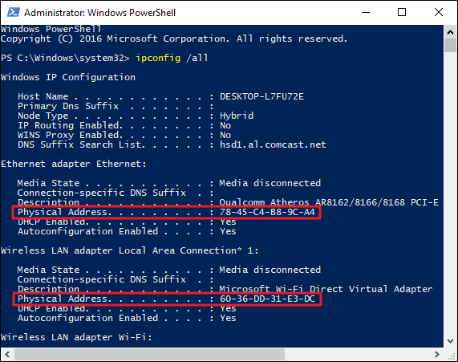

A network can't exist unless each of the devices has the means of communicating with another. This fact applies whether it's our own organization's network or more extensive networks like the world wide web. All networks are built on the same principals.

In this unit, we'll describe the term network standards and explore the hardware that forms the backbone of any network.

## Network standards

While network protocols provide a unified method for communication, network standards govern the hardware and software that uses them.

Today, there are hundreds of thousands of hardware suppliers, yet all of their technology seamlessly integrates with your computer or network with minimal effort. Network standards provide a framework that enables the interoperability between devices.

Network standards improve the interoperability of different network-enabled devices and provide backward compatibility between product revisions and differing vendors. Several official bodies publish regulated standards. They're the International Telecommunication Union (ITU), the American National Standards Institute (ANSI), and the Institute of Electrical and Electronics Engineers (IEEE).

It would be impossible to build networks and connect network-enabled devices reliably without network standards.

## The 802 family of standard

The 802 specification covers all the physical networking standards for both Ethernet and Wireless. The table below shows some of the more widely used standards.

| **802** | **Overview** | **Basics of physical and logical networking concepts.** |
| --------- | ----------------------------------- | ------------------------------------------------------------ |
| 802.1 | Bridging | LAN/MAN bridging and management of the lower sublayers of OSI Layer 2. |
| 802.2 | Logical Link | Commonly referred to as the Logical Link Control specification (LLC). |
| **802.3** | **Ethernet** | Provides asynchronous networking using "carrier sense, multiple accesses with collision detect" (CSMA/CD) over coax, twisted-pair copper, and fiber media. |
| 802.5 | Token Ring | The token-passing standard for shielded copper cables and twisted pair. |
| 802.11 | Wi-Fi | Wireless LAN Media Access Control and Physical Layer specification. |
| 802.11a | Wi-Fi | Specifies a PHY that operates in the 5 GHz |
| 802.11b | Wi-Fi | Enhances 802.11, adds higher data rate modes. |
| 802.11d | Wi-Fi | Enhances 802.11a/b, allows for global roaming |
| 802.11e | Wi-Fi | Enhances to 802.11, adds quality of service (QoS) features. |
| 802.11g | Wi-Fi | Extends WLAN maximum data rate. |
| 802.11 h | Wi-Fi | Enhances 802.11a, now resolves interference issues. |
| 802.11i | Wi-Fi | Enhances 802.11, adds security for WLAN applications. |
| 802.11j | Wi-Fi | Enhances 802.11a for Japanese regulatory extensions. |
| 802.11n | Wi-Fi | Higher-speed standards |
| 802.12 | Demand Priority | Ethernet data rate increased to 100 Mbp/s |
| 802.15 | Wireless Personal Area Networks | Support for Wireless personal area networks (WPANs). |
| 802.15.1 | Bluetooth | Short range (10 m) wireless technology. |
| 802.15.3a | UWB | Short-range, high-bandwidth "ultra wideband" link |
| 802.15.4 | ZigBee | Short-range wireless sensor networks |
| 802.16 | Wireless Metropolitan Area Networks | Covers Mobile and Wireless Broadband Access in a Wireless Metropolitan Area Networks (WMANs.) |

## Network Infrastructure

There are several network standard-compliant devices that make up the structure of our networks. Depending on the network's size, we might use several of these devices to build the backbone of our network. These devices are:

- Repeaters
- Hubs
- Bridges
- Switches
- Routers

Nearly all of these devices depend on a Media Access Control (MAC) or an Internet Protocol (IP) address to deliver data on the network.

### What is a Media Access Control (MAC) address?

The Media Access Control address or MAC address is a unique identifier assigned to every network-enabled device at the time of manufacture. It's sometimes referred to as the burned-in address, the Ethernet hardware address, or a physical address.

The MAC address has a standard composition of six hexadecimal numbers separated by a colon or dash, for example, AA-6A-BA-2B-68-C1. The first three numbers of the MAC address define the manufacturer's organizationally unique identifier (OUI). The remaining three numbers uniquely identify the device.

## Repeater

A repeater is a two-port device that repeats network signals. We use repeaters where we have network devices that are some distance from each other. The repeater doesn't modify or interpret data packets before resending them and doesn't amplify the signal. Instead, it will regenerate the data packet at the original strength, bit by bit.

## Bridge

A bridge divides a network into network segments and can filter and forward data packets between these segments. Bridges use the network device's MAC address to decide the data package's destination. We'll typically use a bridge to improve network performance by reducing unnecessary network traffic on network segments.

## Hub

A hub acts as a multiport repeater on a network. We use hubs to connect more than one device and structure the layout of our network. For example, we can cascade hubs to create network branches or as an endpoint to create a star layout with multiple user type devices. Hubs contain multiple ports that act as an input/output Ethernet connection between the hub and a network device. A hub can only operate at one speed, and that is the speed of the slowest network device on the network. It doesn't interpret or filter data packets and will send copies of each data packet to all attached devices.

### Types of hubs

- **Fast Ethernet** - Used for 100-Mbit/s networks and comes as Class I and Class II type hubs. The primary difference between the two is the amount of delay in data transmission. A Class I hub introduces a signal delay of up to 140-bit times, and Class II hub has a delay of up to 96-bit times. The delay allows for the transcoding of data between different base types. Only two Class II hubs can be used in a hub-based network. Class II hubs increased the likelihood of packet collisions because of their higher speeds.
- **Dual Speed** - With a traditional hub network, the speed of the network was governed by the slowest network device attached. For example, assume we have 10 Mbit/s and 100-Mbit/s devices connected to the network. The whole speed of the network would be 10 Mbit/s. Dual speed hubs solve the problem by acting as a bridge between the two different speed devices.

While hubs are now used for small ad-hoc networks of a few devices, they're rarely used at an enterprise level.

## Switch

A switch combines the functionality of a bridge and a hub. It segments networks and can interpret and filter packet data to send it directly to an attached network device. Switches use the network device's MAC address to decide the data package's destination. Switch operates in full-duplex mode, which means it can send and received data to and from network devices at the same time.

### Features

Modern Ethernet-based switches offer more functionality and capabilities than an Ethernet Hub.

- An Ethernet switch can adjust the connection speed of an inbound packet to match the connection speed of the destination network.
- Many switches now support Power over Ethernet (PoE). PoE enables network devices like Voice Over IP (VOIP) phones to get power from the switch, without needing a separate power supply.
- Other modules can be attached to the switch to enable functions like port mirroring, packet sniffers, and intrusion detection systems.

### Types of Ethernet switch

There are two distinct types of switch, unmanaged and managed.

#### Unmanaged

This type of switch has no configuration capability and is designed for small office/home office environments. Packet switching occurs automatically.

#### Managed

This type of switch offers the means to adjust the configuration, behavior, and operation of the switch. Access to the switch configuration will be through either a Command Line (CLI) using telnet or SSH, Remote Console, or via a web interface.

Here is a list of the more commonly available options to configure on a managed switch. Keep in mind that each switch manufacturer may offer different configuration options.

- **Quality of Service (QoS)** - Manage LAN traffic so critical systems are given higher priority. For example, voice-data packets, which need to be delivered quickly.
- **Virtual LANS** - Create logical groups of devices in their own virtual LAN. Traffic in one virtual LAN wouldn't cross over into another virtual LAN. This logical group of devices can improve the security and performance of the network.
- **Spanning Tree Protocol (STP)** - Build resilience into our network by defining alternative network routes in case a cable or device fails.
- **Port Mirroring** - Typically used with a network analyzer to diagnose network issues and problems. When setting up, the switch exports a copy of the network traffic to a single port.
- **Bandwidth rate-limiting** - allows fine control of the bandwidth used by specific ports. High bandwidth for ports handling database or VOIP, lower bandwidths for email, etc.
- **MAC address filtering** - provides the ability to control which network devices can be used or have access through the switch.
- **SNMP client** - set up and configuration of SNMP with our network monitoring tools.

There are two subtypes of managed switch:

- **Smart** - A smart switch is a half-way point between an unmanaged and a managed switch. They tend to offer only a web-based interface to manage the configuration. The available options are virtual LANs, port mirroring, and bandwidth rate limiting.
- **Enterprise** - TThe fully managed switch service described above.

## Router

Routers link networks with different ranged addresses together. They can interpret and filter data packets, forwarding them to the correct network. Routers use the network device's IP address information to route the data package to its destination. Most routers can now detect issues with data traffic flowing to any attached network and route or reroute it around the issue. A router is also called a gateway. When we configure network devices, we'll usually configure it with a default gateway IP address.

### Interconnectivity

Routers in an interconnected network maintain a routing table that lists the preferred route between each of the networks. The router acts as the start of authority for all the network devices on its network. Routing information is shared between routers using a routing protocol like the Border Gateway Protocol (BGP).

### Types

The majority of routers will use the Border Gateway Protocol (BGP) to share routing information. The type of information shared depends on the usage of the router and the functions they use.

There are several distinct classifications or types of routers available to service different network needs.

- **Access routers** - Typically used in a home or small satellite offices. These routers tend to be low-cost devices, with a simple routing need.
- **Distribution routers** - Compile traffic routing data from multiple routers. Distribution routers come with more significant memory and processing power. This type of router is designed to hold vast quantities of routing information and is often used to manage and control the quality of service across our WAN.
- **Edge routers** - An edge router operates at the boundary between our network and other networks, for example, our local network and the Internet. They act as gateways, filtering traffic and routing it internally or forwarding depending on the packet header. An edge router will often come with access control, or firewalls to improve the security. It may also handle DHC and DNS services, as well.
- **Core routers** - Sometimes called enterprise routers, these routers are designed for higher bandwidths. They're used to connect different builds or geographic locations together. Core routers tend to have fewer features than edge routers since their primary focus is on minimizing packet loss and preventing congestions. They tend to do packet forwarding to edge routers.

## Wireless Router

This network device provides all the routing capabilities of a regular access router, but also offers wireless access point functions. A wireless router or wireless access point is designed to provide a non-wired connection to our network. Any provision to access the Internet or other networks is handled by an edge router associated with our network. A wireless router lets us build a different type of network called a Wireless Local Area Network (WLAN).

A wireless router shouldn't be confused with a wireless modem. A wireless modem is what we receive from our ISP for our home or office and is the device that converts the signal from the ISP into one that is usable on a computer network. Wireless modems are typically combined with routers to allow us to create a private home or office network.

## Azure options

There are a couple of azure options that can help with routing and managing our network traffic.

### Azure hub-spoke

Azure hub-spoke is a reference architecture. The hub is usually an Azure virtual network that acts as the central connection point between the cloud and our on-premises network. Each of the spokes is also Azure virtual networks, usually connected to the hub via a peer network. Connections between the cloud and the on-premises network can be made through VPN gateway or ExpressRoute.

### ExpressRoute

An ExpressRoute is a dedicated circuit between our on-premises network and the cloud that uses a much higher bandwidth than a regular VPN gateway connection. An ExpressRoute circuit is hosted by a connectivity partner and provides a super resilient connection.
