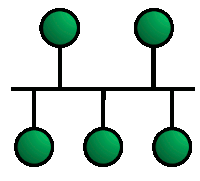

When considering the move to the cloud, it's important to know the fundamentals of how your network is composed.

Now you need to know the different types, their topologies, and their uses. You can apply your network topology knowledge in your own organization's network.  As well as to more extensive networks like the world wide web. All networks are built on the same principals.

In this unit, you'll learn about the different types of networks that exist. You'll  gain an understanding of Ethernet. You'll learn about MAC addresses, and what Address Resolution Protocol (ARP) is and does.

## Networks

### What is a network

A network is a collection of network-enabled devices, typically comprising computers, switches, routers, printers, and servers. Networks are a fundamental part of our day-to-day lives. Networks enable your mobile phone to work and share data and calls, they exist in your home, allowing all your IoT devices to interact with each other.  Finally, networks make the internet possible.

Networks vary in the size, shape, and usage.  To make it easier to identify different network types, they were categorized as PANs, LANs, MANs, and finally, WANs.

### PAN

The Personal Area Network or PAN provides networking needs around an individual. An excellent example of a PAN is where your smartphone, smartwatch, tablet, and laptop all connect and share data with each other without the need to connect to an Access Point or other third-party network service. PAN networks typically use Bluetooth to communicate as it provides a low-power short-range data sharing capability. The network standards associated with a PAN are Bluetooth, and IEEE 802.15.

### LAN

The Local Area Network or LAN provides networking needs around a single location. This location might be your organization's office, a school, university, hospital, an airport, and many others. A LAN is usually privately owned and needs authentication and authorization to access. Of the different classification of a network, a LAN is by far the most commonly used.

### Common LAN Topologies

- **Bus Architecture** - In a bus architecture, each network device is connected to a single network cable. It is the simplest type of network to implement. The many limitations to this type of network. The main two are the length of the main cable or bus. The longer it gets, the higher the chance of signal dropout. One constraint is all the devices have to be physically located near to each other, for example, in the same room. Finally, if the bus cable is damaged in any way, the whole network fails.

  

- **Ring Architecture** - In a ring architecture, each network device is connected to its neighbor until it forms a ring. This form of network is more resilient than a bus architecture. A break in the cable ring will affect the performance of the network.

  

- **Mesh Architecture** - In a mesh architecture, each network device is connected to every other network device in the network. It dramatically increases the resilience of your network but has the physical overhead of connecting them all together. Few networks today are built as a full mesh. Most use a partial mesh, where some machines are connected to each other, but others connect through one device. However, there's a subtle difference between a physical mesh network and a logical one. We've just described a physical mesh network, but their usage is limited. However, the perception is that most modern networks are mesh-based because each device can see and communicate with any other device on the network. It is the logical mesh network and is primarily made possible through the use of network protocols.

  

- **Star Topology** - The star topology is the most commonly used network architecture. Each network device is connected to a centralized hub or switch. Switches and hubs can be linked together to extend and build more extensive networks. This type of typology is, by far, the most robust and scalable.

  

### LAN Transmission Methods

Network traffic can be sent across the network in a couple of different ways:

- Unicast Transmission - This transmission method sends a single packet of data from a source to a single target device on the network.
- Multicast Transmission - In this transmission method, a single packet of data will be copied and sent to multiple destination devices on the network. The list of addresses is known as the multicast address.

### LAN Infrastructure Devices

Your network is comprised of several key elements that form the backbone of your network.

- Repeaters - A repeater is a device used to amplify and repeat the signal. It is used where you have network devices some distance from a hub, switch, or router. The repeater doesn't modify or interpret the data before resending it.
- Bridges - A bridge is a smarter repeater in that it can interpret the data packet and, where necessary, direct it to the target network device.
- Hubs - A hub also acts as a repeater in that it can boost the signal strength. Unlike a bridge, a hub won't interpret the data packet and will send a copy of it to all its attached devices. 
- Switches - A switch brings the benefits of a bridge and a hub. It can boost signal strength, operates in full-duplex mode, and can interpret packet data to send it directly to an attached network device. It helps reduce unnecessary network traffic.
- Routers - Routers are used to link different networks together. They can interpret and filter data packets, sending them to the correct network areas. Most routers can now detect issues with data traffic flowing to any attached network and route or reroute it around the issue.

### MAN

The Metropolitan Area Network or MAN provides networking capabilities between two different locations within a city or metropolitan area to provide a single extensive network. Typically a MAN requires a dedicated and secure connection between each LAN joined to the MAN. Although VPNs are now allowing LANs to act as MANs using existing technology like the internet.

### WAN

The Wide Area Network or WAN provides networking capabilities between two different geographical locations locally or world-wide. You would use a WAN to connect your organization's head office with branch offices all over the country. A WAN links multiple LANs together to create one super network. As a MAN, you would use a virtual private network (VPN) to manage the connection between different LANs.

### Differences between LAN and WAN networks

| LAN                                                          | WAN                                                          |
| ------------------------------------------------------------ | ------------------------------------------------------------ |
| A LAN is a private network typically contained in a single building that allows network devices to connect and communicate with each other. | A WAN is used to connected geographically separate offices to each other. |
| A LAN will operate at speeds of 10 Gbps or higher. | A WAN will operate at speeds of 100 Mbps. |
| A LAN can be managed and administrated in-house. | A WAN typically requires using a third party to configure and set up. Which can increase the cost. |

## Ethernet

Ethernet is synonymous with wire-based LAN networks and is also used in MAN and WAN as well. Ethernet has replaced other wired LAN technologies such as ARCNET and Token Ring and is now an industry standard.

While Ethernet is associated with wired networks, it has nothing to do with the wire. Ethernet is now used in the OSI model at the data link and physical layers. It formed the basis for the IEEE 802.3.

Standard. This standard helped to unify network and hardware development.

The ethernet standard not only defines a framework for data transmission, error handling, and performance thresholds. It defined the rules for configuring an Ethernet network, and how each element in the network interacts with each other.

Ethernet is a continually evolving standard, and the early version only supported data transmission speeds of up to 10 Mbps. To keep up with the demands for increased speed, there have been several iterations.

### Fast Ethernet

The fast Ethernet standard (IEEE 802.3u) was developed to support faster data transmission speeds of up to 100 Mbps. There were three flavors of fast Ethernet: 100BASE-TX, which is now the universal standard because of its compatibility with 10BASE-T, 100BASE-FX, which was used with fiber-optics and 100BASE-T4, which was used for level 3 UTP cable.

### Gigabit Ethernet

Gigabit Ethernet was developed to the needs for a faster communication network can support services like streaming multimedia and Voice over IP (VOIP). The 1000BASE-T standard runs 10 times faster than the 100BASE-TX standard. Gigabit Ethernet is now included in the 802.3 standard and is recommended for enterprise networks. The new standard is backward compatible with the 10BASE-T and 100BASE-T standards.

### 10 Gigabit Ethernet

The most recent addition to the Ethernet standard (IEEE 802.3ae) is 10 Gigabit Ethernet. It has a nominal data transfer speed of 10 Gbits/s, which is 10 times faster than its predecessor. This speed improvement is only made possible by using fiber-optics. The standard now requires that 10-Gigabit Ethernet networks use area-based routing rather than broadcasting to all nodes, in that way reducing network noise and traffic.

## MAC Addresses

The Media Access Control address or MAC address is a unique identifier assigned to every network-enabled device at the time of manufacture. It's sometimes referred to as the burned-in address, the Ethernet hardware address, or a physical address.

The MAC address has a standard composition of six hexadecimal numbers separated by a colon or dash, for example, AA-6A-BA-2B-68-C1. The first three numbers of the MAC address define the manufacturer's organizationally unique identifier (OUI). The remaining three numbers uniquely identify the device.

### Smartphone MAC address randomization

Since a MAC address uniquely identifies an actual device on a network, most mobile phone manufacturers go to extreme lengths to ensure that they don't give out their MAC addresses. It has introduced the term MAC address randomization. While the smartphone is seeking a network to attach to, it uses a randomly generated MAC address. Once the device connects to an Access Point, it stops using a random one and provides the actual one.

## ARP

The Address Resolution Protocol or ARP is a communications protocol within the Internet protocol suite. It's a request-response protocol used to resolve the MAC address for a given IP address. ARP supports many data link layer technologies, including IPv4, DECnet, and PUP. When resolving an IPv6 address, the Neighbor Discovery Protocol (NDP) is used instead of ARP. Without the ARP, there would be no means to resolve an IP address to a physical device address.

There's also the RARP protocol, which is the Reverse Address Resolution Protocol, which will retrieve an IP address based on the given MAC address.

## Networks in Azure

Azure comes with several networking tools and services.

### Azure Virtual Networks

Using Azure, you can build complex virtual networks that emulate the structure of your actual on-premises networks. Using Azure Virtual Network services, you can provision and manage your cloud-based virtual networks, or create hybrid virtual networks that integrate with your on-premises networks.

### Connectivity Services

When you need to have a low-latency high-bandwidth connection between your on-premises network and your Azure Virtual Network, you have two options. You can use a VPN connection via an Azure Gateway, or you'll use a dedicated connection through ExpressRoute. ExpressRoute is a secure point-to-point service. To use this service, you'll need to use a third-party connectivity partner that will provide and host the ExpressRoute circuits on your behalf.
