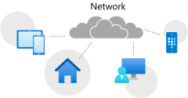
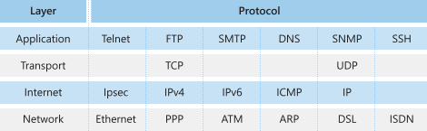

When considering the move to the cloud, it's essential to know the fundamentals of how your network works. The first step in understanding the composition of a network is understanding how network devices communicate with each other. This knowledge applies to your own organization's network as well as more extensive networks like the world wide web. The same principals apply to all networks.

In this unit, we'll learn about the essential network protocols that enable communication across our Internet-based networks.

## Network protocols

A network protocol is a set of conditions and rules that specify how network devices communicate on a given network. It provides a common framework for establishing and maintaining a communications channel, and how to handle errors or faults should they occur. Network protocols allow communication between different network-enabled devices, for example, laptops, tablets, smartphones, desktops, servers, and other network-enabled devices.

The network protocol is an essential building block in the design of our organization's network architecture. There are many network protocols available, and each network protocol has many properties that govern its use and implementation.

Let's define a few terms before we look at some of the commonly used network protocols.

### What is a network address?

A network address is a unique identifier that identifies a network-enabled device. A network-enabled device may have more than one address type. Although there are more address types, for our discussion, we'll only focus on two of these address types.

The first is a media access control (MAC) address that identifies the network interface on the hardware level. The second is an Internet Protocol (IP) address that identifies die network interface on a software level.

We'll explore these two address types in more detail later.

### What is a data packet?

A data packet is a unit we use to describe the message two devices on a network send each other. A data packet consists of raw data, headers, and potentially also a trailer. The header contains several information items. For example, the sender and destination device addresses, size of the packet, the protocol used, and packet number. The trailer in a data packet deals with error checking.

The concept is analogous to sending someone a letter in the post. The difference, though, is instead of sending several pages in one envelope, we send each page in a separate envelope. We'll make sure to add enough information to each envelope to allow the recipient to piece together the complete message once they have all the pages.

### What is a datagram?

A datagram is considered the same as a data packet. However, datagrams commonly refer to data packets of an unreliable service, where delivery can't be guaranteed.

### What is routing?

Routing, in the context of networks, refers to the mechanism used to make sure data packets follow the correct delivery path between the sending and receiving device on a network.

For example, think about the PC we're using and the server that is serving the on the page we're currently reading. Multiple networks may connect our PC, and the server and various paths may be available between these two devices.

## Protocol Categories

We find several types of applications and hardware devices that depend on specific network protocols on a typical network. For example, browsing the Internet using a web browser relies on a different protocol than sending or receiving an email. Converting the data that we see in the browser and send this information over the network will require another protocol.

We categorize the protocols that we use into three categories.

- Network communication protocols
- Network Security protocols
- Network management protocols

Let's have a look at some of the protocols that we'll find in these categories.

## Network communication protocols

Communication protocols focus on establishing and maintaining a connection between devices. As we work with different devices and network services, we'll make use of various network communication protocols.

First, we need to define three foundational protocols of all Internet-based networks. These two protocols are Transmission Control Protocol (TCP), Internet Protocol (IP) and User Datagram Protocol (UDP). These protocols concern themselves with the logical transmission of data over the network.

- **Transmission Control Protocol (TCP)** - is a protocol that chunks up data into data packets that can be sent securely and quickly while minimizing the chance of data loss. It provides a stable and reliable mechanism for the delivery of data packets across an IP-based network. However, even though TCP is an effective connection-orientated protocol, it has overhead.

- **Internet Protocol (IP)** - is responsible for the addressing of a data packet. IP encapsulates the data packet to be delivered, adding an address header. The header contains information on the sender and recipient IP addresses. This protocol isn't concerned about the order the packets are sent or received and doesn't guarantee a packet will be delivered, only the address.

- **User Datagram Protocol (UDP)** - is a connectionless protocol that offers a low-latency and a loss-tolerant implementation. We use UDP with processes that don't need to verify that the recipient device received a datagram.

The rest of the protocols that we'll discuss here are based on a type of application, for example, an email client or web browser. Here is a list of the most commonly used network communication protocols.

- **Hypertext Transfer Protocol (HTTP)** - The HTTP protocol uses TCP/IP to deliver web page content from a server to our browser. HTTP can also handle the download and upload of files from remote servers.

- **File Transfer Protocol (FTP)** - FTP is used to transfer files between different computers on a network. Typically FTP is used to upload files to a server from a remote location. While we can use FTP to download files, web-based downloads are typically handled through HTTP.

- **Post Office Protocol (POP3)** - POP3 is one of three email protocols. It's most commonly used by our email client to allow us to receive emails. This protocol uses TCP for the management and delivery of an email.

- **Simple Mail Transfer Protocol (SMTP)** - SMTP is one of three email protocols. It's most commonly used to send emails from our email client via an email server. This protocol uses the TCP for management and transmission of the email.

- **Interactive Mail Access Protocol (IMAP)** - IMAP is the more powerful of the three email protocols. IMAP allows us, using an email client, to manage a single mailbox on an email server in our organization.

## Network Security protocols

Network security protocols are designed to maintain the security and network of data across your network. These protocols encrypt in-transmission messages between users, services, and applications.

Network security protocols use encryption and cryptographic principals to secure messages. Some of the more popular security protocols include SSL, TLS, HTTPS, POPS, IMAPS, and SSH.

To implement a secure network, you must match the right security protocols for your needs. The following list explores the leading network security protocols:

- **Secure Socket Layer** (SSL) - SSL is a standard encryption and security protocol. It provides a secure and encrypted connection between our computer and the target server or device that we accessed over the Internet.
- **Transport Layer Security** (TSL) - TSL is the successor to SSL and provides a stronger and is more robust security encryption protocol. Based on the (Internet Engineering Task Force) ITEF standard, it's designed to stop message forgery and tampering and eavesdropping. It's typically used to protect web browser communications, email, VOIP, and instant messaging. While TSL is now used, the replacement security protocol is often still called SSL.
- **Hypertext Transfer Protocol Secure** (HTTPS) - HTTPS provides a more secure version of the standard HTTP protocol, by using the TSL or SSL encryption standard. This combination of protocols ensures that all data transmitted between the server and the web browser are encrypted and secure from eavesdropping or data packet sniffing. The same principle is applied to POPS, SMTPS, and IMAPS to create secure versions of the POP, SMTP, and IMAP protocols we saw earlier.
- **Secure Shell** (SSH) - SSH is a cryptographic network security protocol that provides a secure data connection across a network. Designed to support command-line execution of instructions, including remote authentication to servers. The FTP protocol uses many of the SSH functions to provide a secure file transfer mechanism.
- **Kerberos** - This validation protocol provides a robust authentication for client-server based applications through secret-key cryptography. Kerberos assumes that all endpoints in the network are insecure, and enforces strong encryption for all communications and data at all times.

## Network management protocols

In our network, it's perfectly acceptable to have multiple different protocols running concurrently. Previously, we've discussed communications and network protocols. It's equally important to the successful day-to-day running and operating of the network are the management protocols. The focus of this type of protocol is the sustainability of the network, looking at faults and performance.

Network administrators need to monitor their networks and any devices attached to them. Each device in your network will expose some indicators about the state and health of the device. These indicators are requested by the network administrator tool and can be used for monitoring and reporting.

There are two network management protocols available: SNMP and ICMP.

- **Simple Network Management Protocol** (SNMP) - The SNMP is an internet protocol that allows for the collection of data from devices on your network, and the management of those devices. The device has to support SNMP for information to gather information. Typically, these types of devices support SNMP: switches, routers, servers, laptops, desktops, and printers.

- **Internet Control Message Protocol** (ICMP) - The ICMP is one of the protocols included within the Internet protocol suite. It allows network-connected devices to send warning and error messages, along with operation information about the success or failure of a connection request, or if a service is unavailable. Unlike other network transport protocols like UDP and TCP, ICMP isn't used to send or receive data from devices on the network.

### Ports

A port is a logical construct that allows the routing of incoming messages to specific processes. There's a particular port for every type of Internet protocol suite. A port is an unsigned 16-bit number in the range 0 to 65535 and is also known as a port number. Ports are assigned by the sending TCP or UDP layer based on the communications protocol used.

There are specific port numbers reserved for every service. The first 1024 ports, called the well-known port numbers, are reserved for the commonly used services. The high-numbered ports, called the ephemeral ports, are unreserved and used by dedicated applications.

Every port links to a specific service or communications protocol. It means the target network device, say a server, can receive multiple requests on each port and service each of them without conflict.

### The well-known port numbers

Much in the same way, IP addresses are split into classes, so are ports. There are three ranges of ports: the well-known ports, the registered ports, and the dynamic/private ports. 

The Internet Assigned Numbers Authority (IANA) manages the allocation of port numbers, the regional assignment of IP addresses, Domain Name System (DNS) root zones, and a central repository for protocol name and registry used in Internet protocols.

The table below lists some of the more common well-known port numbers.

| Port number | Assignment |
| ----------- | ------------------------------------------------------------ |
| 20 | File Transfer Protocol (FTP) Data Transfer |
| 21 | File Transfer Protocol (FTP) Command Control |
| 22 | Secure Shell (SSH) Secure authentication |
| 23 | Telnet remote authentication service, unencrypted text messages |
| 25 | Simple Mail Transfer Protocol (SMTP) Email routing |
| 53 | Domain Name System (DNS) service |
| 80 | Hypertext Transfer Protocol (HTTP) used in the World Wide Web |
| 110 | Post Office Protocol (POP3) |
| 119 | Network News Transfer Protocol (NNTP) |
| 123 | Network Time Protocol (NTP) |
| 143 | Internet Message Access Protocol (IMAP) Management of digital mail |
| 161 | Simple Network Management Protocol (SNMP) |
| 194 | Internet Relay Chat (IRC) |
| 443 | HTTP Secure (HTTPS) HTTP over TLS/SSL |

## The internet protocol suite (IPS)

The Internet protocol suite (IPS) is a collection of communication protocols, also called a protocol stack. It's also sometimes referred to as the TCP/IP protocol suite since both TCP and IP are primary protocols used in the suite.

The IPS is an abstract, layered networking reference model that describes the different layered protocols used to send and receive data on the Internet and similar networks.

The IPS model is one of several similar networking models that varies between three and seven layers. The best-known model is the Open Systems Interconnection (OSI) networking reference model. We're not going to cover the OSI model here. However, a documentation link is available in the *Learn more* section at the end of this module.

- **Application layer** - The top layer of this stack and is concerned with application or process communication. The application layer is responsible for determining which communication protocols will be used based on what type of message is transmitted. For example, the layer will assign the correct email protocols such as POP, SMTP, or IMAP if the message is email content.
- **Transport layer** - This layer is responsible for host-to-host communication on the network. The protocols associated with this layer are TCP and UDP. TCP is responsible for flow control and UDP for providing a datagram service.
- **Internet layer** - This layer is responsible for exchanging datagrams. A datagram contains the data from the transport layer and adds in the origin and recipient IP addresses. The protocols associated with this layer are IP, ICMP, and the Internet Protocol Security suite (IPsec).
- **Network access layer** - The bottom layer of this stack and is responsible for defining how the data is sent across the network. The protocols associated with this layer are ARP, MAC, Ethernet, DSL, and ISDN.

## How to monitor networks in Azure

Maintaining and managing the health of your network is the same across all networks irrespective of the location of the network. For example, our local organization's network uses the same network standards and protocols as an Azure-based network.

Azure provides us with three network monitoring tools to assist in maintaining and managing the health of your networks. We can also extend some of the monitoring features to our on-premises networks.

- **Network Watcher** - Network Watcher allows us to capture packet data from the azure services we use. It also allows us to understand the flow of data in network traffic patterns and troubleshoot network-related problems on our network.
- **Network Performance Monitor (NPM)** - NPM has been designed to monitor and report on the health of your network, provide insights into its performance, and report on connectivity between your applications. While NPM is cloud-based, it can provide a hybrid service to monitor both cloud and on-premises networks.
- **Performance Monitor** - Performance Monitor is a capability within the NPM. Designed to monitor network connectivity across your entire estate, whether on-premises or cloud-based, it will report network issues as they occur. It can monitor all network routes, including redundant paths, and report any issues. It can identify particular network segments that are degrading network performance. Performance Monitor can report on the health of the network without needing to rely on SNMP.
