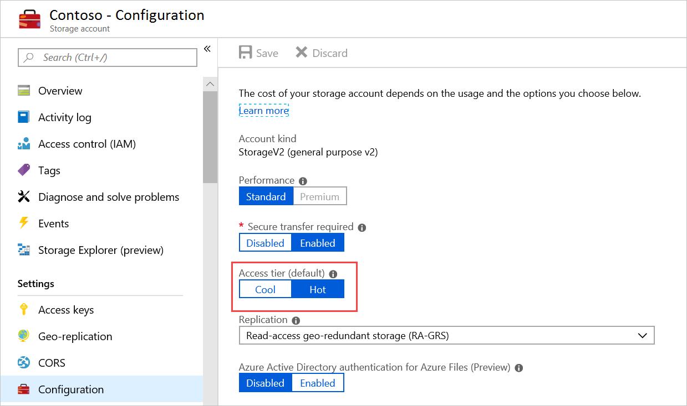
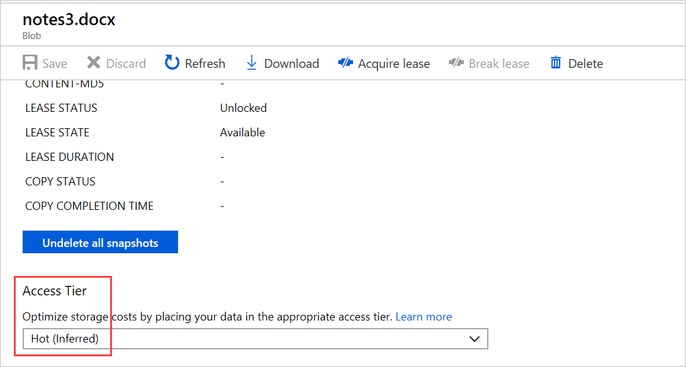
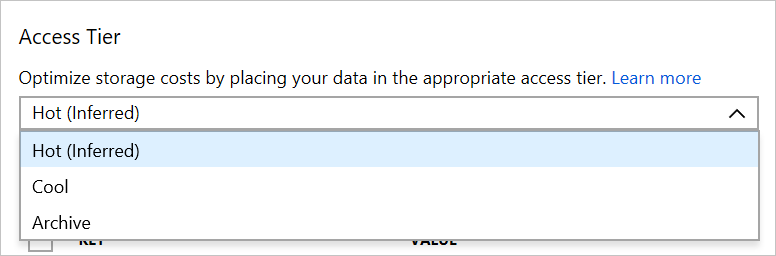
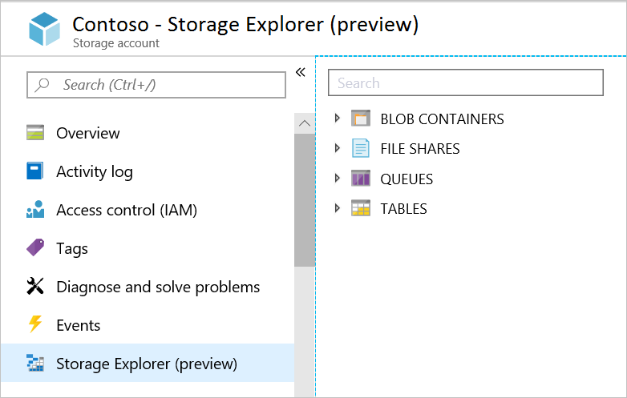
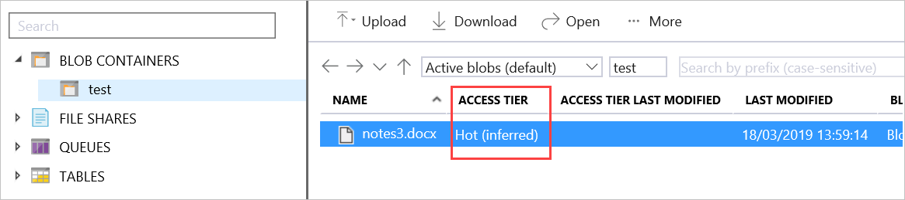

You can configure and manage Azure Storage by using various Azure UI and command-line tools.

In our manufacturing-company example, your next step as project lead in planning your company's storage tier strategy is to review the Azure tool options and decide which are most appropriate for particular scenarios.

In this unit, you compare the methods for configuring and managing storage tiers using Azure tools.

## Azure Tools

There are several tools available that you can use to manage Azure Storage:

- Azure portal
- Azure Storage Explorer
- Azure CLI
- Azure PowerShell

## Azure portal

Using the Azure portal, you can amend the access tier for the storage account from Hot to Cool, or change the Replication options.

1. To manage storage tiers in the Azure portal, select **Storage accounts**.
1. Select one of your storage accounts in the displayed list.
1. Select **Configuration** under the **Settings** heading on the left menu.

   

You can also amend the access tier at the blob level.

1. In the storage account, select **Containers** under **Data storage**.
1. Select **Change tier** in the menu bar.

   

1. Select the access tier you want to use in the drop-down list.

   

## Azure Storage Explorer

You can use Azure Storage Explorer to upload and download Blobs from Azure Storage. There are two versions of Storage Explorer, the Azure portal Storage Explorer and the standalone Storage Explorer.

1. To use the Azure portal tool, go to your storage account and select **Storage browser**:

   

1. Select **Blob containers** to view a list of your containers.
1. Select a container. You can see the access tier for each blob listed.

   

1. To change the access tier, select the blob you want to change, then select **Change tier** in the menu bar.
1. Select the access tier you want to use in the drop-down list.

## Azure PowerShell

You can use PowerShell to manage the access tier for a storage account or for a blob. Some of the cmdlets you can use to manage storage include:

| Cmdlet | Description |
|-----|-----|
| `Add-AzureRMAccount` | Adds an authenticated account to use for Azure Resource Manager cmdlet requests. |
| `Get-AzureStorageAccount` | Gets the storage accounts for the current Azure subscription. |
| `Set-AzureRmStorageAccount -AccessTier` | Sets the access tier for a storage account. |

Here's an example command for changing the access tier on a storage account:

```powershell
Set-AzureRmStorageAccount -ResourceGroupName "TestGroup" -AccountName "StorageAccountName" -AccessTier Cool
```

Here's another example, this time for changing the access tier for multiple blobs in a container:

```powershell
$Storage = "StorageAccountName"

$Key = "StorageAccountKey"

$Container = "BlobContainer"

$blobs = Get-AzureStorageBlob -Container $Container

$blob.icloudblob.setstandardblobtier("Cool")
```

## Azure CLI

You can also use Azure CLI to manage access tiers on storage accounts. Here are some of the cmdlets you can use:

```azurecli
az storage blob upload

az storage blob list

az storage blob download

az storage blob set-tier
```

Here's an example code; this one changes a blob's access tier to **Cool**:

```azurecli
az storage blob set-tier --name BlobName --container-name BlobContainer --account-name StorageAccountName --tier Cool
```
