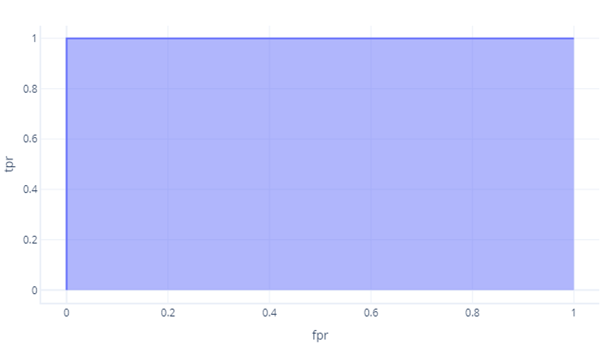
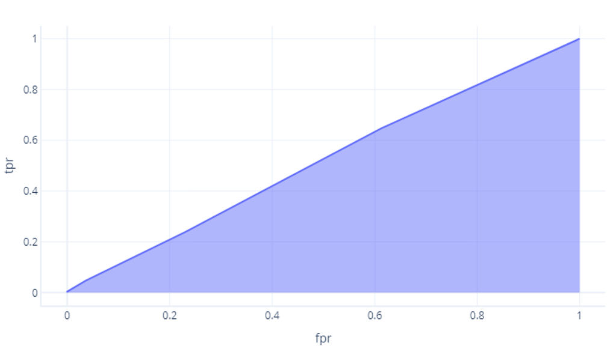

Receiver operator characteristic (ROC) curves let us compare models to one another and tune our selected model. Let’s discuss how and why these are done.

## Tuning a model

The most obvious use for an ROC curve is to choose a decision threshold that gives the best performance. Recall that our models provide us with probabilities, such as a 65% chance that the sample is a hiker. The decision threshold is the point above which a sample is assigned true (hiker) or below which it's assigned `false` (tree). If our decision threshold was 50%, then 65% would be assigned to ‘true’ (hiker). If our decision threshold was 70%, however, a probability of 65% would be too small, and be assigned to false (‘tree’).

We’ve seen in the previous exercise that when we construct an ROC curve, we're just changing the decision threshold and assessing how well the model works. When we do this, we can find the threshold that gives the optimal results.

Usually there isn't a single threshold that gives both the best true positive rate (TPR) and the lower false positive rate (FPR). This means that the optimal threshold depends on what you are trying to achieve. For example, in our scenario, it’s very important to have a high true positive rate because if a hiker isn't identified and an avalanche occurs the team won't know to rescue them. There's a trade-off, though – if the false positive rate is too high, then the rescue team may repeatedly be sent out to rescue people who simply don't exist. In other situations, the false positive rate is considered more important. For example, science has a low tolerance for false-positive results – if the false-positive rate of scientific experiments was higher, there would be an endless flurry of contradictory claims and it would be impossible to make sense of what is real.

## Comparing models with AUC

ROC curves can be used to compare models to each other, just like cost functions can. ROC curve for a model shows how well it will work for a variety of decision thresholds. At the end of the day, what is most important in a model is how it will perform in the real world – where there's only one decision threshold. Why then, would we want to compare models using thresholds we'll never use? There are two answers for this.

Firstly, comparing ROC curves in particular ways is like performing a statistical test that tells us not just that one model did better on this particular test set, but whether it's likely to continue to perform better in the future. This is out of the scope of this learning material, but it's worth keeping in mind.

Secondly, the ROC curve shows, to some degree, how reliant the model is on having the perfect threshold. For example, if our model only works well when we have a decision threshold of 0.9, but terribly above or below this value, it's not a good design. We would probably prefer to work with a model that works reasonably well for various thresholds, knowing that if the real-world data we come across is slightly different to our test set, our model’s performance won't necessarily collapse.

### How to compare ROCs?

The easiest way to compare ROCs numerically is using the area under the curve (AUC). Literally, this is the area of the graph that is below the curve. For example, our perfect model from the last exercise has an AUC of 1:

While our model that did not better than chance has an area of about 0.5:

The more perfect a model is, the larger this area becomes. If we have a model with a large AUC, we know it works well for a variety of thresholds, and so it probably has good architecture and has been trained well. By contrast, a model with a small AUC (closer to 0.5) isn't working well.
