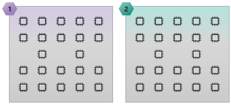
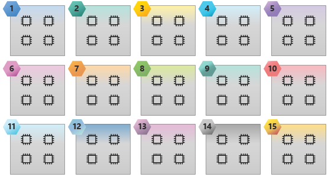

## Why pin processes and threads?

Always pin processes to specific cores in order to help achieve maximum performance and get more consistent performance from run to run.

Process pinning:

- Maximizes memory bandwidth by placing or pinning processes in locations that use all memory channels and distribute all memory channels equally among the cores.

- Improves floating-point performance by guaranteeing that each process is on its own core. This eliminates the possibility that two processes land on the same core.

- Optimizes data movement among the processes by placing processes that communicate in Non-Uniform Memory Access (NUMA) domain nodes. This guarantees that they have the lowest latency and highest bandwidth.

- Reduces operating system overhead and gives you more consistent results because the operating system can't move processes to different cores or NUMA domains.

## Where do you pin processes and threads?

To determine where to pin processes and threads, you need to understand the processor and memory topology, and specifically the number and location of the NUMA domains.

The **lstopo-no-graphics** utility (from the hwloc RPM) and the **Intel Memory Latency Checker (MLC)** are useful tools to determine the processor and memory topology. For example: How many NUMA domains does the VM have? Which cores are members of each NUMA domain? What is the latency and bandwidth for processes in each NUMA domain as they communicate with each other?

The following image displays the HB120_v2 NUMA domain latency map generated by Intel MLC. The lower the latency between NUMA domains, the faster the communication is between them. The illustration clearly shows that HB120_v2 has 30 NUMA domains, and which NUMA domains are on which socket. It also shows which NUMA domains can be grouped together to achieve the lowest data transfer and communication latency.

Intel processors have six memory channels, and AMD EPYC processors have eight memory channels. Ensure that you use all memory channels to maximize the available memory bandwidth. Do this by spreading the parallel processes evenly among the NUMA node domains. For hybrid parallel applications, keep process/thread grouping in the same NUMA domains, ideally sharing the same L3 cache. Make sure that the total thread count doesn't exceed the total number of cores.

The following image illustrates an HC44 SKU with 2 NUMA domains and 44 cores.

The following image illustrates an HB60 SKU with 15 NUMA domains and 60 cores.

## Memory bandwidth bound applications

If you have an application that's bound by memory bandwidth, you might get better performance on the VM by reducing the number of parallel processes and threads in each NUMA node domain. This can provide more memory bandwidth per process and possibly reduce wall clock time.

For example, if you're using HB120_v2 SKU with 30 NUMA node domains, you can try running 1, 2, and 3 processes and threads per NUMA node domain (for example: 30, 60, and 90 processes and threads per VM). You can then see which configuration gives the best performance.
