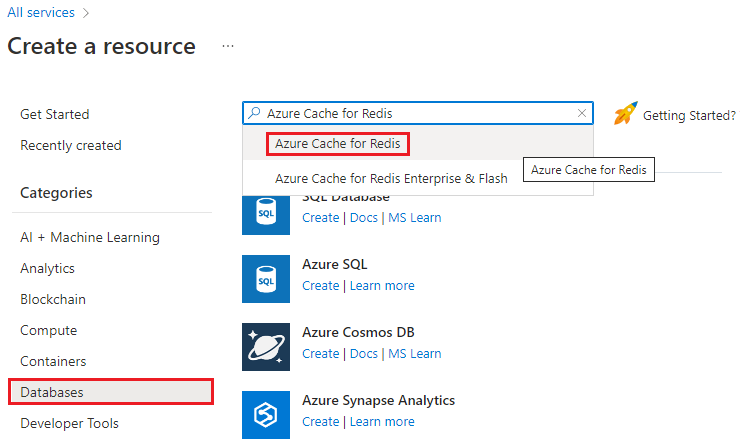

Let's create an Azure Cache for Redis instance to store and return commonly used values.

## Create a Redis cache in Azure

1. Sign into the [Azure portal](https://portal.azure.com/learn.docs.microsoft.com?azure-portal=true) using the same account you activated the sandbox with.

1. On the Azure portal menu, select **Create a resource**.

    

1. Select **Databases**, and then **Azure Cache for Redis**.

    The following screenshot shows the Azure Cache for Redis location within the various database resource options on the Azure portal.

    

### Configure your cache

1. Apply the following settings on the cache:

    | Setting | Value |
    | ----- | ----------- |
    | Subscription | Concierge Subscription |
    | Resource group | <rgn>[sandbox resource group name]</rgn> |
    | DNS name | Create a globally unique name such as **ContosoSportsApp[nnn]**, where `[nnn]` is replaced with random numbers. |
    | Location | Normally, you would select a location near your customers; in this case, the East Coast. For this exercise, you can select any available location. |
    | Cache type | Select Basic C0, which is the lowest tier you can use. Production apps would likely want to store more data and utilize some of the Premium features such as clustering, which would require a higher tier selection |

1. Select **Review + Create**, then select **Create**. Azure will create and deploy the Redis Cache instance for you.

    > [!IMPORTANT]
    > Usually, the Redis cache resource will be created and viewable in the Azure portal quickly, but the cache itself will not be available for a few minutes. The next steps show how to check the status of your cache once deployment is finished.

## Use your cache

You can use the **Console** feature in the Azure portal to issue commands to your Redis cache instance after it has been deployed.

1. Locate your Redis cache through the **Notification** popup when it finishes deployment, or by selecting **All Resources** in the left-hand sidebar and using the filter box on the left to select Redis Cache instances. Alternatively, you can use the search box at the top and type the name of the cache.

1. Select your Redis cache instance.

1. Check the value of the *Status* field. The cache isn't ready until the status is *Running*. You might have to wait for a few minutes before proceeding.

1. Once the cache is running, Click the **>_ Console** button in the toolbar on the **Overview** pane for your Redis Cache. This will open a Redis console, which allows you to enter low-level Redis commands. Try some of the following commands:

    ```console
    ping
    ```

    ```console
    set test one
    ```

    ```console
    get test
    ```

Switch back to the **Overview** panel either through the breadcrumb bar on the top, or use the scrollbar to slide the view back to the left.

## Retrieve the access keys and host name

::: zone pivot="csharp"

1. Select **Settings** > **Access keys**.

1. Copy the **Primary connection string (StackExchange.Redis)** to a safe place, you'll need it for the next exercise.

    This key includes your primary key and host name in a complete connection string for use within your application settings for the **StackExchange.Redis** package we're going to use.

Next, let's learn about some of the commands we can use to interrogate the cache.

::: zone-end

::: zone pivot="javascript"

For the next exercise, you'll need the host name, port, and primary access key of the cache.

1. Select **Settings** > **Access keys** in the resource navigation menu.

1. Copy the **Primary** access key (not the Primary connection string) to a text editor.

1. Select **Settings** > **Properties** in the resource navigation menu.

1. Copy the **Host name** and **SSL port** to a text editor.

Next, let's learn about some of the commands we can use to interrogate the cache.

::: zone-end
