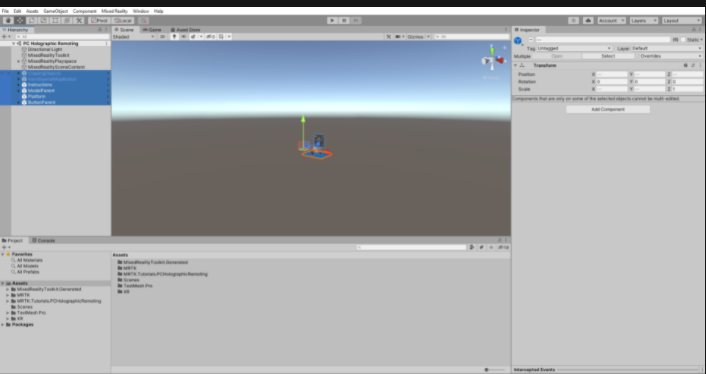
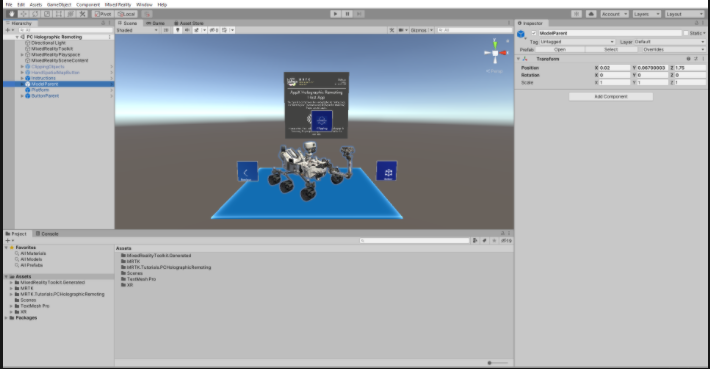
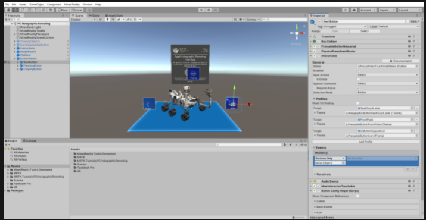
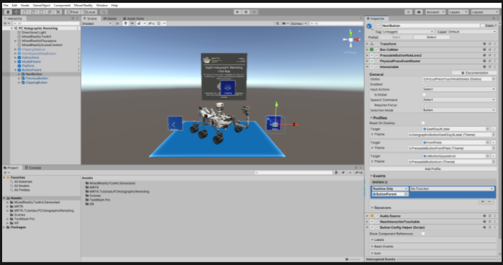
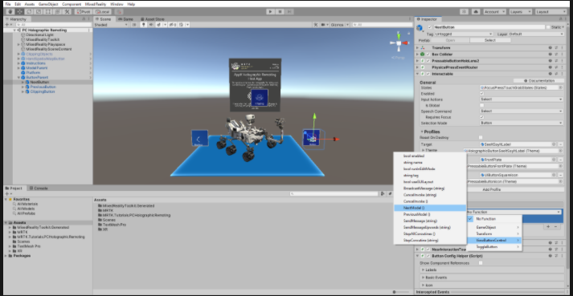
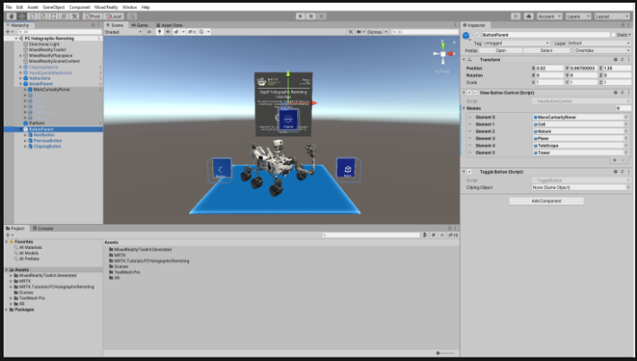
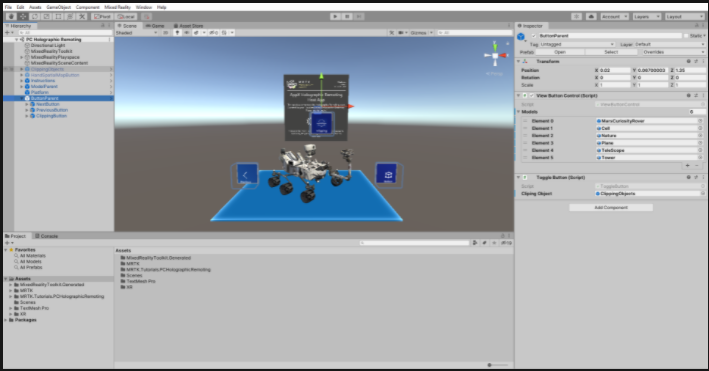
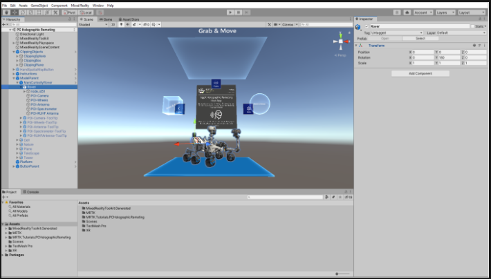
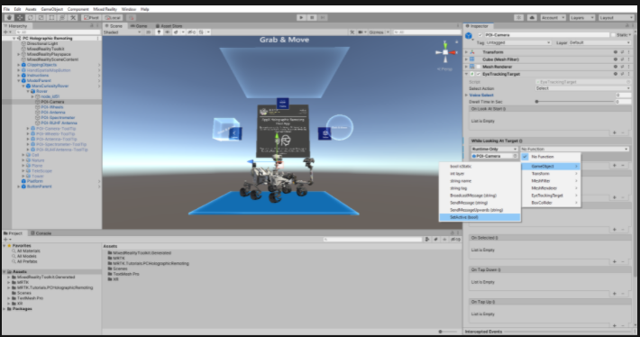

Welcome to the HoloLens 2 tutorials. In this tutorial, you'll learn how to create a Mixed Reality experience that features UI elements, 3D model manipulation, model clipping and eye-tracking features. In the second tutorial, you'll learn how to create a PC app for Holographic Remoting that lets you connect to the HoloLens 2 at any time and visualize your app in 3D.

To complete this tutorial successfully, you should've some basic knowledge of Unity and MRTK. If you don't, we recommend that you complete the Getting started tutorials before continuing.

>[!Important]
>This tutorial series supports Unity 2020 LTS (currently 2020.3.x) if you're using Open XR and Unity 2019 LTS (currently 2019.4.x) if you're using Legacy WSA. This supersedes any Unity version requirements stated in the prerequisites linked above.

## Creating And preparing The Unity Project

In this section, you'll create a new Unity project and get it ready for MRTK development.

Go to the [Initializing your project and deploying your first application](/windows/mixed-reality/develop/unity/tutorials/mr-learning-base-02?tabs=openxr) article and follow the instructions there, but stop when you reach the section titled "Building your application to your HoloLens 2." As a result of completing those instructions, you'll have done the following:

1. Created the Unity project and gave it a suitable name--for example, "MRTK Tutorials."

2. Switched the build platform.

3. Imported the TextMeshPro Essential Resources.

4. Imported the Mixed Reality Toolkit and configured the Unity project.

5. Created and set the scene and gave it a suitable name--for example, "PC Holographic Remoting."

Go to the [Configuring the MRTK profiles](https://docs.microsoft.com/en-us/windows/mixed-reality/develop/unity/tutorials/mr-learning-base-03?tabs=openxr) article and follow the instructions in the "Changing the Spatial Awareness Display Option" section to change the MRTK configuration profile for your scene to the **DefaultHoloLens2ConfigurationProfile**. Change the display options for the spatial awareness mesh to **Occlusion**.

## Importing The Tutorial Assets

[!INCLUDE[]](includes/switching-platform.md)]

## Configuring And Preparing The Scene
In this section, you'll prepare the scene by adding some of the tutorial prefabs.

1. In the Project window, navigate to the **Assets** > **MRTK.Tutorials.PCHolograhicRemoting** > **Prefabs** folder. While holding down the CTRL button, select the following six prefabs.

* ButtonParent
* ClippingObjects
* HandSpatialMapButton
* Instructions
* ModelParent
* Platform

2. Drag these models from the prefabs folder into the **Hierarchy** window.

To focus on the objects in the scene, you can double-click the ModelParent object and then zoom in:

>[!Tip]
>If you feel that the large icons in your scene are distracting (for example, the large framed 'T' icons), you can hide them by [toggling the Gizmos](https://docs.unity3d.com/2019.1/Documentation/Manual/GizmosMenu.html) to the "off" position.

## Configuring The Buttons To Operate The Scene

In this section, you'll add scripts to the scene and create button events that demonstrate the fundamentals of model switching and clipping functionality.

## 1. Configuring The Interactable (Script) Component

1. In the Hierarchy window, expand the **ButtonParent** object and select the next button. In the Inspector window, locate the **Interactable (Script)** component and click on plus sign icon ("+") under **OnClick ()** event.

2. With the **NextButton** object still selected in the Hierarchy window, drag the **ButtonParent** object from the Hierarchy window into the empty **None (Object)** field of the event you just added to make the ButtonParent object listen for the button click event from this button:

3. Click the **No Function**  dropdown of the same event and then select ViewButtonControl > NextModel () to set the NextModel () function as the action that is triggered when the button is pressed:

## Configuring The Remaining Buttons

1. For each of the remaining buttons, complete the process outlined above to assign functions to the **OnClick ()** events:

* For the PreviousButton object, assign the **ViewButtonControl** > **PreviousModel ()** function.
* For ClippingButton, select the **ToggleButton** > **ToggleClipping ()** function.

## Configuring The View Button Control (Script) And Toggle Button (Script) Components

At this point, your buttons are configured to demonstrate the model switching and clipping functionality. Next, you'll add 3D models to the scene and the clipping objects to the script.

We've provided six different 3D models for demonstration. Expand the **ModelParentobject** to expose these models.

1. With the ButtonParent object still selected in the Hierarchy window, in the Inspector window, locate the **View Button Control (Script)** component and expand the **Models** variable.

    In the **Size** field, enter the number of 3D models you would like to have in your scene--in this case, six. This creates fields for adding new 3D models.

2. Drag each child object of ModelParent Object into these fields.

3. Drag the **ClippingObjects** object from the Hierarchy window to the **Toggle Button (Script)** component's **Clipping Object** field.

> [!Note]
> Stay in button parent object only.

4. In the Hierarchy window, select the ClippingObjects prefab and enable it in the Inspector window to turn on the **Clipping objects**.

## Configuring The Clipping Objects To Enable Clipping Feature

In this section, you'll add MarsCuriosityRover object's child objects renderer into an individual **clipping object** to demonstrate the clipping of the MarsCuriosityRover model.

In the Hierarchy window, expand the **ClippingObjects** object to expose the three different clipping objects you'll use in this project.

1. To configure the **ClippingSphere** object, select it, and then in the Inspector window, locate the **Clipping Sphere (Script)** component. Next, enter the number of renderers in the **size** field that you need to add for your 3D model. In this case, add 10 for MarsCuriosityRover child objects. It will create fields for adding renderers. Next, drag the MarsCuriosityRover object's child model objects into these fields.

2. In the Hierarchy window, select the ClippingObjects prefab and enable it in the Inspector window to turn on the Clipping objects.

## Configuring Eye-Tracking To Highlight Tooltips

In this section, you'll explore how to enable eye tracking in your project. For example, you'll implement the functionality to highlight tooltips attached to MarsCuriosityRover's parts while you're looking at them and hide them while you're looking away from them.

## 1. Identify Target Objects And Associated Tooltips

In the Hierarchy window, select the ModelParent object. Next, expand the **MarsCuriosity** -> **Rover** to find five main parts of the MarsCuriosityRover: **POI-Camera, POI-Wheels, POI-Antena, POI-Spectrometer, POI-RUHF Antenna**.

* Observe five corresponding tooltip objects associated with MarsCuriosityRover parts in the Hierarchy window.

## 2. Implement While Looking At Target() & On Look Away() Events

1. In the Hierarchy window, select the **POI-Camera** object. Then, in the Inspector window, locate the Eye Tracking Target (Script) component and configure the **While Looking At Target() & On Look Away()** events as follows:

* In the **None (Object)** field, assign the **POI-Camera ToolTip** object.
* In the**No Function** dropdown of the **While Looking At Target ()** event, select **GameObject > SetActive (bool)**. Select the check box under it to highlight the tooltip as the triggered action when looking at the target object.

* Click the **No Function** dropdown of the **On Look Away ()** event listener. Next, select **GameObject > SetActive (bool)** and leave the check box empty so that hiding the tooltip is the action triggered when you look away from the target object.

Follow the same process and assign respective tooltip objects to their same MarsCuriosityRover parts' While Looking At Target() & On Look Away() events.

