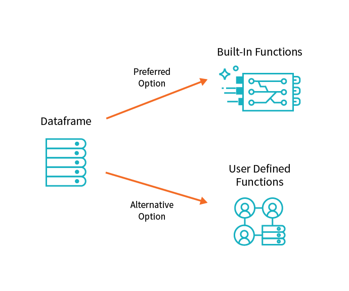
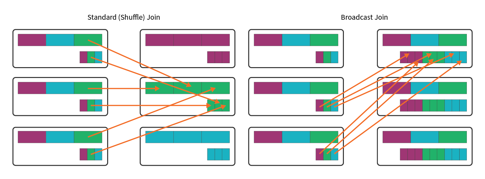
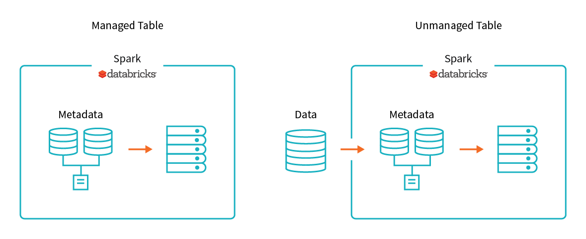

Advanced ETL processes include data transformation using custom and advanced user defined functions, managing complex tables and loading data into multiple databases simultaneously.

## Custom and complex transformations with user defined functions (UDF)

Spark's highly optimized built-in functions provide a wide array of functionality, covering the vast majority of data transformation use cases. However, there may be a scenario when you need to define logic specific to your use case and when you need to encapsulate that solution for reuse. User Defined Functions (UDFs) come in handy in such cases. They should only be used when there is no clear way to accomplish a task using built-in functions.

UDFs provide custom, generalizable code that you can apply to ETL workloads when Spark's built-in functions won't suffice. UDFs can take multiple column inputs, and though they cannot return multiple columns, they can return complex, named types that are easily accessible. This approach is especially helpful in ETL workloads that need to clean complex and challenging data structures.

## Joins and lookup tables

A common use case in ETL jobs involves joining new data to either lookup tables or historical data. Traditional databases join tables by pairing values on a given column. When all the data sits in a single database, it often goes unnoticed how computationally expensive row-wise comparisons are. When data is distributed across a cluster, the expense of joins becomes even more apparent.

A **standard** (or **shuffle**) join moves all the data on the cluster for each table to a given node on the cluster. This is expensive not only because of the computation needed to perform row-wise comparisons, but also because data transfer across a network is often the biggest performance bottleneck of distributed systems.

A **broadcast** join remedies this situation when one DataFrame is sufficiently small. A broadcast join duplicates the smaller of the two DataFrames on each node of the cluster, avoiding the cost of shuffling the bigger DataFrame.

## Writing to multiple databases

Loading your transformed data to multiple target databases can be a time-consuming activity and can have an impact on your database connection. Spark makes this job easier as there are a number of variables that can be tweaked to optimize performance, largely relating to how data is organized on the cluster.

Partitions are one of the options to get optimum performance from your database connections. A partition is a portion of your total data set, which is divided into many of these portions so Spark can distribute your work across a cluster.

The other concept needed to understand Spark's computation is a slot (also known as a core). A slot/core is a resource available for the execution of computation in parallel. In brief, a partition refers to the distribution of data while a slot refers to the distribution of computation.

## Table management

When loading data back to the target database, you might want to optimize your data storage by using managed and unmanaged tables.

A **managed table** is a table that manages both the data itself as well as the metadata. In this case, a 'DROP TABLE' command removes both the metadata for the table as well as the data itself.

**Unmanaged tables** manage the metadata from a table such as the schema and data location, but the data itself sits in a different location, often backed by a blob store like the Azure Blob or S3. Dropping an unmanaged table drops only the metadata associated with the table while the data itself remains in place.

