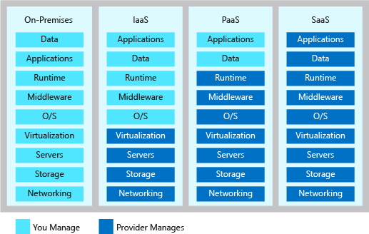

The cloud has changed the way organizations solve their business challenges, and how applications and systems are designed. The role of a solution architect is not only to deliver business value through the functional requirements of the application, but to ensure the solution is designed in ways that are scalable, resilient, efficient and secure. Solution architecture is concerned with the planning, design, implementation, and ongoing improvement of a technology system. The architecture of a system must balance and align the business requirements with the technical capabilities needed to execute those requirements. It includes an evaluation of risk, cost, and capability throughout the system and its components.

#### Design a great Azure Architecture

<!-- TODO: revisit this video after Ignite -->
<!-- > VIDEO: https://www.microsoft.com/videoplayer/embed/RE2yEv2 -->

While there is no one-size-fits-all approach to designing an architecture, there are some universal concepts that will apply regardless of the architecture, technology, or cloud provider. While these are not all-inclusive, focusing on these concepts will help you build a reliable, secure, and flexible foundation for your application.

A great architecture starts with a solid foundation built on four pillars:

* Security
* Performance and scalability
* Availability and recoverability
* Efficiency and operations

## Security

Data is the most valuable piece of your organization's technical footprint. In this pillar, you'll be focused on securing access to your architecture through authentication and protecting your application and data from network vulnerabilities. The integrity of your data should be protected as well, using tools like encryption.

You must think about security throughout the entire lifecycle of your application, from design and implementation to deployment and operations. The cloud provides protections against a variety of threats, such as network intrusion and DDoS attacks, but you still need to build security into your application, processes, and organizational culture.

## Performance and scalability

For an architecture to perform well and be scalable, it should properly match resource capacity to demand. Traditionally, cloud architectures do so by scaling applications dynamically based on activity in the application. Demand for services change, so it's important for your architecture to have the ability to adjust to demand as well. By designing your architecture with performance and scalability in mind, you'll provide a great experience for your customers while being cost-effective.

## Availability and recoverability

Every architect’s worst fear is having your architecture go down with no way to recover it. A successful cloud environment is designed in a way that anticipates failure at all levels. Part of anticipating these failures is designing a system that can recover from the failure, within the time required by your stakeholders and customers.

## Efficiency and operations

You will want to design your cloud environment so that it's cost-effective to operate and develop against. Inefficiency and waste in cloud spending should be identified to ensure you're spending money where we can make the greatest use of it. You need to have a good monitoring architecture in place so that you can detect failures and problems before they happen or, at a minimum, before your customers notice. You also need to have some visibility in to how your application is using its available resources, through a robust monitoring framework.

# Shared responsibility

Moving to the cloud introduces a model of shared responsibility. In this model, your cloud provider will manage certain aspects of your application, leaving you with the remaining responsibility. In an on-premises environment you are responsible for everything. As you move to infrastructure as a service (IaaS), then to platform as a service (PaaS) and software as a service (SaaS), your cloud provider will take on more of this responsibility. This shared responsibility will play a role in your architectural decisions, as they can have implications on cost, operational capabilities, security, and the technical capabilities of your application. By shifting these responsibilities to your provider you can focus on bringing value to your business and move away from activities that aren't a core business function.

# Design choices

In an ideal architecture, we would build the most secure, high performance, highly available, and efficient environment possible. However, as with everything, there are trade-offs. To build an environment with the highest level of all these pillars, there is a cost. That cost may be in actual money, time to deliver, or operational agility. Every organization will have different priorities that will impact the design choices made in each pillar. As you design your architecture, you will need to determine what trade-offs are acceptable and which are not.

When building an Azure architecture, there are many considerations to keep in mind. You want your architecture to be secure, scalable, available, and recoverable. To make that possible, you'll have to make decisions based on cost, organizational priorities, and risk.
