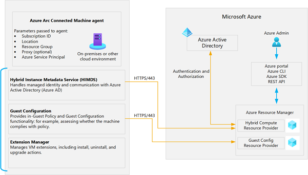

Using Microsoft Defender for Cloud to improve security posture across one's entire digital estate—Microsoft Sentinel for vulnerability and threat intelligence in other clouds, and Azure Monitor to monitor on-premises services—Azure Arc-enabled servers offers customers immense value that is delivered through a simple architecture. 

As Wide World Importers has prioritized its deployment of Azure Arc-enabled servers, you want to first understand how Azure Arc can extend Azure's management plane to servers outside Azure and learn about what capabilities Azure Arc-enabled servers could deliver for the firm.  

## Overview of the Connected Machine agent  

Azure Arc relies on a locally installed agent to establish a logical connection between the local resource and Azure. This agent is the Connected Machine agent. The Connected Machine agent package contains several logical components, which are bundled together:

- The Hybrid Instance Metadata service (HIMDS) manages the connection to Azure and the connected machine's Azure identity.

- The guest configuration agent provides functionality like assessing whether the machine complies with required policies and enforcing compliance.

- The Extension agent manages VM extensions, including install, uninstall, and upgrade.

By establishing a connection between Azure and a local resource, the Azure Connected Machine Agent effectively "arc-enables" the resource. Consequently, the non-Azure resource automatically becomes a hybrid Azure resource as part of the Azure Resource Manager plane. Azure Resource Manager serves as the management interface that allows you to create, modify, and delete Azure resources.

## Capabilities of Azure Arc-enabled servers

Azure Arc-enabled servers can leverage a breadth of capabilities, so you can bring Azure services to your machines anywhere: across on-premises, multi-cloud, and edge environments. These capabilities serve diverse use cases across security, observability, and governance needs.

| Service | Description |
|---|---|
| **Azure Resource** | Azure Arc-enabled servers benefit from Azure's robust resource management functions, including:<ul><li>The ability to organize all organizational resources by using Azure management groups, subscriptions, resource groups, and tags.</li><li>A single, comprehensive inventory of organizational assets across multi-clouds and on-premises, including support for searching and indexing by using Azure Resource Graph.</li><li>A consolidated view of Azure and Azure Arc-enabled resources via the Azure portal, Azure Command Line Interface (CLI), Azure PowerShell, and Representational State Transfer (REST) Application Programming Interface (API).</li></ul> |
| **Microsoft Defender for Cloud** | Microsoft Defender for Cloud enables customers to protect non-Azure servers with Microsoft Defender for Endpoint (included through Microsoft Defender for Cloud) for threat detection, for vulnerability management, and to proactively monitor for potential security threats. Microsoft Defender for Cloud presents the alerts and remediation suggestions from the threats detected, and consolidates security posture with a high-level security score. |
| **Microsoft Sentinel** | You can configure machines connected to Arc-enabled servers with Microsoft Sentinel to collect security-related events and correlate them with other data sources. |
| **Azure Monitor** | Monitor the connected machine guest operating system performance and discover application components to monitor their processes and dependencies with other resources using VM insights. Collect other log data, such as performance data and events, from the operating system or workload(s) running on the machine with the Log Analytics agent. |
| **Azure Policy** | Azure Policy enables customers to manage and evaluate their Arc-enabled servers' internal and regulatory compliance. Users can define, assign, and remediate based on Azure Policy guest configurations to audit settings inside the machine like their time zone or security vulnerabilities. |
| **Azure Automation** | Automate frequent and time-consuming management tasks using PowerShell and Python runbooks. Assess configuration changes about installed software, Microsoft services, Windows registry and files, and Linux daemons using Change Tracking and Inventory. Use Update Management to manage operating system updates for your Windows and Linux servers. |
| **Azure Automanage** | Automate onboarding and configuration of a set of Azure services when you use Automanage Machine for Azure Arc-enabled servers. |

Azure Arc-enabled servers can leverage Azure VM extensions. Azure VM extensions are lightweight software components that automate post-operating system deployment configuration and automation tasks. Traditionally, Azure VM extensions were available only on Azure VMs, but it's now possible to use selected ones on Azure Arc-enabled servers.

| Extension | Description |
|---|---|
| Custom Script Extension | Executes a script on the target Azure Arc-enabled server |
| Desired State Configuration | Applies a PowerShell DSC configuration on the target Azure Arc-enabled server |
| Log Analytics agent | Installs the Log Analytics agent on the target Azure Arc-enabled server and configures it for log forwarding to a Log Analytics workspace |
| Dependency agent | Installs the Dependency agent on the target Azure Arc-enabled server to facilitate identifying internal and external dependencies of server workloads |
| Azure Key Vault agent | Synchronizes certificates from an Azure Key Vault instance to the Arc enabled server |
| Qualys extension | Microsoft Defender for servers' vulnerability-assessment scanning solution |
