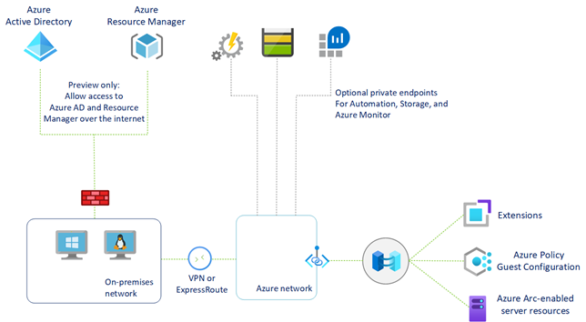

Given the deployment of Arc-enabled servers will encompass thousands of machines across multiple offices handling business critical workloads, security is top of mind for Wide World Importers. As you plan a secure deployment, it's important to consider how you can apply access roles, policies, and networking in tandem to ensure compliance and protection of resources. 

Azure Arc-enabled servers not only benefit from built in-security with careful encryption and data sharing by design, but also have a range of added security configurations. To ensure a secure deployment, you might need to prepare an effective landing zone for Arc-enabled resources by configuring the appropriate access controls, governance infrastructure, and advanced networking options. In this unit, you learn to:

1. **Configure Role based access control (RBAC)**: Develop an access plan to control who has access to manage Azure Arc-enabled servers and ability to view their data from other Azure services.

1. **Develop an Azure Policy governance plan**: Determine how you'll implement governance of hybrid servers and machines at the subscription or resource group scope with Azure Policy.

1. **Select Advanced Networking options**: Evaluate whether Proxy Server or Azure Private Link will be necessary for your Arc-enabled server deployment

## Secure Identities and Access Control

Each Azure Arc-enabled server has a managed identity as part of a resource group inside an Azure subscription. That identity represents the server running on-premises or other cloud environment. Access to this resource is controlled by standard Azure role-based access control (RBAC). Two Arc-enabled Server specific roles are Azure Connected Machine Onboarding role and the Azure Connected Machine Resource Administrator role.

The Azure Connected Machine Onboarding role is available for at-scale onboarding, and can only read or create new Azure Arc-enabled servers in Azure. It ca't delete servers already registered or manage extensions. As a best practice, we recommend only assigning this role to the Azure Active Directory (Azure AD) service principal used to onboard machines at scale.

Users with the Azure Connected Machine Resource Administrator role can read, modify, re-onboard, and delete a machine. This role is designed to support management of Azure Arc-enabled servers, but not other resources in the resource group or subscription.

Additionally, the Azure Connected Machine agent uses public-key authentication to communicate with the Azure service. After you onboard a server to Azure Arc, a private key is saved to the disk and used whenever the agent communicates with Azure. If stolen, the private key can be used on another server to communicate with the service and act as if it were the original server. This includes getting access to the system-assigned identity and any resources to which that identity has access. The private key file is protected to only allow the HIMDS account access to read it. To prevent offline attacks, we strongly recommend the use of full disk encryption (for example, BitLocker, dm-crypt, etc.) on the operating system volume of your server.

## Azure Policy Governance

Regulatory Compliance in Azure Policy provides Microsoft created and managed initiative definitions, known as built-ins, for the compliance domains and security controls related to different compliance standards. Some Regulatory Compliance Azure Policies include:

- Australian Government ISM PROTECTED
- Azure Security Benchmark
- Azure Security Benchmark v1
- Canada Federal PBMM
- CMMC Level 3
- FedRAMP High
- FedRAMP Moderate
- HIPAA HITRUST 9.2
- IRS 1075 September 2016
- ISO 27001:2013
- New Zealand ISM Restricted
- NIST SP 800-171 R2
- NIST SP 800-53 Rev. 4
- NIST SP 800-53 Rev. 5
- UK OFFICIAL and UK NHS

Before deploying Azure Arc-enabled servers to a resource group, you can systemically define and assign Azure Policies with their respective remediation tasks at the resource group, subscription, or management group level, to ensure that auditing and compliance guardrails are in place.  

## Secure Networking with Private Link

Beyond public endpoint, two other secure networking options for Azure Arc-enabled servers are Proxy Server and Azure Private Link.

If your machine is communicating through a proxy server to connect to the internet, you can specify the proxy server IP address or the name and port number that the machine will use to communicate with the proxy server. You can make this specification directly in the Azure portal when generating a script for onboarding multiple machines to Arc.

For high-security scenarios, Azure Private Link allows you to securely link Azure PaaS services to your virtual network using private endpoints. For many services, you just set up an endpoint per resource. This means you can connect your on-premises or multi-cloud servers with Azure Arc and send all traffic over an Azure ExpressRoute or site-to-site VPN connection instead of using public networks. By utilizing Private Link with Arc-enabled servers, you can:

- Connect privately to Azure Arc without opening up any public network access.
- Ensure data from the Azure Arc-enabled machine or server is only accessed through authorized private networks.
- Securely connect your private on-premises network to Azure Arc using ExpressRoute and Private Link.
- Keep all traffic inside the Microsoft Azure backbone network.

