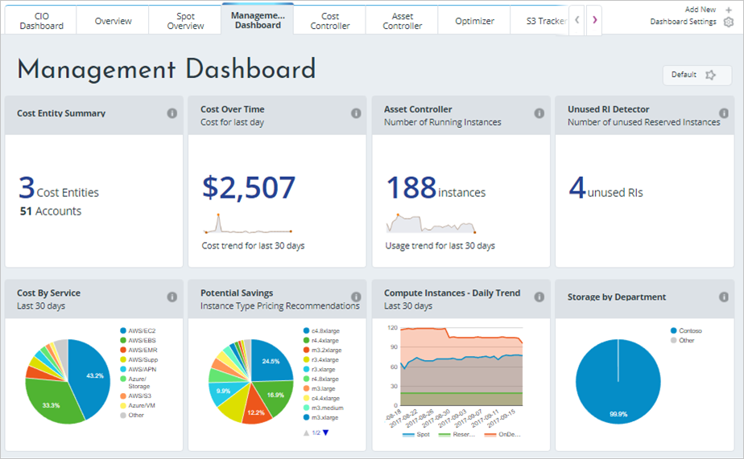

We learned how to estimate your costs before you deploy services on Azure, but what if you already have resources deployed? How do you get visibility into the costs you're already accruing? If we had deployed our previous solution to Azure and now want to make sure that we've sized the virtual machines properly and predict how much our bill will be, how can we do this? Let's look at a few tools on Azure that you can use to help you solve this problem.

## What is Azure Advisor?

**Azure Advisor** is a free service built into Azure that provides recommendations on high availability, security, performance, and cost. Advisor analyzes your deployed services and looks for ways to improve your environment across those four areas. We'll focus on the cost recommendations, but you'll want to take some time to review the other recommendations as well.

Advisor makes cost recommendations in the following areas:

1. **Reduce costs by eliminating unprovisioned Azure ExpressRoute circuits.**
    This identifies ExpressRoute circuits that have been in the provider status of *Not Provisioned* for more than one month and recommends deleting the circuit if you aren't planning to provision the circuit with your connectivity provider.

1. **Buy reserved instances to save money over pay-as-you-go.**
    This will review your virtual machine usage over the last 30 days and determine if you could save money in the future by purchasing reserved instances. Advisor will show you the regions and sizes where you potentially have the most savings and will show you the estimated savings you might achieve from purchasing reserved instances.

1. **Right-size or shutdown underutilized virtual machines.**
    This monitors your virtual machine usage for 14 days and then identifies underutilized virtual machines. Virtual machines whose average CPU utilization is 5 percent or less and network usage is 7 MB or less for four or more days are considered underutilized virtual machines. The average CPU utilization threshold is adjustable up to 20 percent. By identifying these virtual machines, you can decide to resize them to a smaller instance type, reducing your costs.

[!include]

Let's take a look at where you can find Azure Advisor in the portal. 

1. Sign into the [Azure portal](https://portal.azure.com?azure-portal=true) using your Microsoft account. 

1. Click on **All Services**, and in the **Management Tools** category, you will see **Advisor**. You can also type `Advisor` in the filter box to filter on just that service.

1. Click on Advisor, and you'll be taken to the Advisor recommendations dashboard where you can see all the recommendations for your subscription. You'll see a box for each category of recommendations.

> [!NOTE]
> You might not have any recommendations on cost in Advisor. This could be because assessments have not yet completed or simply because Advisor has no recommendations.

Clicking on the **Cost** box will take you to detailed recommendations where you can see the recommendations that Advisor has.

Clicking on any recommendation will take you to the details for that specific recommendation. Then you'll be able to take a specific action, such as resizing virtual machines to reduce spending.

These recommendations are all places where you might be inefficiently spending money. They're a great place to start and continue to revisit when looking for places to reduce costs. In our example, there's an opportunity for us to save around $700 per month if we take these recommendations. This savings adds up, so be sure to review this periodically for recommendations across all four areas.

## Azure Cost Management

Azure Cost Management is another free, built-in Azure tool that can be used to gain greater insights into where your cloud money is going. You can see historical breakdowns of what services you are spending your money on and how it is tracking against budgets that you have set. You can set budgets, schedule reports, and analyze your cost areas.

## Cloudyn

Cloudyn, a Microsoft subsidiary, allows you to track cloud usage and expenditures for your Azure resources and other cloud providers including Amazon Web Services and Google. Easy-to-understand dashboard reports help with cost allocation and chargebacks. Cost Management helps optimize your cloud spending by identifying underutilized resources that you can then manage and adjust. Usage for Azure is free, and there are paid options for premium support and to view data from other clouds.

As you can see, there are several tools available for no cost on Azure that you can use to track and predict your cloud spend and identify where your environment may be inefficient from a cost perspective. You'll want to make sure you make it a regular practice to review the reports and recommendations that these tools make available, so you can unlock savings across your cloud footprint.