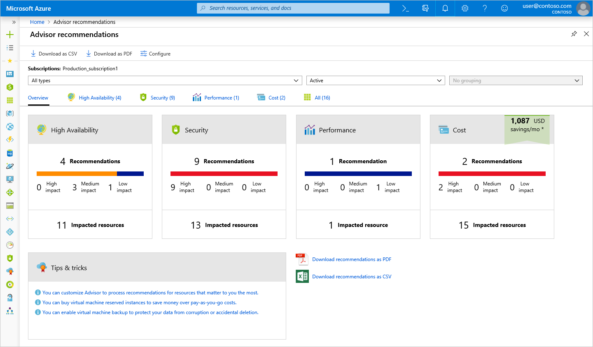
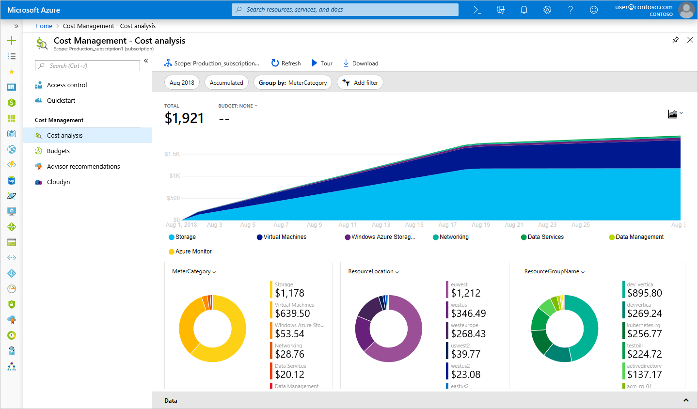

We learned how to estimate costs before you deploy services on Azure, but what if you already have resources deployed? How do you get visibility into the costs you're already accruing? If we had deployed our previous solution to Azure, and now want to make sure that we've sized the virtual machines properly and predict how much our bill will be, how can we do this review? Let's look at a few tools on Azure that can help you resolve this issue.

## What is Azure Advisor?

**Azure Advisor** is a free service built into Azure that provides recommendations on reliability, security, performance, operational excellence, and cost. Advisor analyzes your deployed services and looks for ways to improve your environment across each of these areas. We'll focus on the cost recommendations, but you'll want to take some time to review the other recommendations as well.

Advisor makes cost recommendations in the following areas:

- **Reduce costs by eliminating unprovisioned Azure ExpressRoute circuits**.
    This recommendation identifies ExpressRoute circuits that have been in the provider status of *Not Provisioned* for more than one month. Advisor recommends deleting the circuit if you aren't planning to provision the circuit with your connectivity provider.

- **Buy reserved instances to save money over pay-as-you-go**.
    Advisor will review your virtual machine usage over the last 30 days, and determine if you could save money in the future by purchasing reserved instances. Advisor will show you the regions and sizes where you potentially have the most savings, and will show you the estimated savings you might achieve from purchasing reserved instances.

- **Right-size or shutdown underutilized virtual machines**.
    This analysis monitors your virtual machine usage for 14 days and then identifies underutilized virtual machines. Virtual machines whose average CPU utilization is 5 percent or less, and network usage is 7 MB or less for four or more days are considered underutilized virtual machines. The average CPU utilization threshold is adjustable up to 20 percent. By identifying these virtual machines, you can decide to resize them to a smaller instance type, reducing your costs.

    [!include]

Let's take a look at where you can find Azure Advisor in the portal.

1. Sign in to the [Azure portal](https://portal.azure.com?azure-portal=true) using your Microsoft account.

1. Expand the left-hand navigation from the top-left menu, and select **All Services**.

1. Select the **Management + governance** category, and then select **Advisor**. You can also enter `Advisor` in the services filter box to filter on just that name.

    The Advisor recommendations dashboard appears where you can see all the recommendations for your subscription. You'll see a box for each category of recommendations.

    > [!NOTE]
    > You might not have any recommendations on cost in Advisor. Assessments may not have completed yet or Advisor may not have recommendations.

    

1. Select the **Cost** box to open the detailed recommendations, where you can see the recommendations that Advisor has.

    

    Selecting any recommendation opens the details for that specific recommendation. You'll be able to take a specific action, such as resizing virtual machines to reduce spending.

    

These recommendations are all places where you might be inefficiently spending money. They're a great place to start and continue to revisit when looking for places to reduce costs. In our example, there's an opportunity for us to save around $700 per month if we take these recommendations. This savings adds up, so be sure to review these recommendations periodically across all areas.

## Azure Cost Management

Azure Cost Management is another free, built-in Azure tool that can be used to gain greater insights into where your money for the cloud is going. You can see historical breakdowns of the services you're spending your money on, and how it's tracking against budgets that you have set. You can set budgets, schedule reports, and analyze your cost areas.

As you can see, Azure offers tools at no additional cost that you can use to track and predict your cloud spend, and identify where your environment may be inefficient from a cost perspective. You'll want to make sure you make a regular practice out of reviewing the reports and recommendations that these tools make available, so you can unlock savings across your cloud footprint.
