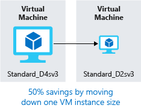

We have seen how to create cost estimates for environments you'd like to build, walked through some tools to get details on where we're spending money, and projected future expenses. Our next challenge is to look at how to reduce those infrastructure costs.

## Use Azure credits

Visual Studio subscribers can activate a monthly credit benefit that allows you to experiment with, develop, and test new solutions on Azure. Use Azure credits to try out new services such as App Service, Windows 10 VMs, Azure SQL Server databases, Containers, Cognitive Services, Functions, Data Lake, and more, without incurring any monetary costs.

When you activate this benefit, you will own a separate Azure subscription under your account with a monthly credit balance that renews each month while you remain an active Visual Studio subscriber.

The credit amount varies based on the program level, and you should check the documentation for more details on how much credit you receive for your specific subscription level. For example:

- $50 per month for Visual Studio Professional
- $150 per month for Visual Studio Enterprise

> [!IMPORTANT]
> The monthly Azure credit for Visual Studio subscribers is for **development and testing only** and does not carry a financially-backed SLA. Azure will suspend any instance (VM or cloud service) that runs continuously for more than 120 hours or if it's determined that the instance is being used for production. This benefit is made available to Visual Studio subscribers on a best efforts basis; there is no guarantee of capacity availability.

## Use spending limits

By default, Azure subscriptions that have associated monthly credits (which includes trial accounts) have a _spending limit_ to ensure you aren't charged once you have used up your credits. This feature is useful for development teams exploring new solution architectures as it ensures you won't have an unexpectedly large bill at the end of the month.

> [!NOTE]
> Azure spending limits are not the same as subscription, service, or resource group limits and quotas.

Azure provides the spending limits feature to help prevent you from exhausting the credit on your account within each billing period. When your Azure usage results in charges that use all the included monthly credit, the services that you deployed are disabled and turned off for the rest of that billing period. Once a new billing period starts, assuming there are credits available, the resources are reactivated and deployed.

You are notified by email when you hit the spending limit for your subscription. In addition, the Azure portal includes notifications about your credit spend. You can adjust the spending limit as desired or turn it off completely.

> [!IMPORTANT]
> The spending limit feature is specific to subscriptions that include a monthly Azure credit allotment. It is not available on pay-only subscriptions.

## Use reserved instances

If you have virtual machine workloads that are static and predictable, using reserved instances is a fantastic way to potentially save up to 70 to 80 percent off the pay-as-you-go cost. The savings can be significant, depending on the VM size and duration the machine runs. The following illustration shows that using Azure reserved instances saves you up to 72 percent and using reserved instance plus Azure Hybrid Benefit saves up to 80 percent in costs.

You commit to reserved instances in one-year or three-year terms. Payment can be made in full for the entire commitment period, or the commitment can be billed monthly. After it's reserved, Microsoft matches up the reservation to running instances and decrements the hours from your reservation. Reservations can be purchased through the Azure portal. And because reserved instances are a compute discount, they are available for both Windows and Linux VMs.

## Choose low-cost locations and regions

The cost of Azure products, services, and resources can vary across locations and regions, and if possible, you should use them in those locations and regions where they cost less.

> [!NOTE]  
> Some resources are metered and billed according to how much outgoing network bandwidth they consume (egress). You should provision connected resources that are bandwidth metered _in the same region_ to reduce egress traffic between them.

## Research available cost-saving offers

Keep up to date with the latest Azure customer and subscription offers, and switch to offers that provide the most significant cost-saving benefit.

You can check the [Azure Updates page](https://azure.microsoft.com/updates/) for information about the latest updates to Azure products, services, and features, as well as product roadmaps and announcements.

## Right-size underutilized virtual machines

Recall from our previous discussion that Azure Cost Management and Azure Advisor might recommend right-sizing or shutting down VMs. Right-sizing a virtual machine is the process of resizing it to a proper size. Let's imagine you have a server running as a domain controller that is sized as a **Standard_D4sv3**, but your VM is sitting at 90 percent idle the vast majority of the time. By resizing this VM to a **Standard_D2sv3**, you reduce your compute cost by 50 percent. Costs are linear and double for each size larger in the same series. In this case, you might even benefit from changing the instance series to go to a less expensive VM series. The following illustration shows a 50 percent savings achieved by moving one size down within the same series.

Over-sized virtual machines are a common unnecessary expense on Azure, and one that can be easily fixed. You can change the size of a VM through the Azure portal, Azure PowerShell, or the Azure CLI.

> [!TIP]
> Resizing a VM requires it to be stopped, resized, and then restarted. This may take a few minutes depending on how significant the size change is. Plan for an outage, or shift your traffic to another instance while you perform this task.

## Deallocate virtual machines in off hours

If you have virtual machine workloads that are only used during certain periods, but you're running them every hour of every day, you're wasting money. These VMs are great candidates to shut down when not in use and start back up on a schedule, saving you compute costs while the VM is deallocated.

This approach is an excellent strategy for development environments. It's often the case that development may happen only during business hours, giving you the flexibility to deallocate these systems in the off hours and stopping your compute costs from accruing. Azure now has an [automation solution](https://docs.microsoft.com/azure/automation/automation-solution-vm-management) fully available for you to leverage in your environment.

You can also use the **auto-shutdown** feature on a virtual machine to schedule automated shutdowns.

## Delete unused virtual machines

 This advice may sound obvious, but if you aren't using a service, you should shut it down. It's not uncommon to find non-production or proof-of-concept systems that are no longer needed following the completion of a project. Regularly review your environment and work to identify these systems. Shutting down these systems can have a multifaceted benefit by saving you not only on infrastructure costs but also potential savings on licensing and operations.

## Migrate to PaaS or SaaS services

Lastly, as you move workloads to the cloud, a natural evolution is to start with infrastructure-as-a-service (IaaS) services and then move them to platform-as-a-service (PaaS) services, as appropriate, in an iterative process.

PaaS services typically provide substantial savings in both resource and operational costs. The challenge is that depending on the type of service, varying levels of effort will be required to move to these services, from both a time and resource perspective. You might be able to move a SQL Server database to Azure SQL Database easily, but it might take substantially more effort to transfer your multi-tier application to a container or serverless-based architecture. It's a good practice to continuously evaluate the architecture of your applications to determine if there are efficiencies to be gained through PaaS services.

Azure makes it easy to test these services with little risk, giving you the ability to try out new architecture patterns relatively easily. That said, it's typically a longer journey and might not be of immediate help if you're looking for quick wins from a cost-savings perspective. The Azure Architecture Center is a great place to get ideas for transforming your application, as well as best practices across a wide array of architectures and Azure services.
