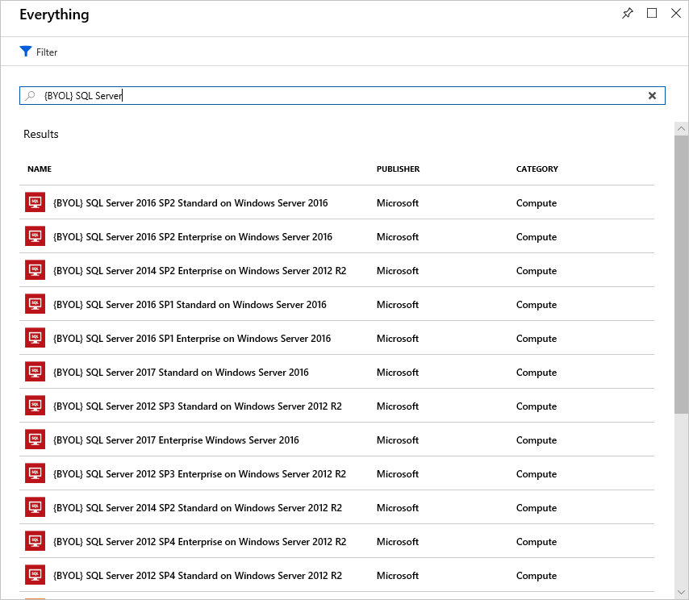

Licensing is another area that can dramatically impact your cloud spending. Let's look at some ways you can reduce your licensing costs.

## Linux vs. Windows

Many of the Azure services you deploy have the choice of running on Windows or Linux. In some cases, the cost of the product can be different based on the OS you choose. Where you have a choice, and your application doesn't depend on the underlying OS, it's useful to compare pricing to determine whether you can save money.

## Azure Hybrid Benefit for Windows Server

Many customers have invested in Windows Server licenses and would like to repurpose this investment on Azure. The Azure Hybrid Benefit gives customers the right to use these licenses for virtual machines on Azure.

To be eligible for this benefit, your Windows licenses must be covered by Software Assurance. The following guidelines will also apply:

- Each two-processor license or each set of 16-core licenses is entitled to two instances of up to eight cores or one instance of up to 16 cores.
- Standard Edition licenses can only be used either on-premises or in Azure, but not both. That means you can't use the same license for an Azure VM and a local computer.
- Datacenter Edition benefits allow for simultaneous usage both on-premises and in Azure so that the license will cover two running Windows machines.

> [!NOTE]
> Most customers are typically licensed by core, so you'll use that model for your calculation. If you have questions about what licenses you have, reach out to your license reseller or your Microsoft account team.

Applying the benefit is easy. It can be turned on and off at any time with existing VMs or applied at deployment time for new VMs. The Hybrid Benefit can provide substantial license savings, especially when combined with reserved instances.

## Azure Hybrid Benefit for SQL Server

The Azure Hybrid Benefit for SQL Server helps you maximize the value from your current licensing investments and accelerate your migration to the cloud. Azure Hybrid Benefit for SQL Server is an Azure-based benefit that enables you to use your SQL Server licenses with active Software Assurance to pay a reduced rate.

You can use this benefit even if the Azure resource is active, but the reduced rate will only be applied from the time you select it in the portal. No credit will be issued retroactively.

### Azure SQL Database vCore-based options

For Azure SQL Database, the Azure Hybrid Benefit works as follows:

- If you have Standard Edition per-core licenses with active Software Assurance, you can get one vCore in the General Purpose service tier for every one license core you own on-premises.
- If you have Enterprise Edition per-core licenses with active Software Assurance, you can get one vCore in the Business Critical service tier for every one license core you own on-premises. The Azure Hybrid Benefit for SQL Server for the Business Critical service tier is available only to customers who have Enterprise Edition licenses.
- If you have highly virtualized Enterprise Edition per-core licenses with active Software Assurance, you can get four vCores in the General Purpose service tier for every one license core you own on-premises. The vCore benefit is a unique virtualization benefit available only on Azure SQL Database.

The following illustration shows the vCore-based options available in each service tier with Azure Hybrid Benefit for SQL Server licenses.

:::image type="complex" border="false" source="../media/5-sql-tradein-value.png" alt-text="Diagram showing an example of maximizing existing SQL server license value using the Azure Hybrid Benefit.":::
    An example of SQL Server license benefit. One Standard Edition license allows one general purpose vCore. One Enterprise Edition license allows one business critical vCore. And one Hyper virtualized Enterprise Edition license allows four general purpose vCores.
:::image-end:::

For SQL Server in Azure Virtual Machines, the Azure Hybrid Benefit works as follows:

- If you have Enterprise Edition per-core licenses with active Software Assurance, you can get one core of SQL Server Enterprise Edition in Azure Virtual Machines for every one license core you own on-premises.
- If you have Standard Edition per-core licenses with active Software Assurance, you can get one core of SQL Server Standard Edition in Azure Virtual Machines for every one license core you own on-premises.

This license arrangement can make a dramatic impact on your Azure spending with SQL Server workloads.

## Use Dev/Test subscription offers

The [Enterprise Dev/Test](https://azure.microsoft.com/offers/ms-azr-0148p/) and [Pay-As-You-Go (PAYG) Dev/Test](https://azure.microsoft.com/offers/ms-azr-0023p/) offers are a benefit you can take advantage of to save costs on your non-production environments. This benefit gives you several discounts, most notably for Windows workloads, eliminating license charges and only billing you at the Linux rate for virtual machines. SQL Server and other Microsoft software covered under a Visual Studio subscription (formerly known as MSDN) are also included.

There are a few requirements for this benefit. First, it's only for non-production workloads. This benefit also requires any users of these environments (excluding testers) must be covered under a Visual Studio subscription. In short, for non-production workloads, this benefit allows you to save money on your Windows, SQL Server, and other Microsoft virtual machine workloads.

For full details of each offer, check out the offer links above. If you are a customer on an Enterprise Agreement, you'd want to leverage the Enterprise Dev/Test offer, and if you are a customer without an Enterprise Agreement and are instead using PAYG accounts, you'd leverage the Pay-As-You-Go Dev/Test offer.

## Bring your own SQL Server license

If you are a customer on an Enterprise Agreement and already have an investment in SQL Server licenses, and they have freed up as part of moving resources to Azure, you can provision **bring your own license** (BYOL) images off the Azure Marketplace, giving you the ability to take advantage of these unused licenses and reduce your Azure VM cost. You've always been able to use these licenses by provisioning a Windows VM and manually installing SQL Server, but this process simplifies the creation process by leveraging Microsoft certified images. Search for **BYOL** in the Marketplace to find these images.

> [!IMPORTANT]
> An Enterprise Agreement subscription is required to use these certified BYOL images.

## Use SQL Server Developer Edition

Many people are unaware that SQL Server Developer Edition is a free product for **nonproduction use**. Developer Edition has all the same features that Enterprise Edition has, but for nonproduction workloads, you can save dramatically on your licensing costs.

Look for SQL Server images for Developer Edition on the Azure Marketplace and use them for development or testing purposes to eliminate the additional cost for SQL Server in these cases.

> [!TIP]
> For full licensing information, take a look at the [documented pricing guidance](https://docs.microsoft.com/azure/virtual-machines/windows/sql/virtual-machines-windows-sql-server-pricing-guidance).

## Use constrained instance sizes for database workloads

Many customers have high requirements for memory, storage, or I/O bandwidth. But they also often have low requirements for CPU core counts. Based on this popular request, Microsoft has made available the most popular VM sizes (DS, ES, GS, and MS) in new sizes that constrain the vCPU count to one half or one-quarter of the original VM size, while maintaining the same memory, storage, and I/O bandwidth.

| VM Size | vCPUs | Memory | Max disks | Max I/O throughput | SQL Server Enterprise licensing cost per year | Total cost per year (compute + licensing) |
|---|---|---|---|---|---|---|
| Standard_DS14v2 | 16 | 112 GB | 32 | 51,200 IOPS or 768 MB/s |  |  |
| Standard_DS14-4v2 | **4** | 112 GB | 32 | 51,200 IOPS or 768 MB/s | 75% lower | 57% lower |
| Standard_GS5 | 32 | 448 GB | 64 | 80,000 IOPS or 2 GB/s |  |  |
| Standard_GS5-8 | **8** | 448 GB | 64 | 80,000 IOPS or 2 GB/s | 75% lower | 42% lower |

Because database products like SQL Server and Oracle are licensed per CPU, customers can reduce licensing cost by up to 75 percent and still maintain the high performance their database requires.
