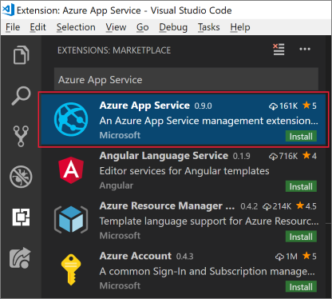

::: zone pivot="vscode"

To use Visual Studio Code for Azure development, you'll need to install Visual Studio Code locally and one or more Azure extensions. In this exercise, we'll add the **Azure App Service** extension.

## Install Visual Studio Code

To install Visual Studio Code, use the appropriate steps for your operating system.

### Windows

1. [Download the Visual Studio Code installer for Windows](https://code.visualstudio.com/).

1. Run the installer.

1. Open Visual Studio Code by pressing the Windows key or selecting the Windows icon on the task bar, typing "Visual Studio Code" and selecting the **Visual Studio Code** result.

### macOS

1. [Download Visual Studio Code for macOS](https://code.visualstudio.com/).

1. Double-click the downloaded archive to expand the contents.

1. Drag Visual Studio Code.app to the Applications folder.

1. Open Visual Studio Code by selecting the icon the Apps section or by searching for Visual Studio Code in Spotlight.

### Linux

#### Debian and Ubuntu

1. Download and install the [.deb package (64-bit)](https://go.microsoft.com/fwlink/?LinkID=760868) through the graphical software center (if it's available) or through the command line (replacing `<file>` with the .deb filename you downloaded):

   ```bash
   sudo dpkg -i <file>.deb
   sudo apt-get install -f # Install dependencies
   ```

#### RHEL, Fedora, and CentOS

1. Use the following script to install the key and repository:

   ```bash
   sudo rpm --import https://packages.microsoft.com/keys/microsoft.asc
   sudo sh -c 'echo -e "[code]\nname=Visual Studio Code\nbaseurl=https://packages.microsoft.com/yumrepos/vscode\nenabled=1\ngpgcheck=1\ngpgkey=https://packages.microsoft.com/keys/microsoft.asc" > etc/yum.repos.d/vscode.repo'
   ```

1. Update the package cache and install the package by using dnf (Fedora 22 and above):

   ```bash
   dnf check-update
   sudo dnf install code
   ```

#### openSUSE and SLE

1. The yum repository also works for openSUSE and SLE-based systems. The following script will install the key and repository:

   ```bash
   sudo rpm --import https://packages.microsoft.com/keys/microsoft.asc
   sudo sh -c 'echo -e "[code]\nname=Visual Studio Code\nbaseurl=https://packages.microsoft.com/yumrepos/vscode\nenabled=1\ntype=rpm-md\ngpgcheck=1\ngpgkey=https://packages.microsoft.com/keys/microsoft.asc" > /etc/zypp/repos.d/vscode.repo'
   ```

1. Update the package cache and install the package by using:

   ```bash
   sudo zypper refresh
   sudo zypper install code
   ```

> [!NOTE]
> For further details about installing or updating Visual Studio Code on various Linux distributions, please see the [Running Visual Studio Code on Linux documentation](https://code.visualstudio.com/docs/setup/linux).

## Install Azure App Service extension

1. If you haven't already, open Visual Studio Code.

1. Open the **Extensions** browser via the menu on the left.

1. Search for **Azure App Service**.

1. Select the **Azure App Service** result and select **Install**.

   The following screenshot shows the Azure App Service extension selected from the Visual Studio Code extension search results:

   

Visual Studio Code will install the extension. You're now ready to connect to your Azure subscription and deploy a web, mobile, or API app to an Azure App Service.

::: zone-end

::: zone pivot="vstudio"

Here, you'll install Visual Studio on either your Windows or macOS development machine.

## Exercise steps

To install Visual Studio, use the appropriate steps for your operating system.

### Windows

1. Go to https://visualstudio.microsoft.com/downloads/ and select the edition you want to install.
    - Community **Free download** is always free for students and individuals
    - Professional **Free trial** for small teams
    - Enterprise **Free trial** for large organizations with 500 or more user devices 

1. When the executable finishes downloading, launch the installer and select **Modify**.

1. On the **Workloads** tab, select the **Azure development** workload. The **Installation details** pane on the right displays the tools and extensions for Azure.

    :::image type="content" source="../media/5-select-azure-workload.png" alt-text="Screenshot of Visual Studio Installer Workloads with Azure development highlighted." loc-scope="vs":::

1. (Optional) Select the check boxes to include **ASP.NET and web development**, **Python development**, and **Node.js development** workloads to be ready to create web applications and scripts in Azure.

1. Select **Install** and wait for Visual Studio to install. For systems with Visual Studio already installed, select **Modify**. If prompted with a User Account Control dialog, select **Yes** to permit the installer to run.

   **Visual Studio Installer** notifies you of any updates required in the versions you have on your system.

1. When the installation is complete, select **Launch** to open Visual Studio.

### macOS

1. Go to https://visualstudio.microsoft.com/ and download the Visual Studio for Mac installer.

1. Select the **VisualStudioInstaller.dmg** file to mount the installer, then run it by double-clicking the logo.

1. Acknowledge the Privacy and License terms when presented.

1. The installer prompts you to select which components you wish to install. Azure components are already part of Visual Studio for Mac, but we recommend installing the **.NET Core** platform to develop web experiences for Azure.

   :::image type="content" source="../media/5-vsmac-install-net-core.png" alt-text="Screenshot of the Visual Studio for Mac installer with the selected .NET Core platform option highlighted." loc-scope="vs":::

1. When you've selected the necessary tools and extensions, select **Install and Update** and wait for the installer to complete.

1. If you're prompted to elevate the permissions needed, use your administrator credentials to do so.

1. Once the installer is complete, start Visual Studio for Mac.

::: zone-end

::: zone pivot="eclipse"

Here, you'll install Eclipse and the Azure Toolkit on your development machine. By the end of the exercise, you'll have everything you need to create a Java application connected to Azure.

## Install Eclipse IDE

1. Download the appropriate [Eclipse IDE for your operating system](https://www.eclipse.org/downloads/packages/installer).

1. Start the Eclipse installer once downloaded.

   - On Windows, double-click the downloaded file.

   - On macOS and Linux, unzip the installer from the downloaded file and run it.

   > [!NOTE]
   > The installer might prompt you to install the Java Development Kit, if it is missing.

1. Select the packages to install. For Java developers, choose either the Java or Java EE Eclipse IDE option.

1. Select the installation destination on your machine.

1. Launch Eclipse to validate that it installed correctly.

## Install Azure Toolkit for Eclipse

Installing the Azure Toolkit is the same across Windows, macOS, and Linux.

1. Start Eclipse and open a workspace.

1. Drag the following icon into the Eclipse workspace to install the Azure Toolkit for Eclipse plugin.

   [](https://marketplace.eclipse.org/marketplace-client-intro?mpc_install=1919278 "Drag to your running Eclipse* workspace. *Requires Eclipse Marketplace Client")

1. In the confirmation dialog, select **Confirm** to continue.

   :::image type="content" source="../media/7-eclipse-confirm-feature.png" alt-text="Screenshot of the feature confirmation dialog in Eclipse." loc-scope="third-party":::

1. Review and accept the license agreements, then select **Finish**.

1. Eclipse will download and install the Azure Toolkit.

1. Restart Eclipse, if necessary.

1. Validate the Azure Toolkit installation by verifying that **Azure** exists in the **Tools** menu.

::: zone-end

::: zone pivot="intellij"

Here, you'll install IntelliJ IDEA and the Azure Toolkit on your development machine. By the end of the exercise, you'll have everything you need to create a Java application connected to Azure.

## Install IntelliJ IDEA

1. Download the appropriate [IntelliJ IDEA for your operating system](https://www.jetbrains.com/idea/download/).

1. Start the IntelliJ IDEA installer once downloaded.

   - On Windows, double-click the downloaded file.

   - On macOS and Linux, unzip the installer from the downloaded file and run it.

   > [!NOTE]
   > The installer might prompt you to install the Java Development Kit, if it is missing.

1. Select the installation destination on your machine and confirm other settings.

1. Launch IntelliJ IDEA to validate that it installed correctly.

## Install Azure Toolkit for IntelliJ

Installing the Azure Toolkit is the same across Windows, macOS, and Linux.

1. Start IntelliJ IDEA and open a workspace.

1. Go to **Configure** > **Settings**.

1. In the **Settings** dialog, select **Plugins**, then search for `Azure Toolkit for IntelliJ` in plugin marketplace.

   :::image type="content" source="../media/9-intellij-marketplace.png" alt-text="Screenshot of IntelliJ IDEA showing the Settings window with Plugin section selected and search results for Azure Toolkit for IntelliJ." loc-scope="third-party":::

1. Select **OK**, then select **Install**.

1. Review and accept the license agreements if prompted. IntelliJ IDEA will download and install the Azure Toolkit.

1. Restart IntelliJ IDEA after the installation.

1. Verify that the Azure Toolkit ha installed checking the **Tools** menu for **Azure**.

::: zone-end
