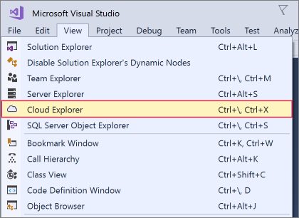
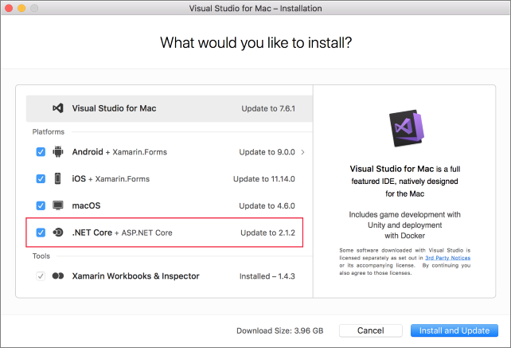

Here, you'll install Visual Studio on either your Windows or your macOS development machine.

## Exercise steps

::: zone pivot="windows"

### Windows

1. Download the Visual Studio installer from https://visualstudio.microsoft.com/downloads/.

1. Run the installer.

1. On the **Workloads** tab, select the **Azure development** workload.

    The following screenshot shows the Visual Studio Installer workload selected to allow Azure development within Visual Studio.

    

1. (Optional) Install the ASP.NET and web development workload to be ready to create web applications for Azure.

1. Click **Install**, and wait for Visual Studio to install. For systems with Visual Studio already installed, this button may say **Modify**.

1. When the installation is complete, open Visual Studio.

1. Go to the View menu in Visual Studio and make sure you have the **Cloud Explorer** option.

    The following screenshot shows the Cloud Explorer menu option that will be present if you have the Azure development workload installed.

    

::: zone-end

::: zone pivot="macos"

### macOS

1. Go to https://visualstudio.microsoft.com/ and download the Visual Studio for Mac installer.

1. Click the VisualStudioInstaller.dmg file to mount the installer, then run it by double-clicking the logo.

1. Acknowledge the Privacy and License terms when presented.

1. The installer will ask which components you wish to install. Azure components are already part of Visual Studio for Mac, but it is recommended to install the **.NET Core** platform to develop web experiences for Azure.

    The following screenshot shows the .NET Core platform required to add Azure development capabilities to Visual Studio for Mac.

    

1. Click **Install and Update** once you are happy with the selections, and wait for the installer to complete.

1. If you are prompted to elevate the permissions needed, use your administrator credentials to do so.

1. Once the installer is complete, start Visual Studio for Mac.

::: zone-end