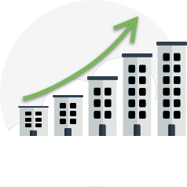

:::row:::
:::column:::

  :::column-end:::
  :::column span="3":::
*Economies of scale* is the ability to do things more efficiently or at a lower-cost per unit when operating at a larger scale. This cost advantage is an important benefit in cloud computing.

Cloud providers such as Microsoft, Google, and Amazon are large businesses able to leverage the benefits of economies of scale, and then pass the savings onto their customers.
  :::column-end:::
  :::column:::
:::row-end:::

This savings is apparent to end users in a number of ways, one of which is the ability to acquire hardware at a lower cost than if a single user or smaller business were purchasing it. Cloud providers can also make deals with local governments and utilities to get tax savings, lower pricing on power, cooling, and high-speed network connectivity between sites.

They are then able to pass on these benefits to end users in the form of lower prices than what you could achieve on your own.

There are limits to the benefits large organizations can realize through economies of scale. A product will inevitably have an underlying core cost, as it becomes more of a commodity, based on what it costs to produce. Competition is also another factor that has an effect on the costs of cloud services.