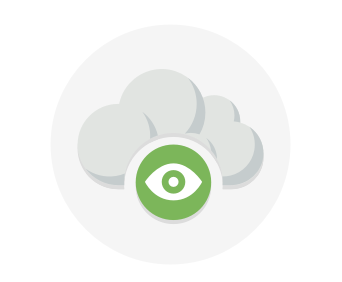
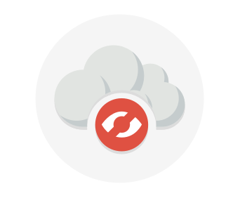
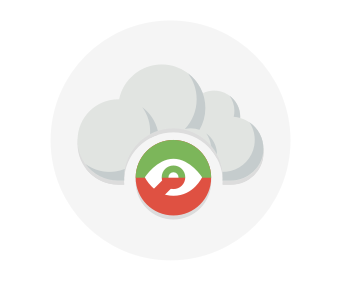

There are three different cloud deployment models. A cloud deployment model defines where your data is stored and how your customers interact with it – how do they get to it, and where do the applications run? It also depends on how much of your own infrastructure you want or need to manage.

## Explore the three deployment methods of cloud computing

#### Public versus Private versus Hybrid

> [!VIDEO httpsg//www.microsoft.com/videoplayer/embed/RE2yEv7]

**Public cloud**

This is the most common deployment model. In this case, you have no local hardware to manage or keep up-to-date – everything runs on your cloud provider’s hardware. In some cases, you can save additional costs by sharing computing resources with other cloud users.

Some advantages of the public cloud are:

- High scalability – you don’t have to buy a new server in order to scale
- Pay-as-you-go pricing – you pay only for what you use
- You’re not responsible for maintenance or updates of the hardware
        

**Private cloud**

In a private cloud, you create a cloud environment in your own data center and provide self-service access to compute resources to users in your organization. This offers a simulation of a public cloud to your users, but you remain completely responsible for the purchase and maintenance of the hardware and software services you provide.

Some reasons teams move away from the private cloud are:

- You have to purchase the hardware for startup and maintenance
- Private clouds require IT skills and expertise that's hard to come by

**Hybrid cloud**

A hybrid cloud combines public and private clouds, allowing you to run your applications in the most appropriate location. For example, you could host a web site in the public cloud and link it to a highly secure database hosted in your private cloud (or on-premises data center).

This is helpful when you have some things that cannot be put in the cloud, maybe for legal reasons. For example, you may have data that cannot be exposed publicly (such as medical data). Another example is one or more applications that run on old hardware that can’t be updated. In this case, you can keep the old system running locally, and connect it to the public cloud for authorization or storage.

Some advantages of a hybrid cloud versus a private cloud are:

- You can keep any systems running and accessible that use out-of-date hardware or an out-of-date operating system
- You have flexibility with what you run locally versus in the cloud

Some concerns you'll need to watch out for are:

- It can be more expensive than selecting one deployment model
- It can be more complicated to set up and manage

## Summary

Cloud computing is flexible and gives you the ability to choose how you want to deploy it. The cloud deployment model you choose depends on your budget, and on your security, scalability, and maintenance needs.
