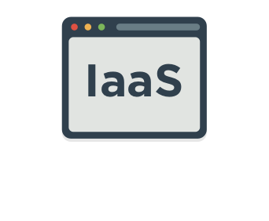
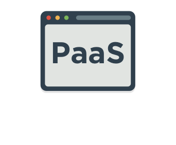
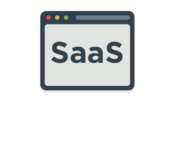
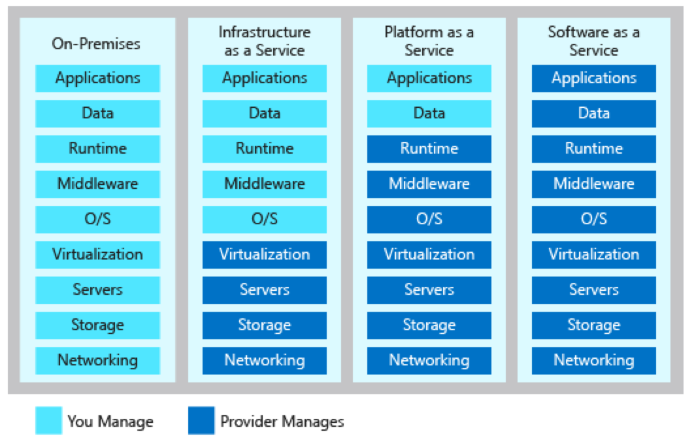

When talking about cloud computing, there are three major categories. It's important to understand them because they are used in conversation, documentation, and training.

## Explore the three categories of cloud computing

#### IaaS versus Sass versus PaaS

> [!VIDEO https://www.microsoft.com/videoplayer/embed/RE2yEbs]

:::row:::
  :::column:::
    
  :::column-end:::
  :::column span="3":::
**Infrastructure as a service (IaaS)**

Infrastructure as a Service is the most flexible category of cloud services. It aims to give you complete control over the hardware that runs your application. Instead of buying hardware, with IaaS, you rent it.
  :::column-end:::
:::row-end:::

:::row:::
  :::column:::
    
  :::column-end:::
  :::column span="3":::
**Platform as a service (PaaS)**

PaaS provides an environment for building, testing, and deploying software applications. The goal of PaaS is to help you create an application as quickly as possible without having to worry about managing the underlying infrastructure. For example, when deploying a web application using PaaS, you don't have to install an operating system, web server, or even system updates.
  :::column-end:::
:::row-end:::

:::row:::
  :::column:::
    
  :::column-end:::
  :::column span="3":::
**Software as a service (SaaS)**

SaaS is software that is centrally hosted and managed for the end customer. It is usually based on an architecture where one version of the application is used for all customers, and licensed through a monthly or annual subscription. Office 365 is a perfect example of SaaS software.
  :::column-end:::
:::row-end:::

## Think about service categories as layers

One thing to understand is that these categories are layers on top of each other. For example, PaaS adds a layer on top of IaaS by providing a level of abstraction. The abstraction has the benefit of hiding the details that you may not care about so that you can get to coding quicker. However, one cost of that is that you have less control over the underlying hardware. The following illustration shows a list of resources that you manage and that your service provider manages in each cloud service category.

## Summary

IaaS, PaaS, and SaaS each contain different levels of managed services. You may easily use a combination of these types of infrastructure. You could use Office 365 on your company’s computers (SaaS), and in Azure you could host your VMs (IaaS) and use Azure SQL Database (PaaS) to store your data. With the cloud’s flexibility, you can use any combination that provides you with the maximum result.
