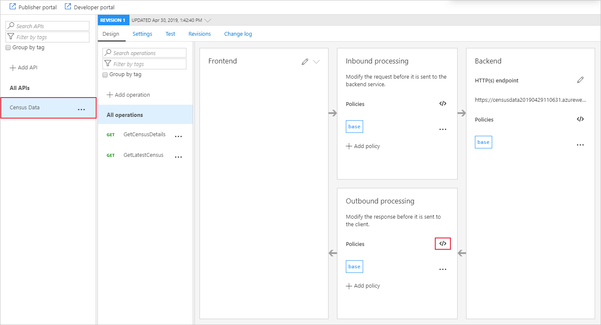
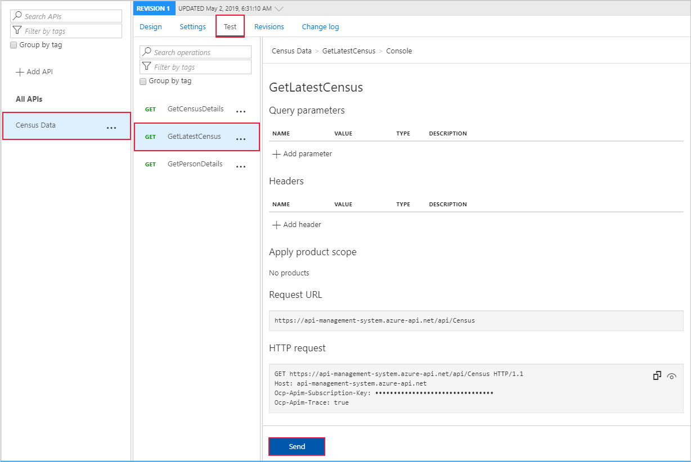
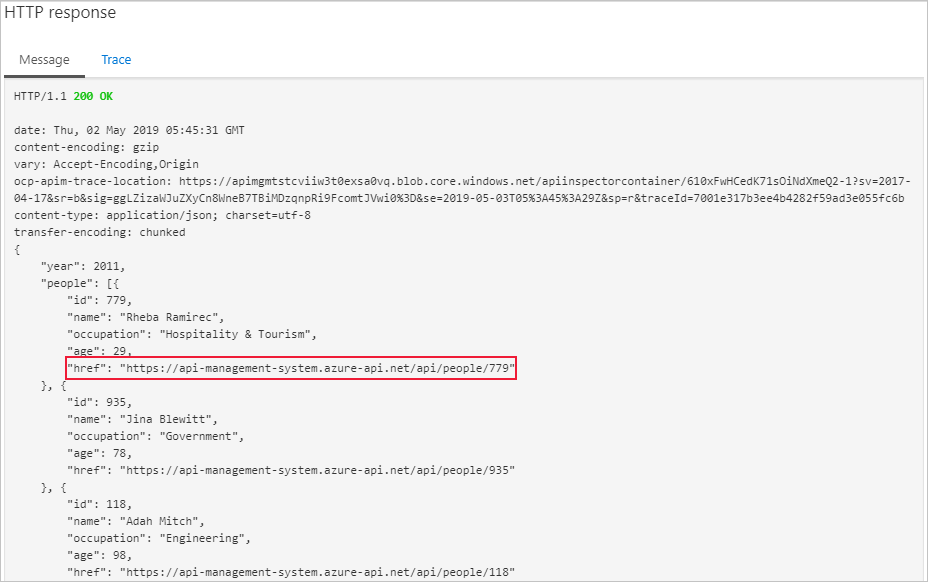

If an API that you host includes its original URL in responses, clients may be able to bypass your API Management policies by connecting directly to the API. You can prevent that by masking the original URL in API responses.

The Government census API includes its URL in this way. You want to make sure that all requests go through API Management.

In this unit, you will mask some of the data returned in the body of the census API. You will learn how to use a transformation policy to rewrite the URL data exposed in the body of the response.

## Mask URLs

The following exercise will demonstrate how to apply the **Mask URL** transformation policy within API Management.



1. Sign into the [Azure portal](https://portal.azure.com/learn.docs.microsoft.com?azure-portal=true) using the same account you activated the sandbox with.
1. In the left menu, click **All Resources**, and then select your API gateway.
1. Under **API management**, click **APIs**, and then select **Census Data**. 
1. On the top of the screen, select the **Design** tab, and then select **All operations**.
1. In the **Outbound** processing section, click the **</>** icon.
1. Inside the `<outbound>` element, below the `<set-header-name>` element you added previously, add the following element:

    ```XML
    <redirect-content-urls />
    ```

1. Click the **Save** button

## Test the new policy

We can use the **Test** tool in the Azure portal to check that the policy behaves as we want:

1. Select **Census Data**, and then, at the top of the screen, select the **Test** tab
1. Select **GetLatestCensus**, and then click **Send**

    

1. You should now see how the **Mask URL** transformation policy has altered the links within the response body to the API Management endpoints.

    
