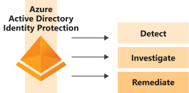
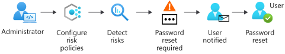
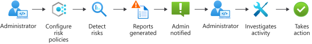

Azure Active Directory (Azure AD) Identity Protection helps you to automatically detect, remediate, and investigate identity-based risks for your organization.

The retail company you work for is conscious about its reputation. Compromised identities have previously enabled malicious users to obtain customer information fraudulently. These attacks have affected your organization's reputation, and ultimately its profitability. Your manager has asked you to investigate Identity Protection as a solution. You've been asked to report back on what the service does and how it's used.

In this unit, you learn what Identity Protection is and the risks involved in using it. You explore the different workflows you can use in Identity Protection to protect your identities.

## What is Azure Active Directory Identity Protection?

Identity Protection is a solution built into Azure AD that's designed to protect your identities through a three-part process.

Your company's specialist expertise is in retail, not in identity protection. It wants to continue to focus on its areas of strength, but still ensure that it's protected against identity risks. Your organization can use Identity Protection to automate the detection, investigation, and remediation of risks related to users' identities without hiring expensive security experts.

## What are risks?

Risks are categorized in two ways: as *user risks* and *sign-in risks*. We can describe user risks as actions that users take after signing in, and sign-in risks as suspicious activity and actions by users when they sign in.

### User risk

A user risk is caused when a user's identity or account is compromised. User risks can include:

| Risk  | Description |
| --- | --- |
| Unusual behavior | The account showed unusual activity or the patterns of usage are similar to those patterns that Microsoft systems and experts have identified as attacks. |
| Leaked credentials | The user's credentials could have been leaked. For example, Microsoft might have found a list of leaked credentials on the dark web, which could affect your user accounts. |

### Sign-in risk

Here, Identity Protection scrutinizes each authentication request to judge whether the owner of the identity authorized it. Sign-in risks can include:

| Risk  | Description |
| --- | --- |
| Unfamiliar sign-in properties | Identity Protection remembers and learns a particular user's sign-in history. For example, when a sign-in occurs from a location that's unusual for the user, a risk detection is triggered. |
| Atypical travel | For example, when two or more sign-ins occur from distant locations in an unrealistically short time period, a risk detection is raised. |
| Malware-linked IP address | For example, if it's known that the IP address where the sign-in originates has been in contact with an active bot server, a risk detection is raised. |
| Anonymous IP address | For example, a sign-in originates from an anonymous IP address. Because attackers can use these details to hide their real IP address or location, a risk detection is raised. |

## Azure Active Directory Identity Protection workflow

There are two different ways to detect and handle identity risks: self-remediation workflow and administrator remediation workflow.

- **Self-remediation workflow**

    Identity Protection uses risk policies to automatically respond to detected threats for you. You can configure a risk policy to decide how you want Identity Protection to respond to a particular type of risk. Then you choose the action the user is asked to complete. The action could be a self-service password reset or multifactor authentication enforcement. Using policies in this way helps save time and gives you peace of mind.

    

    In this workflow, the administrator first configures the risk policies that then monitor for identity risks. When a risk is detected, the policies enforce measures to remediate it. A policy might, for example, prompt a user to reset their password in response to a risk detected. The user then resets their password, and the risk is remediated.

- **Administrator remediation workflow**

   You can also have admins decide how a risk should be remediated when your risk policies detect it. This type of remediation workflow helps you make more tailored decisions. The admin understands the context in which the risks were detected.

    

    In this workflow, the admin configures risk policies. The policies then monitor for identity risks. The admin is notified of risks in a report. The admin views the detailed report and takes appropriate action to remediate the risks. For example, the admin might decide a sign-in is safe, and accept the risk.
