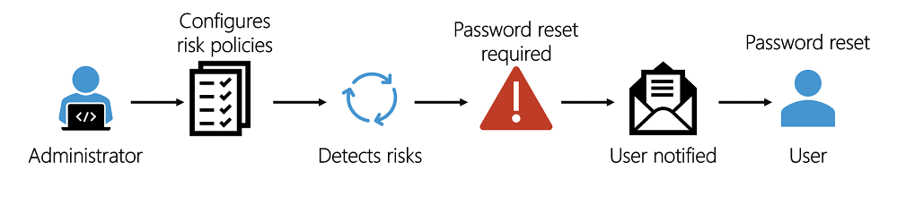
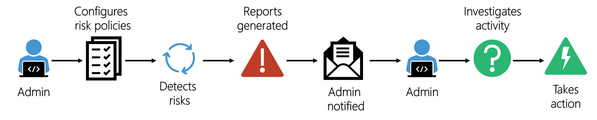

Azure Active Directory Identity Protection (AADIP) helps you to automatically detect, remediate, and investigate identity-based risks for your organization. The retail company you work for is very conscious about its reputation. Identities at risk have previously affected its reputation, and ultimately its profitability.

Your manager has asked you to investigate AADIP as a solution. You've been asked to report back on what the service does and how it's used.

In this unit, you'll learn what AADIP is and the risks involved in using it. You'll explore the different workflows you can use in AADIP to protect your identities.

## What is Azure Active Directory Identity Protection?

Azure Active Directory Identity Protection (AADIP) is a solution built into Azure Active Directory, that is designed to protect your identities through a three-part process:

<!-- Please feel free to style according to Learn standards. -->

Your company specializes in retail, not in identity protection. It wants to continue to focus on its areas of strength, but still ensure that it's protected against identity risks. Your organization can use AADIP to automate the detection, investigation, and remediation of risks related to users' identities.

### What are risks?

Risks can be described as suspicious activity and actions by users when they sign in or when they're doing operations after signing in. That's why risks are categorized in two ways: a user risk or a sign-in risk.

**User risk**

A user risk is caused when their identity or account is being compromised. User risks can include:

|Risk  |Description |
|------|------------|
|Azure Active Directory threat intelligence| The account is showing unusual activity, or the patterns of usage are similar to those that Microsoft systems and experts have identified as an attack.|
|Leaked credentials| The user's credentials could have been leaked. For example, Microsoft might have found a list of leaked credentials on the dark web, which could affect your user accounts. A risk detection would be raised automatically for you.|

**Sign-in risk**

Here, AADIP scrutinizes each authentication request to judge whether it was authorized by the owner of the identity. Sign-in risks can include:

|Risk  |Description |
|------|------------|
|Unfamiliar sign-in properties| AADIP remembers and learns a particular user's sign-in history. For example, when a sign-in occurs from a location that's unusual for the user, a risk detection is triggered. |
|Atypical travel|For example, when two or more sign-ins occur from distant locations, in an unrealistically short time period, a risk detection is raised.|
|Malware linked IP address|For example, the IP address where the sign-in originates is known to have been in contact with an active bot server. A risk detection is raised. |
|Anonymous IP address|For example, a sign-in originates from an anonymous IP address. Because these details can be used by attackers to hide their real IP address or location, a risk detection is raised.|

### Azure Active Directory Identity Protection workflow

There are two different ways to detect and handle identity risks.

1. **Self-remediation workflow**

    AADIP uses risk policies to automatically respond to detected threats for you. You configure a risk policy to decide how you want AADIP to respond to a particular type of risk. You then choose the action the user is asked to do: it could be a self-service password reset, or multi-factor authentication enforcement. Using policies in this way helps save time, and gives you peace of mind.

    
    <!-- Please feel free to style according to Learn standards. -->

    In this workflow, the administrator first configures the risk policies that then monitor for identity risks. When a risk is detected, the policies enforce measures to remediate it. A policy might, for example, ask a user to reset their password in response to a risk detected. The user then resets their password, and the risk is remediated.

1. **Administrator remediation workflow**

   You can also have administrators decide how a risk should be remediated when it's been detected by your risk policies. This type of remediation workflow helps you make more tailored decisions. The administrator understands the context in which the risks were detected.

    
    <!-- Please feel free to style according to Learn standards. -->

    In this workflow, the administrator configures risk policies. The policies then monitor for identity risks. The administrator is notified of risks in a report. The administrator views the detailed report and takes appropriate action to remediate the risks. For example, an administrator might decide a sign-in is safe and accept the risk.
