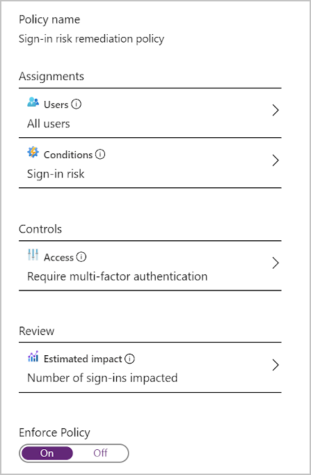
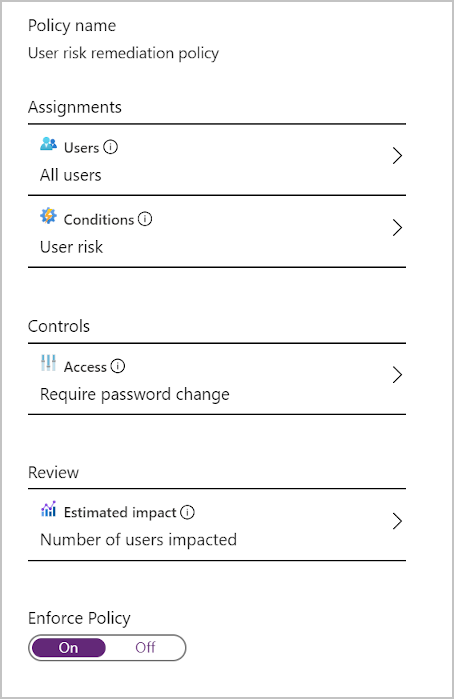
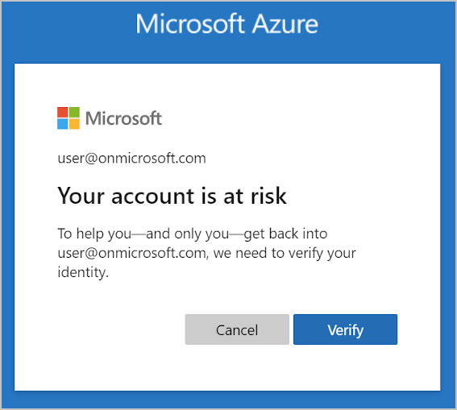
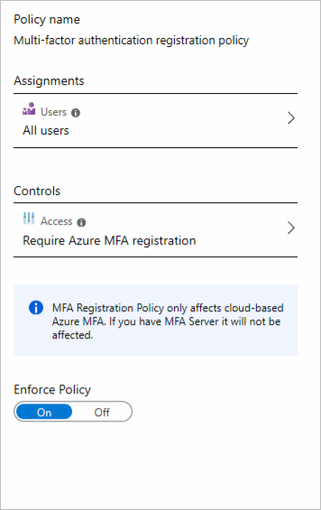
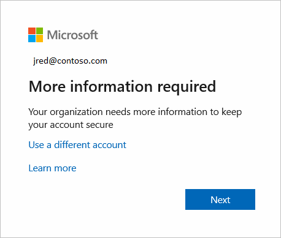

Risk policies make it possible for your organization to respond more appropriately to identity risk.

Previously, your retail company's IT team didn't have security skills in-house and had to hire external contractors to protect identities. Your manager wants to avoid the same situation going forward. Your company needs to be able to respond to threats in a controlled and more cost-effective manner without weakening security.

You've been asked to investigate how identity risks are detected in Azure AD Identity Protection. You've been asked to look into risk policies and how to use them.

In this unit, you investigate what risk policies are. You also learn what each type of risk policy is used for, and how to configure and enable them. Then, you see what the user experience is like for each risk policy type.

## What is a risk policy?

You can configure a risk policy to decide how you want Identity Protection to respond to a particular type of risk. Do you want to block or allow access? Do you want to make users go through more authentication before you allow access? Risk policies help you respond to risks rapidly. Your company can apply risk policies, and avoid hiring external contractors to handle identity-based risks.

Based on the type of identity risk, different risk policies are available. You can use a sign-in risk policy or a user risk policy.

## Sign-in risk policy

A sign-in risk policy scrutinizes every sign-in and gives it a risk score. This score indicates the probability that the person whose credentials are used is actually the one attempting to sign-in. You can decide which level of risk is acceptable by choosing a threshold of low, medium, or high. Based on the risk level, you'll choose whether to allow access, automatically block, or allow access only after other requirements are met. For example, users might be asked to go through multifactor authentication to remediate detected risks that are considered to be at the medium level. Users could be blocked entirely if the risk is considered high.

You use a form to configure a sign-in risk policy in the Azure portal. You can specify settings such as:

- The users this policy should target
- The conditions that must be met, such as how high a score triggers the policy
- How you want to respond

Make sure users are already registered for Azure AD Multi-Factor Authentication before you apply this policy.

After a sign-in risk is identified, the user is asked to take action to remediate the risk. They're told what triggered the risk and what they need to provide to resolve the issue. For example, the user might see this notification:

## User risk policy

Here, Identity Protection learns the user's normal behavioral patterns. Identity Protection then uses this knowledge to calculate the likely risk that the user's identity was compromised. Based on this risk, the admin can decide whether to allow access, block it, or allow access only after extra requirements are met. The user could, for example, be asked to change their password by using self-service password reset before they're allowed access.

You use a form to configure a user risk policy in the Azure portal. You can specify settings such as the users this policy should target, the conditions that must be met, and how you want to respond. Make sure users are already registered for self-service password reset before you apply this policy.

After a user risk is identified, the user is asked to take action to remediate that risk. They're told what triggered the risk and what they need to provide to resolve the issue. For example, the user might see this notification:

## Multifactor authentication (MFA) registration policy

Multifactor authentication (MFA) adds a second layer of protection to your users' identities. With multifactor authentication, the user has to go through an extra verification step after they successfully provide their username and password.

You can use an MFA registration policy to make sure all users are registered for MFA from the first time they use their account. You also configure this policy so you can enforce sign-in risk policies. This way, you let users self-remediate after a sign-in risk is detected.

You fill in a form to configure an MFA registration policy by using the Azure portal. You need to provide details about which users the policy targets, and whether it should be enabled or disabled.

After you configure an MFA registration policy, the user is asked to register when they sign in. The user sees this notification.

Users must complete the registration within 14 days, but they can choose to skip signing in during that period. After 14 days, they have to complete registration before they're allowed to sign in again.
