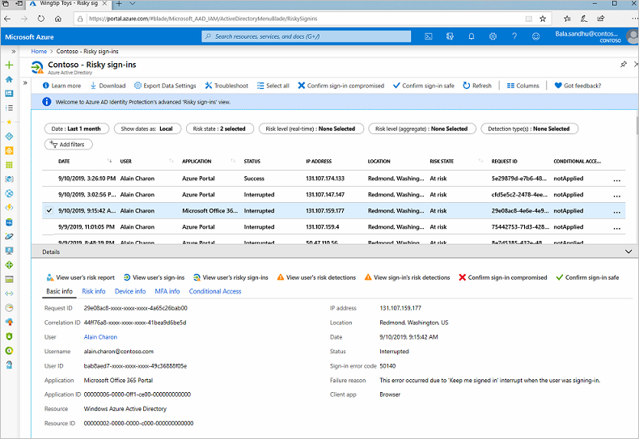

Investigations help you understand how you can improve your identity security posture. They make it possible for you to respond to risks better, and help you avoid risks in the future.

In your retail company, you've configured Azure AD Identity Protection policies and risks are being detected. Your manager has asked you to investigate and remediate all the risks detected and share a report with the project manager. The team uses it to understand the company's identity-based risks better.

In this unit, you learn how to investigate risks by using reports. You also see how to remediate different types of risks and deal with any user accounts that might be blocked.

## Investigate risks

Identity Protection provides reports you can use to investigate identity-based risks detected for your organization's users. These reports come in different types. Each kind of report gives the admin information about certain risks. The admin can then take specific actions to address those risks.

|Report |Information included |Actions the admin can take |Period covered|
|---------|---------|---------|---------|
|Risky sign-ins| Location details, device details, sign-ins confirmed as safe, or with dismissed or remediated risks.| Confirm that sign-ins are safe or confirm that they're compromised. | Last 30 days|
|Risky users|Lists of users at risk and users with dismissed or remediated risks. User history of risky sign-ins.| Reset user passwords, dismiss user risk, block user sign-ins, and confirm user accounts as compromised.| Not applicable

You can use these reports to investigate risks detected by Identity Protection. The reports help you understand how to better prevent risks and improve your security stance for identities.

You can also access *risk detection type reports*, which combine information about risky user detections and sign-in detections. Use these reports to see how different risk types are related and take appropriate action.

You can view and download all reports from the Azure portal.

## Remediate risks

When your investigation is complete, you want to remediate the risks if you're not already using risk policies to automatically deal with them. Always address detected risks quickly.

There are different ways to remediate risks. The methods you use depend on your organization's needs.

| Remediation method  |  Description |
|---------------------|--------------|
|**Self-remediation**  |If you configure risk policies, you can let users self-remediate. When Identity Protection has detected a risk, users either reset their password or go through multifactor authentication to unblock themselves. After self-remediation, these detected risks are considered closed. In your risk policies, the lower the acceptable risk level that triggers the policy, the more users are affected. In general, we recommend that you set the threshold for user risk policies at *high*, and set sign-in risk policies to *medium and above*.|
|**Reset passwords manually**|For some organizations, automated password reset might not be an option. In this case, the admin can manually enforce password resets. For example, the admin can generate a temporary password and advise the user. The user can then change their password.|
|**Dismiss user risk detections**|Sometimes, password reset isn't possible. For example, perhaps the affected user account was deleted. In this case, you can dismiss the risk detections for this user. If you choose to dismiss user risk detections, all associated risk detections for the user are closed.|
|**Close individual detections** |All detected risks contribute to an overall risk score for a user. This risk score represents the probability that a user account is compromised. The admin can also choose to close individual risk detections and lower the overall risk of a user's account. For example, the admin can determine from a user that a particular risk detection is no longer needed and then dismiss it. The overall risk that a user account was compromised is lowered.|

### Unblock users

When risk policies block a user account or an admin blocks an account manually after an investigation. How these user accounts are unblocked depends on the type of risk that caused the blockage:

- **Accounts blocked because of sign-in risk**

    An account blocked because of sign-in risk can be unblocked by excluding the user from the policy. The account might be unblocked if the admin asks the user to sign in from a familiar location or device. Sometimes, sign-ins are blocked from unfamiliar locations or devices. There might be an alert for suspicious behavior based on what's known about the user account's sign-in patterns. The policy can also be disabled if the admin found issues with it.

- **Accounts blocked because of user risk**

    An account might be blocked if the user was flagged because of possible risky behavior. The admin can reset the password for the user to unblock the account. To remove the block, the admin might dismiss the activity identified as risky or exclude the user from the policy. If the policy is causing problems for many users, the admin can completely disable the policy.
